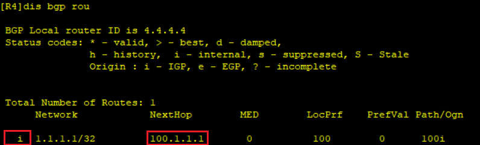

# BGP（华为）
## 常用命令
- 进入系统视图：
`<Huawei>system-view`
- 关闭信息中心：
`[Huawei]undo info-center enable`
- 删除某条配置：
`[Huawei]undo xxxx`
- 更改名称：
`[Huawei]sysname S2`
- 查看当前配置：
```
[S2]display current-configuration`
[S2-GigabitEthernet0/0/1]display this
<S1>display ip interface brief Vlanif 30
```

- 查看路由表：
`[S2]dis ip routing-table`
- 保存配置：
`<S1>save`
- 删除所有静态路由
`undo ip rou static all`
### BGP常用命令
- 查看BGP路由详细信息
`[R3-bgp]dis bgp rou 1.1.1.1 32`

## BGP特征
AS之间专门使用BGP（Border Gateway Protocol，边界网关协议）协议进行路由传递，相较于传统的IGP协议：
- BGP基于TCP，只要能够建立TCP连接即可建立BGP。
- 只传递路由信息，不会暴露AS内的拓扑信息。
- 触发式更新，而不是进行周期性更新。

BGP使用TCP为传输层协议，TCP端口号179。路由器之间的BGP会话基于TCP连接而建立。

两个建立BGP会话的路由器互为对等体（Peer），BGP对等体之间交换BGP路由表。

BGP存在两种对等体关系类型：
- EBGP（External BGP）：位于不同自治系统的BGP路由器之间的BGP对等体关系。两台路由器之间要建立EBGP对等体关系，必须满足两个条件：
  - 两个路由器所属AS不同（即AS号不同）。
  - 在配置EBGP时，Peer命令所指定的对等体IP地址要求路由可达，并且TCP连接能够正确建立。
- IBGP（Internal BGP）：位于相同自治系统的BGP路由器之间的BGP邻接关系。

## BGP路由
- 不同于IGP路由协议，BGP自身并不会发现并计算产生路由，BGP将IGP路由表中的路由注入到BGP路由表中，并通过Update报文传递给BGP对等体。

BGP注入路由的方式有两种：
- network
- import-route
  - 直连路由
  - 静态路由
  - OSPF路由
  - IS-IS路由

## 基础配置


```c
//EBGP
//AS 100
[R1]bgp 100
//指定环回地址为router-id
[R1-bgp]router-id 1.1.1.1
//配置对等体
[R1-bgp]peer 100.1.1.2 as-number 200
[R2]bgp 200
[R2-bgp]router-id 2.2.2.2
[R2-bgp]peer 100.1.1.1 as-number 100

//IBGP
[R2-bgp]peer 4.4.4.4 as-number 200
//TCP默认使用出口IP作为源地址，更新源地址为环回IP以建立TCP连接，否则为active状态
[R2-bgp]peer 4.4.4.4 connect-interface LoopBack 0
[R4]bgp 200
[R4-bgp]router-id 4.4.4.4
[R4-bgp]peer 2.2.2.2 as-number 200
//更新源地址
[R4-bgp]peer 2.2.2.2 connect-interface LoopBack 0

//EBGP
[R4-bgp]peer 200.1.1.1 as-number 300
[R5]bgp 300
[R5-bgp]router-id 5.5.5.5
[R5-bgp]peer 200.1.1.2 as-number 200

//指定建立EBGP连接允许的最大跳数。缺省情况下，EBGP连接允许的最大跳数为1，即
//只能在物理直连链路上建立EBGP连接。
//[R5-bgp]peer 200.1.1.2 ebgp-max-hop 2

//发布本地全局路由表中的路由（与路由表中表项须一致）
[R1-bgp]network 1.1.1.1 32
//将传递给对等体的路由的下一跳地址改为本地IP地址
[R2-bgp]peer 4.4.4.4 next-hop-local
[R5-bgp]network 5.5.5.5 32
[R4-bgp]peer 2.2.2.2 next-hop-local

//将bgp路由引入ospf解决R3路由黑洞问题
//引入可达R1的路由
[R2-ospf-1]import-route bgp
//引入可达R5的路由
[R4-ospf-1]import-route bgp

//1.1.1.1与5.5.5.5互通
[R1]ping -a 1.1.1.1 5.5.5.5

bgp 100
//EBGP
peer 10.1.12.2 as-number 200

//查看BGP对等
dis bgp peer
//查看BGP路由
dis bgp rou

bgp 200
//IBGP使用环回口建立对等体
peer 2.2.2.2 as-number 200
//指定会话本地源接口
peer 2.2.2.2 connect-interface LoopBack0

//发布本地全局路由表中的路由（与路由表中表项须一致）
network 1.1.1.1 32

//只会发布本地最优路由给其他对等体
*（路由可用）>（路由最优）i（IBGP传递的路由）

//将传递给对等体的路由的下一跳地址改为本地IP地址
peer 2.2.2.2 next-hop-local
```
R2可用最优路由：

R3非最优路由

转换下一跳地址后路由：


//路由聚合（detail-suppressed：抑制明细）
aggregate 1.1.1.0 30 detail-suppressed
//自动聚合 只能对import-route引入的路由聚合 只对主类（A,B,C类IP）进行聚合
summary automatic

//请求对方发送路由（refresh、update报文）
refresh bgp all import
//本地发送路由信息给对等体（update报文）
refresh bgp all export


## 路由聚合
在BGP配置视图中使用aggregate命令可以执行BGP路由手工聚合，在BGP已经学习到相应的明细路由情况下，设备会向BGP注入指定的聚合路由。


- 聚合前路由：

```c
//聚合路由
[R1-bgp]aggregate 1.1.1.0 30
```
- 聚合后路由：


>执行聚合之后，在本地的BGP路由表中除了原本的明细路由条目之外，还会多出一条聚合的路由条目。如果在执行聚合时指定了**detail-suppressed**，则BGP只会向对等体通告聚合后的路由，而不通告聚合前的明细路由。

```c
//聚合路由（detail-suppressed：抑制明细路由）
[R1-bgp]aggregate 1.1.1.0 30 detail-suppressed 
```

- 明细抑制聚合后路由：


```c
//自动聚合 只能对import-route引入的路由聚合 只对主类（A,B,C类IP）进行聚合
[R1-bgp]summary automatic 
```
## 通告原则
BGP通过network、import-route、aggregate聚合方式生成BGP路由后，通过Update报文将BGP路由传递给对等体。

BGP通告遵循以下原则：
- 只发布有效且最优路由。
- 从EBGP对等体获取的路由，会发布给所有对等体。
- IBGP水平分割：从IBGP对等体获取的路由，不会发送给IBGP对等体。
- BGP同步规则：当一台路由器从自己的IBGP对等体学习到一条BGP路由时（这类路由被称为IBGP路由），它将不能使用该条路由或把这条路由通告给自己的EBGP对等体，除非它又从IGP协议（例如OSPF等，此处也包含静态路由）学习到这条路由，也就是要求IBGP路由与IGP路由同步。同步规则主要用于规避BGP路由黑洞问题。

## 路径属性
每条BGP路由都携带多种路径属性（Path attribute），BGP可以通过这些路径属性控制路径选择，而不像IS-IS、OSPF只能通过Cost控制路径选择，因此在路径选择上，BGP具有丰富的可操作性，可以在不同场景下选择最合适的路径控制方式。

当路由器将BGP路由通告给它的对等体时，一并被通告的还有路由所携带的各个路径属性。BGP的路径属性将影响路由优选。

- 公认属性：
公认属性是所有BGP路由器都必须能够识别的属性
  - 公认必遵（Well-known Mandatory）：必须包括在每个Update消息里。
    - Origin
    - AS_Path
    - Next_hop
  - 公认任意（Well-known Discretionary）：可能包括在某些Update消息里。
    - Local_Preference
    - Atomic_aggregate 
- 可选属性：
可选属性不需要都被BGP路由器所识别
  - 可选过渡（Optional Transitive）：BGP设备不识别此类属性依然会接受该类属性并通告给其他对等体。
    - Aggregator
    - Community
  - 可选非过渡（Optional Non-transitive）：BGP设备不识别此类属性会忽略该属性，且不会通告给其他对等体。
    - MED
    - Cluster-List
    - Originator-ID 
### AS_Path
- 该属性为公认必遵属性，是前往目标网络的路由经过的AS号列表；
- 作用：确保路由在EBGP对等体之间传递无环；另外也作为路由优选的衡量标准之一；
- 路由在被通告给EBGP对等体时，路由器会在该路由的AS_Path中追加上本地的AS号；路由被通告给IBGP对等体时，AS_Path不会发生改变。

优先选择AS_Path属性值最短的路由：
- AS_Path属性值改变前最优路由为R2：

- R2增加AS_Path属性值长度
```c
//增加as-path属性值
//流量/路由抓取
[R2]acl number 2000
//抓取源1.1.1.1的路由，0表示全匹配
[R2-acl-basic-2000]rule 5 permit source 1.1.1.1 0
//针对特定路由修改属性
[R2]route-policy as-path  permit node 10
[R2-route-policy]if-match acl 2000
//添加as-path属性值100 100
[R2-route-policy]apply as-path 100 100 additive 
//正常放行其他路由
[R2]route-policy as-path permit node 20
//R2在向对等体R3的出口应用规则
[R2-bgp]peer 10.10.1.2 route-policy as-path export 
```
- AS_Path属性值改变前最优路由为R4：


- 使用Route-Policy修改BGP路由的AS_Path属性时，可以使用以下三种方式：

```c
//清空as-path属性
apply as-path none overwrite
```

## Origin
该属性为公认必遵属性，它标识了BGP路由的起源。
| 起源名称 | 标记 | 描述 |
| -- | -- | -- |
| IGP | i | 如果路由是由始发的BGP路由器使用network命令注入到BGP的，那么该BGP路由的Origin属性为IGP |
| EGP | e | 如果路由是通过EGP学习到的，那么该BGP路由的Origin属性为EGP |
| Incomplete | ? | 如果路由是通过其他方式学习到的，则Origin属性为Incomplete（不完整的）。例如通过import-route命令引入到BGP的路由 |

当去往同一个目的地存在多条不同Origin属性的路由时，在其他条件都相同的情况下，BGP将按如Origin的下顺序优选路由：IGP > EGP > Incomplete。

查看路由的Origin属性：


## Next_Hop
该属性是一个公认必遵属性，用于指定到达目标网络的下一跳地址。

当路由器学习到BGP路由后，需对BGP路由的Next_Hop属性值进行检查，该属性值（IP地址）必须在本地路由可达，如果不可达，则这条BGP路由不可用。

### Next_Hop属性值
在不同的场景中，设备对BGP路由的缺省Next_Hop属性值的设置规则如下：
- 路由器将BGP路由通告给自己的EBGP对等体时，将该路由的Next_Hop设置为自己的更新源IP地址。
- 路由器在收到EBGP对等体所通告的BGP路由后，在将路由传递给自己的IBGP对等体时，会保持路由的Next_Hop属性值不变。
- 如果路由器收到某条BGP路由，该路由的Next_Hop属性值与EBGP对等体（更新对象）同属一个网段，那么该条路由的Next_Hop地址将保持不变并传递给它的BGP对等体。

      使用**peer next-hop-local**命令可以在设置向IBGP对等体（组）通告路由时，把下一跳属性设为自身的TCP连接源地址。

## Local_Preference
- Local_Preference即本地优先级属性，是公认任意属性，可以用于告诉AS中的路由器，哪条路径是离开本AS的首选路径。
- Local_Preference属性值越大则BGP路由越优。缺省的Local_Preference值为100。
- 该属性只能被传递给IBGP对等体，而不能传递给EBGP对等体(AS域内传递)。

本地使用network命令及import-route命令引入的路由， Local_Preference为缺省值100，并能在AS内向其他IBGP对等体传递，传递过程中除非受路由策略影响，否则Local_Preference不变。

## Community
Community（团体）属性为可选过渡属性，是一种路由标记，用于简化路由策略的执行。

可以将某些路由分配一个特定的Community属性值，之后就可以基于Community值而不是网络前缀/掩码信息来匹配路由并执行相应的策略了。

Community属性值长度为32bit，也就是4Byte。可使用两种形式呈现：
- 十进制整数格式。
- AA：NN格式，其中AA表示AS号，NN是自定义的编号，如12:10000。

## MED
MED（Multi-Exit Discriminator，多出口鉴别器）是可选非过渡属性，是一种度量值，用于向外部对等体指出进入本AS的首选路径，即当进入本AS的入口有多个时，AS可以使用MED动态地影响其他AS选择进入的路径。

MED属性值越小则BGP路由越优。

MED主要用于在AS之间影响BGP的选路。MED被传递给EBGP对等体后，对等体在其AS内传递路由时，携带该MED值，但将路由再次传递给其EBGP对等体时，缺省不会携带MED属性。

缺省情况下，路由器只比较来自同一相邻AS的BGP路由的MED值，也就是说如果去往同一个目的地的两条路由来自不同的相邻AS，则不进行MED值的比较。

- 如果路由器通过IGP学习到一条路由，并通过network或import-route的方式将路由引入BGP，产生的BGP路由的MED值继承路由在IGP中的metric。
- 如果路由器将本地直连、静态路由通过network或import-route的方式引入BGP，那么这条BGP路由的MED为0，因为直连、静态路由cost为0。
- 如果路由器通过BGP学习到其他对等体传递过来的路由，那么将路由更新给自己的EBGP对等体时，默认是不携带MED的。


## BGP路由优选规则
当到达同一个目的网段存在多条路由时，BGP通过如下的次序进行路由优选：

    丢弃下一跳不可达的路由。
> （越大越优）
1. 优选Preferred-Value属性值最大的路由。
2. 优选Local_Preference属性值最大的路由。
3. 本地始发的BGP路由优于从其他对等体学习到的路由，本地始发的路由优先级：优选手动聚合>自动聚合>network>import>从对等体学到的。
> （越小越优）
4. 优选AS_Path属性值最短的路由。
5. 优选Origin属性最优的路由。Origin属性值按优先级从高到低的排列是：IGP>EGP>Incomplete。
6. 优选MED属性值最小的路由。
7. 优选从EBGP对等体学来的路由（EBGP路由优先级高于IBGP路由）。
8. 优选到Next_Hop的IGP度量值最小的路由。
9.  优选Cluster_List最短的路由。
10. 优选Router ID（Orginator_ID）最小的设备通告的路由。
11. 优选具有最小IP地址的对等体通告的路由。


```c
//前8条选路原则属性一样
//启用2路负载分担
maximum load-balancing ibgp 2
```


```c
//路由信息由R4向R1方向传递（与消息传递方向相反）

//R2与R1、R4分别建立BGP邻居
//R3与R1、R4分别建立BGP邻居

//R4引入直连路由
[R4-bgp]import-route direct

//R1访问R4的loopback0走R2，通过在R1上修改本地优先级实现
//创建ip-prefix匹配IP 4.4.4.1
[R1]ip ip-prefix local_pref index 10 permit 4.4.4.1 32
//创建route-policy
[R1]route-policy local_pref permit node 10
//修改4.4.4.1路由的本地优先级
[R1-route-policy]if-match ip-prefix local_pref
[R1-route-policy]apply local-preference 200
//放行其他路由
[R1]route-policy local_pref permit node 20
//在入方向应用路由策略
[R1-bgp]peer 100.10.0.2 route-policy local_pref import


//R1访问R4的loopback1走R3，通过在R2上修改MED实现
//创建ip-prefix匹配IP 4.4.4.2
[R2]ip ip-prefix med index 10 permit 4.4.4.2 32
//修改4.4.4.2路由的MED
[R2]route-policy med permit node 10
[R2-route-policy]if-match ip-prefix med
[R2-route-policy]apply cost 20
//放行其他路由
[R2]route-policy med permit node 20
//在出方向应用路由策略
[R2-bgp]peer 100.10.0.1 route-policy med export

//默认情况下BGP只会对来自同一个AS的相同路由比较MED值
//开启来自不同AS的相同路由也比较MED值。
[R1-bgp]compare-different-as-med

//R1访问R4的loopback2走R2，通过在R4上修改AS-path实现
//创建ip-prefix匹配IP 4.4.4.3
[R4]ip ip-prefix as_path index 10 permit 4.4.4.3 32
//修改4.4.4.3路由的AS-PATH
[R4]route-policy as_path permit node 10
[R4-route-policy]if-match ip-prefix as_path
[R4-route-policy]apply as-path 400 additive
//放行其他路由
[R4]route-policy as_path permit node 20
//在出方向应用路由策略
[R4-bgp]peer 100.40.0.2 route-policy as_path export

//R1访问R4的loopback3走R3，通过在R3上修改origin属性实现
//前提
//[R4-bgp]import-route direct

//创建ip-prefix匹配IP 4.4.4.4
[R3]ip ip-prefix origin index 10 permit 4.4.4.4 32
//修改4.4.4.4路由的Origin （?->i）
[R3]route-policy origin permit node 10
[R3-route-policy]if-match ip-prefix origin
[R3-route-policy]apply origin igp
//放行其他路由
[R3]route-policy origin permit node 20
//在出方向应用路由策略
[R3-bgp]peer 100.20.0.1 route-policy origin export

```


## 路由反射器
引入路由反射器之后存在两种角色：
- RR（Route Reflector）：路由反射器
- Client：RR客户端

RR会将学习的路由反射出去，从而使得IBGP路由在AS内传播无需建立IBGP全互联。

将一台BGP路由器指定为RR的同时，还需要指定其Client。至于Client本身，无需做任何配置，它并不知晓网络中存在RR。

RR在接收BGP路由时：
- 如果路由反射器从自己的非客户对等体学习到一条IBGP路由，则它会将该路由反射给所有客户
- 如果路由反射器从自己的客户学习到一条IBGP路由，则它会将该路由反射给所有非客户，以及除了该客户之外的其他所有客户
- 如果路由学习自EBGP对等体，则发送给所有客户、非客户IBGP对等体。

RR的设定使得**IBGP水平分割原则**失效，这就可能导致环路的产生，为此RR会为BGP路由添加两个特殊的路径属性来避免出现环路：
- Originator_ID
  - RR将一条BGP路由进行反射时会在反射出去的路由中增加Originator_ID，其值为本地AS中通告该路由的BGP路由器Router ID。
  - 若AS内存在多个RR，则Originator_ID属性由第一个RR创建，并且不被后续的RR（若有）所更改。
  - 当BGP路由器收到一条携带Originator_ID属性的IBGP路由，并且Originator_ID属性值与自身的Router ID相同，则它会忽略关于该条路由的更新。
- Cluster_List
  - 路由反射簇包括反射器RR及其Client。一个AS内允许存在多个路由反射簇。每一个簇都有唯一的簇ID（Cluster_ID，缺省时为RR的BGP Router ID ）。
  - 当一条路由被反射器反射后，该RR（该簇）的Cluster_ID就会被添加至路由的Cluster_list属性中。
  - 当RR收到一条携带Cluster_list属性的BGP路由，且该属性值中包含该簇的Cluster_ID时，RR认为该条路由存在环路，因此将忽略关于该条路由的更新。


R3可以通过路由反射器R2学到R1通告的路由：
```c
//配置路由反射器及其客户端
[R2-bgp]peer 10.1.3.1 reflect-client 
//查看路由详细信息
[R3-bgp]dis bgp rou 1.1.1.1 32
```

originator和cluster list中分别有R1和R2的router-id：

在R2上修改cluster-id
```c
//配置路由反射器的集群ID（默认bgp router-id）
[R2-bgp]reflector cluster-id 2.2.2.2
```
