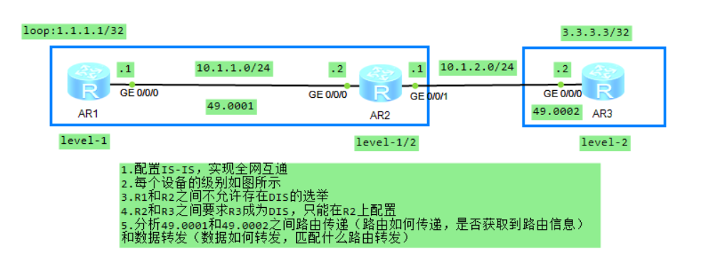
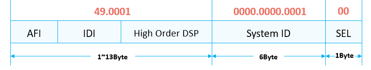
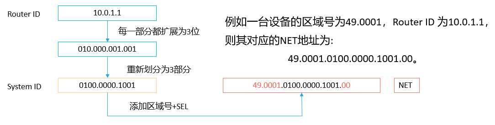
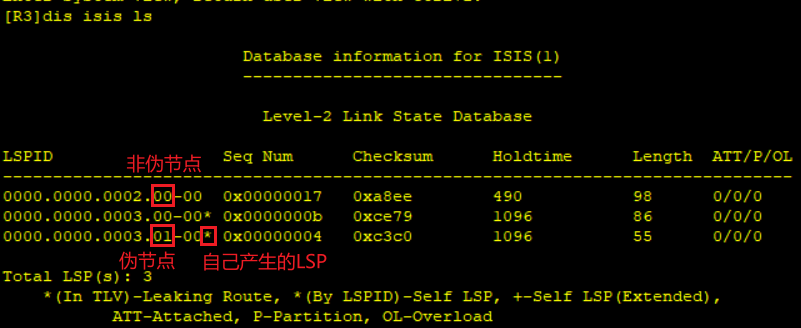
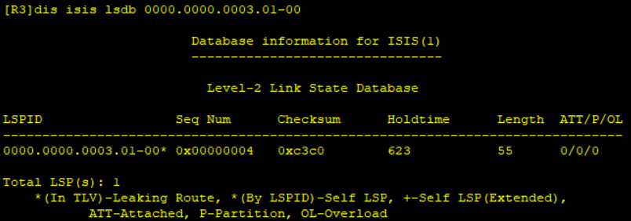

# IS-IS（华为）
## 常用命令
- 进入系统视图：
`<Huawei>system-view`
- 关闭信息中心：
`[Huawei]undo info-center enable`
- 删除某条配置：
`[Huawei]undo xxxx`
- 更改名称：
`[Huawei]sysname S2`
- 查看当前配置：
```
[S2]display current-configuration`
[S2-GigabitEthernet0/0/1]display this
<S1>display ip interface brief Vlanif 30
```

- 查看路由表：
`[S2]dis ip routing-table`
- 保存配置：
`<S1>save`
- 删除所有静态路由
`undo ip rou static all`
## IS-IS

### 常用命令
- 查看isis邻接表
`dis isis peer`
- 查看isis链路状态表
`dis isis lsdb`
- 查看isis路由表
`dis isis route`

### NET
NET（Network Entity Title，网络实体名称）是OSI协议栈中设备的网络层信息，主要用于路由计算，由区域地址（Area ID）和System ID组成，可以看作是特殊的NSAP（SEL为00的NSAP）。

- 一般根据Router ID配置System ID


```c
//创建ISIS进程并配置网络实体名称（NET）
[R1-isis-1]network-entity 49.0001.0000.0000.0001.00
//接口使能ISIS
[R1-GigabitEthernet0/0/0]isis enable 1
[R1-LoopBack0]isis enable 1

[R2-isis-1]network-entity 49.0001.0000.0000.0002.00
[R2-GigabitEthernet0/0/0]isis enable 1
[R2-GigabitEthernet0/0/1]isis enable 1

[R3-isis-1]network-entity 49.0002.0000.0000.0003.00
[R3-GigabitEthernet0/0/0]isis enable 1
[R3-LoopBack0]isis enable 1
```
### IS-IS路由器分类
1. level-1路由器
   - Level-1路由器（例如图中的R1）是一种IS-IS区域内部路由器，它只与属于同一区域的Level-1和Level-1-2路由器形成邻接关系，这种邻接关系称为Level-1邻接关系。Level-1路由器无法与Level-2路由器建立邻接关系。
   - Level-1路由器只负责维护Level-1的链路状态数据库LSDB，该LSDB只包含本区域的路由信息。值得一提的是，Level-1路由器必须通过Level-1-2路由器接入IS-IS骨干区域从而访问其他区域。
2. level-1-2路由器
   - Level-1-2路由器与OSPF中的ABR非常相似，它也是IS-IS骨干网络的组成部分。
   - Level-1-2路由器维护两个LSDB，Level-1的LSDB用于区域内路由，Level-2的LSDB用于区域间路由。
   - 同时属于Level-1和Level-2的路由器称为Level-1-2路由器（例如图中的R2），它可以与同一区域的Level-1和Level-1-2路由器形成Level-1邻接关系，也可以与其他区域的Level-2和Level-1-2路由器形成Level-2的邻接关系。
3. level-2路由器
   - Level-2路由器（例如图中的R3）是IS-IS骨干路由器，它可以与同一或者不同区域的Level-2路由器或者Level-1-2路由器形成邻接关系。Level-2路由器维护一个Level-2的LSDB，该LSDB包含整个IS-IS域的所有路由信息。
   - 所有Level-2级别（即形成Level-2邻接关系）的路由器组成路由域的骨干网，负责在不同区域间通信。路由域中Level-2级别的路由器必须是物理连续的，以保证骨干网的连续性。

> **IS-IS在自治系统内采用骨干区域与非骨干区域两级的分层结构：**
> - Level-1路由器部署在非骨干区域。
> - Level-2路由器和Level-1-2路由器部署在骨干区域。
> - 每一个非骨干区域都通过Level-1-2路由器与骨干区域相连。

```c
//配置全局level级别
[R1-isis-1]is-level level-1
[R2-isis-1]is-level level-1-2
[R3-isis-1]is-level level-2
//配置接口level级别
[R3-GigabitEthernet0/0/2]isis circuit-level level-1
```
### DIS与伪节点
IS-IS会自动根据接口的数据链路层封装决定该接口的缺省网络类型， IS-IS支持两种类型的网络：
- 广播（Broadcast）
- 点到点（P2P）

在**广播网络**中，IS-IS需要在所有的路由器中选举一个路由器作为DIS（Designated Intermediate System）。

DIS用来创建和更新伪节点（Pseudonodes），并负责生成伪节点的LSP，用来描述这个网络上有哪些网络设备。伪节点是用来模拟广播网络的一个虚拟节点，并非真实的路由器。在IS-IS中，伪节点用DIS的System ID和Circuit ID（非0值）标识。

IS-IS链路状态报文LSP用于交换链路状态信息。LSP分为两种：Level–1 LSP和Level–2 LSP。Level–1 LSP由Level-1路由器传送，Level–2 LSP由Level-2路由器传送，Level-1-2路由器则可传送以上两种LSP。
```c
//查看伪节点LSP
[R3-isis-1]dis isis ls 0000.0000.0002.01-00 verbose 

//设置接口的网络类型为点对点网络，取消DIS选举以节省性能，广播网络中才选举DIS
[R1-GigabitEthernet0/0/0]isis circuit-type p2p
[R2-GigabitEthernet0/0/0]isis circuit-type p2p

//恢复接口默认网络类型
[R1-GigabitEthernet0/0/0]undo isis circuit-type

//修改接口DIS优先级（默认64，越大越优先）
[R2-GigabitEthernet0/0/1]isis dis-priority 20

//修改链路cost（默认10）
[R2-GigabitEthernet0/0/0]isis cost 5
```
- 查看LSDB：

- 查看伪节点LSP：


### Level-1路由器的路由计算
- R1是LLevel-1路由器，只维护Level-1 LSDB
- Level-1路由器根据LSDB中的Level-1 LSP计算出Area 49.0001内的拓扑，以及到达区域内各个网段的路由信息。
- R2为Area 49.0001内的Level-1-2路由器，会在它们向该区域下发的Level-1 LSP中设置**ATT标志位**，用于向区域内的Level-1路由器宣布可以通过自己到达其他区域。 R1作为Level-1路由器，会根据该ATT标志位，计算出指向R2的默认路由（通过该缺省路由其他区域到达）。

通过**路由渗透**，可以将区域间路由通过Leve-1-2路由器传递到Level-1区域，此时Leve-1路由器可以学习到其他区域的详细路由，从而计算出最优路径。
```c
//L1根据ATT产生对L1/L2设备的缺省路由，多条缺省路由可能产生次优路径
//路由渗透，将L2的路由引入L1，避免次优路径
[R2]ip ip-prefix 1 permit 3.3.3.3
[R2-isis-1]import-route isis level-2 into level-1 filter-policy ip-prefix 1
//路由渗透，网段
[R2]ip ip-prefix 1 permit 100.1.1.0 24
[R2-isis-1]import-route isis level-2 into level-1 filter-policy ip-prefix 1

//路由汇总
[R6-isis-1]summary 8.8.0.0 255.255.248.0
```
### IS-IS认证
IS-IS认证是基于网络安全性的要求而实现的一种认证手段，通过在IS-IS报文中增加认证字段对报文进行认证。当本地路由器接收到远端路由器发送过来的IS-IS报文，如果发现认证密码不匹配，则将收到的报文进行丢弃，达到自我保护的目的。

- 接口认证：
  - 在接口视图下配置，对**Level-1和Level-2**的**Hello报文**进行认证。
  - Hello报文使用的认证密码保存在接口下，发送带认证TLV的认证报文，互相连接的路由器接口必须配置相同的口令。
- 区域认证：
  - 在IS-IS进程视图下配置，对**Level-1**的**CSNP、PSNP和LSP报文**进行认证。
  - 区域内的每一台L1路由器都必须使用相同的认证模式和具有共同的钥匙串。
- 路由域认证：
  - 在IS-IS进程视图下配置，对**Level-2**的**CSNP、PSNP和LSP报文**进行认证。
  - IS-IS域内的每一台L2和L1/L2类型的路由器都必须使用相同模式的认证，并使用共同的钥匙串。

对于区域和路由域认证，可以设置为SNP和LSP分开认证。
```c
//区域认证 L1
[R1-isis-1]area-authentication-mode md5 plain huawei
[R2-isis-1]area-authentication-mode md5 plain huawei

//路由域认证 L2
[R2-isis-1]domain-authentication-mode md5 plain huawei
[R3-isis-1]domain-authentication-mode md5 plain huawei

//接口认证
[R1-GigabitEthernet0/0/0]isis authentication-mode md5 plain huawei
[R2-GigabitEthernet0/0/0]isis authentication-mode md5 plain huawei
```


