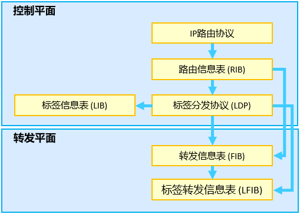
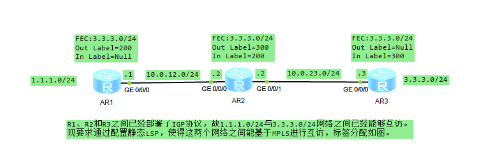
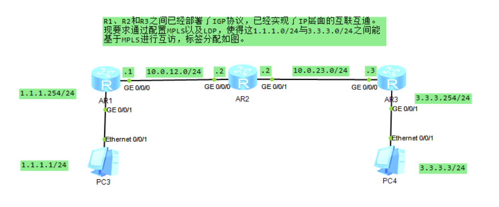
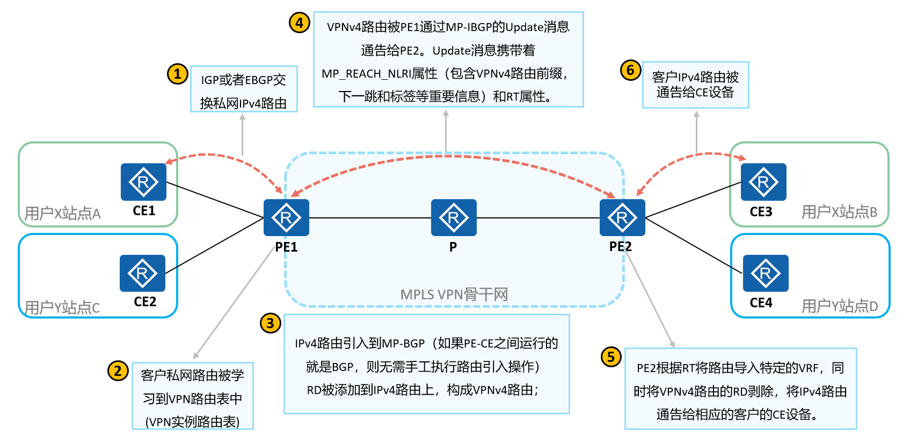
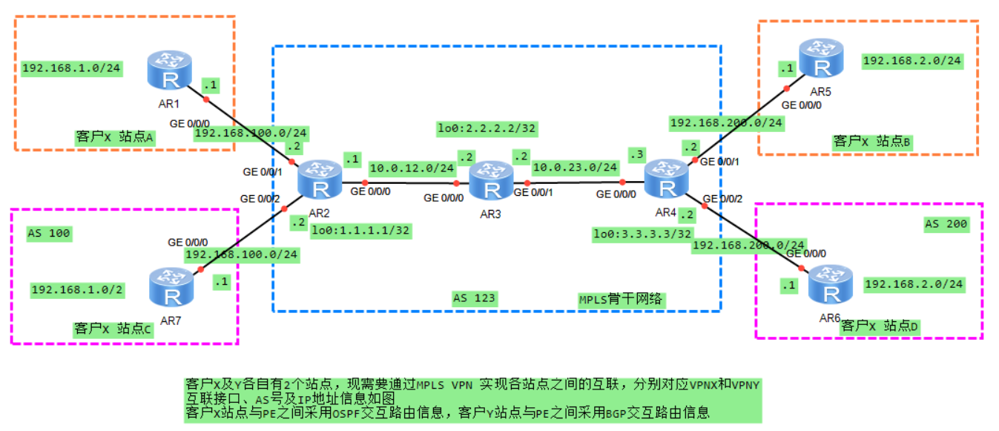
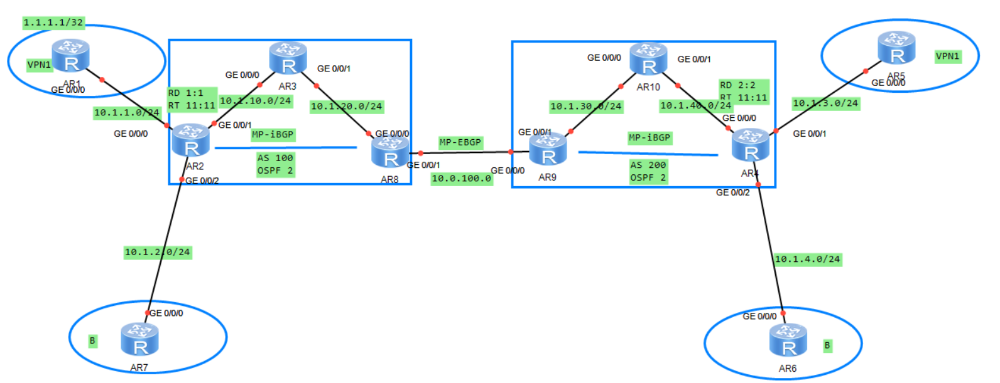
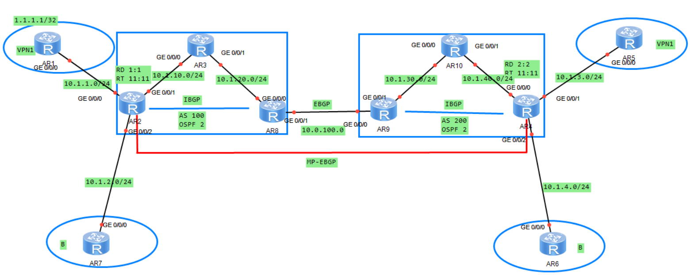

# MPLS（华为）
## 常用命令
- 进入系统视图：
`<Huawei>system-view`
- 关闭信息中心：
`[Huawei]undo info-center enable`
- 删除某条配置：
`[Huawei]undo xxxx`
- 更改名称：
`[Huawei]sysname S2`
- 查看当前配置：
```c
[S2]display current-configuration`
[S2-GigabitEthernet0/0/1]display this
<S1>display ip interface brief Vlanif 30
```

- 查看路由表：
`[S2]dis ip routing-table`
- 保存配置：
`<S1>save`
- 删除所有静态路由
`undo ip rou static all`
## 基础
### 常用命令
```c
//查看静态LSP配置
[R2]dis mpls static-lsp
//查看LDP邻居状态
<R1>display mpls ldp peer 
//查看LDP会话状态
<R1>display mpls ldp session 
//查看LDP创建的LSP信息
<R1>dis mpls ldp lsp
//查看LSP信息
<R1>dis mpls lsp
//查看使能VPNv4的MP-BGP对等体
display bgp vpnv4 all peer 
//查看MP-BGP的VPN路由
[R2-bgp]dis bgp vpnv4 vpn-instance VPNX routing-table 
//查看BGP vpn实例的路由标签
[R2-bgp]dis bgp vpnv4 vpn-instance VPN1 rou label 
//查看BGP路由标签
[R2-bgp]dis bgp  rou label 
//查看IP 1.1.1.1的vpn路由
[R2]dis bgp vpnv4 all rou 1.1.1.1
```
---
MPLS位于TCP/IP协议栈中的数据链路层和网络层之间，可以向所有网络层提供服务。

- MPLS域（MPLS Domain）：一系列连续的运行MPLS的网络设备构成了一个MPLS域。
- LSR（Label Switching Router，标签交换路由器）：支持MPLS的路由器（实际上也指支持MPLS的交换机或其他网络设备）。位于MPLS域边缘、连接其它网络的LSR称为边沿路由器LER（Label Edge Router），区域内部的LSR称为核心LSR（Core LSR）。
- 除了根据LSR在MPLS域中的位置进行分类之外，还可以根据对数据处理方式的不同进行分类：
  - 入站LSR（Ingress LSR）：通常是向IP报文中压入MPLS头部并生成MPLS报文的LSR。
  - 中转LSR（Transit LSR）：通常是将MPLS报文进行例如标签置换操作，并将报文继续在MPLS域中转发的LSR。
  - 出站LSR（Egress LSR）：通常是将MPLS报文中MPLS头部移除，还原为IP报文的LSR。


- FEC（Forwarding Equivalence Class，转发等价类）是一组具有某些共性的数据流的集合，这些数据流在转发过程中被网络节点以相同方式处理。
  - 在MPLS网络中，FEC可以通过多种方式划分，例如基于目的IP地址及网络掩码、DSCP等特征来划分。
  - 数据属于哪一个LSP，由数据进入MPLS域时的Ingress LSR决定。
  - MPLS标签通常是与FEC相对应的，必须有某种机制使得网络中的LSR获得关于某FEC的标签信息。
- LSP（Label Switched Path，标签交换路径）是标签报文穿越MPLS网络到达目的地所走的路径。
  - 同一个FEC的报文通常采用相同的LSP穿越MPLS域，所以对同一个FEC，LSR总是用相同的标签转发。
- IP报文进入MPLS域之前，会被入站LSR压入MPLS头部（又叫MPLS标签），形成一个MPLS标签报文。一个标签报文可以包含一个或多个MPLS标签。
  - MPLS支持一层或多层标签头部，这些标签头部的有序集合被称为标签栈（Label Stack）。
## MPLS转发
MPLS转发的本质就是将数据归到对应的FEC并按照提前建立好的LSP进行转发。
- 对于整个MPLS域，LSP是某一给定的FEC进入域和离开域的路径，可以看成是LSR的有序集合。
- 对于单台LSR，需要建立标签转发表，用标签来标识FEC，并绑定相应的标签处理和转发等行为。
- 同一个FEC，若进入MPLS域的Ingress LSR（入站LSR）不同，转发时的LSP也不相同。
- 同一个FEC，LSR的处理方式相同，不论这个FEC来自哪里（进入设备的接口）。
- LSR的转发动作决定了LSP，而标签转发表确定转发动作，所以建立标签转发表也可以理解为建立LSP。
### MPLS体系结构

MPLS的体系结构由控制平面 (Control Plane)和转发平面 (Forwarding Plane)组成。
- 控制平面：
  - 控制平面是无连接的，主要功能是负责产生和维护路由信息以及标签信息。
  - 控制平面包括：
    - 路由信息表RIB（Routing Information Base）：由IP路由协议（IP Routing Protocol）、静态路由和直连路由共同生成，用于选择路由。
    - 标签信息表LIB（Label Information Base）：用于管理标签信息，LIB中的表项可由标签交换协议（LDP、RSVP等协议）或静态配置生成。
- 转发平面：
  - 转发平面也称为数据平面，是面向连接的， 主要功能是负责普通IP报文的转发以及带MPLS标签报文的转发。
  - 转发平面包括：
    - 转发信息表FIB（Forwarding Information Base）：从RIB提取必要的路由信息生成，负责普通IP报文的转发。
    - 标签转发信息表LFIB（Label Forwarding Information Base）：简称标签转发表，负责带MPLS标签报文的转发。

---
LSP建立原则：
- 当网络层协议为IP协议时，FEC所对应的路由必须存在于LSR的IP路由表中，否则该FEC的标签转发表项不生效。
- LSR用标签标识指定FEC，所以该FEC的数据被发送至LSR时，必须携带正确的标签，才能被LSR正确的处理。

MPLS需要为报文事先分配好标签，建立一条LSP，才能进行报文转发。LSP分为静态LSP和动态LSP两种。
- 静态LSP：
  - 静态LSP是用户通过手工为各个FEC分配标签而建立的。
  - 静态LSP不使用标签发布协议，不需要交互控制报文，因此消耗资源比较小。
  - 通过静态方式建立的LSP不能根据网络拓扑变化动态调整，需要管理员干预。
  - 标签分配原则：
    - 前一节点出标签的值等于下一个节点入标签的值。
- 动态LSP：
  - 动态LSP通过标签发布协议动态建立。
  - 标签发布协议是MPLS的控制协议（也可称为信令协议），负责FEC的分类、标签的分发以及LSP的建立和维护等一系列操作。
  - 标签分发协议 (LDP,Label Distribution Protocol)：
    - LDP是多协议标签交换MPLS的一种控制协议，负责转发等价类FEC的分类、标签的分配以及标签交换路径LSP的建立和维护等操作。LDP规定了标签分发过程中的各种消息以及相关处理过程。
    - RSVP-TE：Resource Reservation Protocol Traffic Engineering，它是对RSVP的扩展，用于建立基于约束的LSP。它拥有普通LDP LSP没有的功能，如发布带宽预留请求、带宽约束、链路颜色和显式路径等。
    - MP-BGP：Multiprotocol Border Gateway Protocol，MP-BGP是在BGP协议基础上扩展的协议。MP-BGP支持为MPLS VPN业务中私网路由和跨域VPN的标签路由分配标签。
### 静态LSP配置

```c
//配置LSR的ID
//LSR ID用来在网络中唯一标识一个LSR
//LSR没有缺省的LSR ID，必须手工配置。为了提高网络的可靠性，推荐使用LSR某个Loopback接口的地址作为LSR ID并在配置前对网络中所有LSR的LSR ID进行统一规划
[R1]mpls lsr-id 5.5.5.1
//使能全局MPLS功能。
[R1]mpls
//使能接口MPLS功能
[R1-GigabitEthernet0/0/0]mpls

//配置R2 LSR的ID并使能全局和接口MPLS
[R2]mpls lsr-id 5.5.5.2
[R2]mpls
[R2-GigabitEthernet0/0/0]mpls
[R2-GigabitEthernet0/0/1]mpls

//配置R3 LSR的ID并使能全局和接口MPLS
[R3]mpls lsr-id 5.5.5.3
[R3]mpls
[R3-GigabitEthernet0/0/0]mpls

//R1到R3的静态LSP
//Ingress LSR配置
//出标签200
[R1]static-lsp ingress 1-3 destination 3.3.3.3 24 nexthop 10.0.12.2 out-label 200
//Transit LSR配置
//入标签200，出标签300
//in-label的取值范围为16~1023。out-label的取值范围为16~1048575。
[R2]static-lsp transit 1-3 incoming-interface g0/0/0 in-label 200 nexthop 10.0.23.3 out-label 300
//Egress LSR配置
//入标签300
[R3]static-lsp egress 1-3 incoming-interface g0/0/0 in-label 300

//查看静态LSP配置
[R2]dis mpls static-lsp
```

### LDP
LDP是MPLS的一种控制协议，相当于传统网络中的信令协议，负责FEC的分类、标签的分配以及LSP的建立和维护等操作。LDP规定了标签分发过程中的各种消息以及相关处理过程。

LDP的工作过程：
1. LSR之间建立LDP会话。
2. LSR之间基于LDP会话动态交换标签与FEC的映射信息，并根据标签信息建立LSP。

LSR之间交互标签绑定消息之前必须建立LDP会话。LDP会话可以分为：
- 本地LDP会话（Local LDP Session）：建立会话的两个LSR之间是直连的；
- 远程LDP会话（Remote LDP Session）：建立会话的两个LSR之间可以是直连的，也可以是非直连的。

两台LSR之间交互Hello消息之后，即建立起邻接体（Adjacency）关系；在建立邻接体关系的基础上，两台LSR之间交互，两台设备之间形成LDP对等体关系；LDP会话消息，建立起LDP会话。

每一台运行了LDP的LSR除了必须配置LSR ID，还必须拥有LDP ID。
- LDP ID的长度为48bit，由32bit的LSR ID与16bit的标签空间标识符（Label Space ID）构成。
- LDP ID以“LSR ID : 标签空间标识”的形式呈现。例如2.2.2.2:0。
- 标签空间标识一般存在两种形态：
  - 值为0：表示基于设备（或基于平台）的标签空间；
  - 值非0：表示基于接口的标签空间。

在MPLS网络中，下游LSR决定标签和FEC的绑定关系，并将这种绑定关系发布给上游LSR。
  - MPLS根据数据的转发方向确定上、下游关系。标签报文从上游LSR发出，被下游LSR接收并处理。

LDP通过发送标签请求和标签映射消息，在LDP对等体之间通告FEC和标签的绑定关系来建立LSP

**PHP（Penultimate Hop Popping，次末跳弹出）**，如果激活了PHP特性，那么egress节点在为本地路由分配标签的时候，会分配一个特殊标签—3，该标签被称为隐式空标签（Implicit NULL Label）。当LSR转发一个标签报文时，如果发现对应的出标签值为3，则LSR会将栈顶标签弹出，并将里面所封装的数据转发给下游LSR。

### 动态LSP配置

```c
//配置LSR的ID及使能mpls
//lsr-id必须是本地的ip地址
[R1]mpls lsr-id 10.1.12.1
[R1]mpls
//使能全局ldp
[R1-mpls]mpls ldp
//使能全局及接口mpld和ldp
[R1-GigabitEthernet0/0/0]mpls
[R1-GigabitEthernet0/0/0]mpls ldp

//配置LSP，使能mpls、ldp
[R2]mpls lsr-id 10.0.12.2
[R2]mpls
[R2-mpls]mpls ldp
[R2-GigabitEthernet0/0/0]mpls
[R2-GigabitEthernet0/0/0]mpls ldp
[R2-GigabitEthernet0/0/1]mpls
[R2-GigabitEthernet0/0/1]mpls ldp

//配置LSP，使能mpls、ldp
[R3]mpls lsr-id 10.0.23.3
[R3]mpls
[R3-mpls]mpls ldp
[R3-GigabitEthernet0/0/0]mpls
[R3-GigabitEthernet0/0/0]mpls ldp

//lsp-trigger命令用来指定哪些静态路由及IGP路由会触发LDP LSP的建立
//缺省情况下，根据32位地址的IP路由触发LDP建立LSP
//配置ip-prefix触发LDP
[R1]ip ip-prefix ldp permit 1.1.1.0 24
[R1-mpls]lsp-trigger ip-prefix ldp

//配置ip-prefix触发LDP
[R3]ip ip-prefix ldp permit 3.3.3.0 24
[R3-mpls]lsp-trigger ip-prefix ldp
```

## MPLS_VPN
MPLS VPN网络架构由三部分组成：CE（Customer Edge）、PE（Provider Edge）和P（Provider）
- CE：用户网络边缘设备，有接口直接与运营商网络相连。CE可以是路由器或交换机，也可以是一台主机。通常情况下，CE“感知”不到VPN的存在，也不需要支持MPLS。
- PE：运营商边缘路由器，是运营商网络的边缘设备，与CE直接相连。在MPLS网络中，对VPN的所有处理都发生在PE上，对PE性能要求较高。
- P：运营商网络中的骨干路由器，不与CE直接相连。P设备只需要具备基本MPLS转发能力，不维护VPN相关信息。

MPLS VPN不是单一的一种VPN技术，是多种技术结合的综合解决方案，主要包含下列技术：
- MP-BGP：负责在PE与PE之间传递站点内的路由信息。
- LDP：负责PE与PE之间的隧道建立
- VRF：负责PE的VPN用户管理。
- 静态路由、IGP、BGP：负责PE与CE之间的路由信息交换。

### 入口PE到出口PE路由传递 
VRF（Virtual Routing and Forwarding，虚拟路由转发），又称VPN实例，是MPLS VPN架构中的关键技术，每个VPN实例使用独立的路由转发表项，实现VPN之间的逻辑隔离。

PE收到不同VPN的CE发来的IPv4地址前缀，本地根据VPN实例配置去区分这些地址前缀。但是VPN实例只是一个本地的概念，PE无法将VPN实例信息传递到对端PE，故有了RD（Route Distinguisher，路由标识符）。
- RD长8字节，用于区分使用相同地址空间的IPv4前缀。
- PE从CE接收到IPv4路由后，在IPv4前缀前加上RD，转换为全局唯一的VPN-IPv4路由。

VPN-IPv4地址又被称为VPNv4地址：VPNv4地址共有12个字节，包括8字节的路由标识符RD（Route Distinguisher）和4字节的IPv4地址前缀。
- RD:100:1,IP:192.168.1.0/24-->VPNv4地址:100:1:192.168.1.0/24

### 入口PE到出口PE路由传递 
PE之间建立MP-BGP邻居关系，并通过BGP进行路由传递。
- MP-BGP将VPNv4传递到远端PE之后，远端PE需要将VPNv4路由导入正确的VPN实例。
- MPLS VPN使用32位的BGP扩展团体属性－VPN Target（也称为Route Target）来控制VPN路由信息的发布与接收。
- 本地PE在发布VPNv4路由前附上RT属性，对端PE在接收到VPNv4路由后根据RT将路由导入对应的VPN实例。

在PE上，每一个VPN实例都会与一个或多个VPN Target属性绑定，有两类VPN Target属性：
- Export Target（ERT）：本地PE从直接相连站点学到IPv4路由后，转换为VPN IPv4路由，并为这些路由添加Export Target属性。Export Target属性作为BGP的扩展团体属性随路由发布。
- Import Target（IRT）：PE收到其它PE发布的VPN-IPv4路由时，检查其Export Target属性。当此属性与PE上某个VPN实例的Import Target匹配时，PE就把路由加入到该VPN实例的路由表。

VPN-Target的配置格式与RD格式一致。

#### P设备路由黑洞
骨干网络使用两层标签进行数据转发：
- 内层标签（私网标签）由PE的MP-BGP为VPN路由分发。PE根据内层标签确定数据所属的VPN。
- 外层标签（公网标签）由LDP为VPN路由的NextHop（一般是PE的某个接口地址）分发，P根据外层标签转发数据到PE。


PE上分配私网标签的方法有如下两种：
- 基于路由的MPLS标签分配：为VPN路由表的每一条路由分配一个标签（one label per route）。这种方式的缺点是：当路由数量比较多时，设备入标签映射表ILM（Incoming Label Map）需要维护的表项也会增多，从而提高了对设备容量的要求。
- 基于VPN实例的MPLS标签分配：为整个VPN实例分配一个标签，该VPN实例里的所有路由都共享一个标签。使用这种分配方法的好处是节约了标签。

私网路由交叉：VPNv4路由与本地VPN实例的VPN-Target进行匹配的过程称为私网路由交叉。PE在收到VPNv4路由后，既不进行优选，也不检查隧道是否存在，直接将其与本地的VPN实例进行交叉。

隧道迭代：为了将私网流量通过公网传递到另一端，需要有一条公网隧道承载这个私网流量。因此私网路由交叉完成后，需要根据目的IPv4前缀进行路由迭代，即该**IPv4路由的下一跳有对应的LSP存在**；只有隧道迭代成功，该路由才被放入对应的VPN实例路由表。
>路由迭代：为了能够将报文正确转发出去，BGP设备必须先找到一个直接可达的地址，通过这个地址到达路由表中指示的下一跳。在上述过程中，去往直接可达地址的路由被称为依赖路由，BGP路由依赖于这些路由指导报文转发。根据下一跳地址找到依赖路由的过程就是路由迭代。

路由传递过程：
- PE和P设备之间运行LDP，交换公网标签，建立PE之间的LSP隧道（公网隧道）。
- 入口PE在通过MP-BGP传递VPNv4路由时，会携带私网标签，用于区分不同VPN的数据。
- 出口PE在接收到VPNv4路由后，需要执行私网路由交叉和隧道迭代来选择路由。


### 入口PE到出口PE路由传递
PE根据VPNv4路由所携带的RT将路由导入正确的VPN实例之后，VPNv4路由的RD值剥除，将IPv4路由通告给相应的客户的CE设备。站点B和站点D的CE设备就能学习到去往各自远端站点的路由。



### 报文转发过程
1. CE3上存在到192.168.1.0/24网段路由，发送一个普通IP报文。
2. PE2根据绑定的VPN实例的RD查找对应VPN的转发表。
3. 匹配目的IPv4前缀，查找对应的Tunnel-ID，
4. 根据Tunnel-ID找到隧道，并打上对应的内层标签（I-L）。
5. 将报文从隧道发送出去，即打上公网（外层）MPLS标签头（O-L1）
6. 骨干网的所有P设备都对该报文进行外层标签交换，直到到达PE1。
7. PE1收到该携带两层标签的报文，交给MPLS处理，MPLS协议将去掉外层标签。
8. PE1继续处理内层标签：根据内层标签确定对应的下一跳，并将内层标签剥离后，以纯IPv4报文的形式发送给CE1。
9. CE1收到该IPv4报文后，进行常规的IPv4处理流程。

### MPLS_VPN配置

```c
//配置OSPF，实现骨干网互通

//骨干网内部配置MPLS与LDP，建立公网隧道
[R2]mpls lsr-id 1.1.1.1
[R2]mpls
[R2-mpls]mpls ldp
[R2-GigabitEthernet0/0/0]mpls
[R2-GigabitEthernet0/0/0]mpls ldp

[R3]mpls lsr-id 2.2.2.2
[R3]mpls
[R3-mpls]mpls ldp
[R3-GigabitEthernet0/0/0]mpls
[R3-GigabitEthernet0/0/0]mpls ldp
[R3-GigabitEthernet0/0/1]mpls
[R3-GigabitEthernet0/0/1]mpls ldp

[R4]mpls lsr-id 3.3.3.3
[R4]mpls
[R4-mpls]mpls ldp
[R4-GigabitEthernet0/0/0]mpls
[R4-GigabitEthernet0/0/0]mpls ldp

//建立PE（R2、R4）之间的MP-BGP对等体关系
[R2]bgp 123
[R2-bgp]router-id 1.1.1.1
[R2-bgp]peer 3.3.3.3 as-number 123
//连接端口改为环回口
[R2-bgp]peer 3.3.3.3 connect-interface LoopBack 0
//使能与指定MP-BGP对等体之间交换VPNv4路由信息
[R2-bgp]ipv4-family vpnv4 unicast 
[R2-bgp-af-vpnv4]peer 3.3.3.3 enable 

[R4]bgp 123
[R4-bgp]router-id 3.3.3.3
[R4-bgp]peer 1.1.1.1 as-number 123
//连接端口改为环回口
[R4-bgp]peer 1.1.1.1 connect-interface lo 0
//使能与指定MP-BGP对等体之间交换VPNv4路由信息
[R4-bgp]ipv4-family vpnv4 unicast
[R4-bgp-af-vpnv4]peer 1.1.1.1 enable 

//查看LSP信息
display mpls lsp 
//查看使能VPNv4的MP-BGP对等体
display bgp vpnv4 all peer 

//PE配置VPN实例
//VPNX实例
[R2]ip vpn-instance VPNX
//配置RD
[R2-vpn-instance-VPNX]route-distinguisher 100:1
//配置RT
[R2-vpn-instance-VPNX-af-ipv4]vpn-target 100:321 import-extcommunity 
[R2-vpn-instance-VPNX-af-ipv4]vpn-target 100:123 export-extcommunity 

//VPNY实例
[R2]ip vpn-instance VPNY
//配置RD
[R2-vpn-instance-VPNY]route-distinguisher 200:1
//配置RT
[R2-vpn-instance-VPNY-af-ipv4]vpn-target 200:234 import-extcommunity 
[R2-vpn-instance-VPNY-af-ipv4]vpn-target 200:432 export-extcommunity 

//接口分别与VPN实例绑定并重新配置IP
[R2-GigabitEthernet0/0/1]ip binding vpn-instance VPNX
[R2-GigabitEthernet0/0/1]ip a 192.168.100.2 24
[R2-GigabitEthernet0/0/2]ip binding vpn-instance VPNY
[R2-GigabitEthernet0/0/2]ip a 192.168.100.2 24

//VPNX实例
[R4]ip vpn-instance VPNX
//配置RD
//相同的VPN实例RD值相同
[R4-vpn-instance-VPNX]route-distinguisher 100:1
//配置RT
//相同相同的VPN实例ERT与IRT相对应
[R4-vpn-instance-VPNX-af-ipv4]vpn-target 100:123 import-extcommunity 
[R4-vpn-instance-VPNX-af-ipv4]vpn-target 100:321 export-extcommunity   

//VPNY实例
[R4]ip vpn-instance VPNY
//配置RD
//相同的VPN实例RD值相同
[R4-vpn-instance-VPNY]route-distinguisher 200:1
//配置RT
//相同相同的VPN实例ERT与IRT相对应
[R4-vpn-instance-VPNY-af-ipv4]vpn-target 200:432 import-extcommunity 
[R4-vpn-instance-VPNY-af-ipv4]vpn-target 200:234 export-extcommunity 

//接口分别与VPN实例绑定并重新配置IP
[R4-GigabitEthernet0/0/1]ip binding vpn-instance VPNX
[R4-GigabitEthernet0/0/1]ip a 192.168.100.2 24
[R4-GigabitEthernet0/0/2]ip binding vpn-instance VPNY
[R4-GigabitEthernet0/0/2]ip a 192.168.100.2 24

//PE与CE路由交互
//OSPF
//创建与VPN实例绑定的OSPF进程
[R2]ospf 2 vpn-instance VPNX
[R2-ospf-2-area-0.0.0.0]network 192.168.100.2 0.0.0.0
//OSPF进程与MP-BGP之间的VPN路由双向引入
[R2-ospf-2]import-route bgp
[R2-bgp]ipv4-family vpn-instance VPNX
[R2-bgp-VPNX]import-route ospf 2

//创建与VPN实例绑定的OSPF进程
[R4]ospf 2 vpn-instance VPNX
[R4-ospf-2-area-0.0.0.0]net 192.168.200.2 0.0.0.0
//OSPF进程与MP-BGP之间的VPN路由双向引入
[R4-ospf-2]import-route bgp
[R4-bgp]ipv4-family vpn-instance VPNX
[R4-bgp-VPNX]import-route ospf 2

//查看MP-BGP的VPN路由
[R2-bgp]dis bgp vpnv4 vpn-instance VPNX routing-table 

//BGP
[R2-bgp]ipv4-family vpn-instance VPNY
[R2-bgp-VPNY]peer 192.168.100.1 as-number 100

[R4-bgp]ipv4-family vpn-instance VPNY
[R4-bgp-VPNY]peer 192.168.200.1 as-number 200
```


### MPLS_VPN跨域 Option B:


```c
//配置OSPF，实现骨干网互通

//骨干网内部配置MPLS与LDP，建立公网隧道
[R2]mpls lsr-id 2.2.2.2
[R2]mpls
[R2-mpls]mpls ldp
[R2-GigabitEthernet0/0/1]mpls
[R2-GigabitEthernet0/0/1]mpls ldp  

[R3]mpls lsr-id 3.3.3.3
[R3]mpls
[R3-mpls]mpls ldp
[R3-GigabitEthernet0/0/0]mpls
[R3-GigabitEthernet0/0/0]mpls ldp
[R3-GigabitEthernet0/0/1]mpls
[R3-GigabitEthernet0/0/1]mpls ldp

[R8]mpls lsr-id 8.8.8.8 
[R8]mpls 
[R8-mpls]mpls ldp
[R8-GigabitEthernet0/0/0]mpls
[R8-GigabitEthernet0/0/0]mpls ldp

//建立PE与ASBR-PE（R2、R8）之间的MP-BGP对等体关系
[R2]bgp 100
[R2-bgp]router-id 2.2.2.2
[R2-bgp]peer 8.8.8.8 as-number 100
//连接端口改为环回口
[R2-bgp]peer 8.8.8.8 connect-interface LoopBack 0
//使能与指定MP-BGP对等体之间交换VPNv4路由信息
[R2-bgp]ipv4-family vpnv4 unicast 
[R2-bgp-af-vpnv4]peer 8.8.8.8 enable 

[R8]bgp 100
[R8-bgp]router-id 8.8.8.8
[R8-bgp]peer 2.2.2.2 as-number 100
//连接端口改为环回口
[R8-bgp]peer 2.2.2.2 connect-interface LoopBack 0
//使能与指定MP-BGP对等体之间交换VPNv4路由信息
[R8-bgp]ipv4-family vpnv4 unicast 
[R8-bgp-af-vpnv4]peer 2.2.2.2 enable 


//VPN1实例
[R2]ip vpn-instance VPN1
//配置RD
//相同的VPN实例RD值相同
[R2-vpn-instance-VPN1]route-distinguisher 1:1
//配置RT
//相同相同的VPN实例ERT与IRT相对应
[R2-vpn-instance-VPN1-af-ipv4]vpn-target 11:11
//接口与VPN实例绑定并重新配置IP
[R2-GigabitEthernet0/0/0]ip binding vpn-instance VPN1
[R2-GigabitEthernet0/0/0]ip a 10.1.1.1 24

//骨干网内部配置MPLS与LDP，建立公网隧道
[R4]mpls lsr-id 4.4.4.4
[R4]mpls
[R4-mpls]mpls ldp
[R4-GigabitEthernet0/0/0]mpls
[R4-GigabitEthernet0/0/0]mpls ldp

[R9]mpls lsr-id 9.9.9.9
[R9]mpls 
[R9-mpls]mpls ldp
[R9-GigabitEthernet0/0/1]mpls
[R9-GigabitEthernet0/0/1]mpls ldp

[R10]mpls lsr-id 10.10.10.10
[R10]mpls
[R10-mpls]mpls ldp
[R10-GigabitEthernet0/0/0]mpls
[R10-GigabitEthernet0/0/0]mpls ldp
[R10-GigabitEthernet0/0/1]mpls
[R10-GigabitEthernet0/0/1]mpls ldp

//建立PE与ASBR-PE（R4、R9）之间的MP-BGP对等体关系
[R4]bgp 200
[R4-bgp]router-id 4.4.4.4
[R4-bgp]peer 9.9.9.9 as-number 200
//连接端口改为环回口
[R4-bgp]peer 9.9.9.9 connect-interface LoopBack 0
//使能与指定MP-BGP对等体之间交换VPNv4路由信息
[R4-bgp]ipv4-family vpnv4 unicast 
[R4-bgp-af-vpnv4]peer 9.9.9.9 enable

[R9]bgp 200
[R9-bgp]router-id 9.9.9.9
[R9-bgp]peer 4.4.4.4 as-number 200
//连接端口改为环回口
[R9-bgp]peer 4.4.4.4 connect-interface LoopBack 0
//使能与指定MP-BGP对等体之间交换VPNv4路由信息
[R9-bgp]ipv4-family vpnv4 unicast 
[R9-bgp-af-vpnv4]peer 4.4.4.4 enable 

//VPN1实例
[R4]ip vpn-instance VPN1
//配置RD
//相同的VPN实例RD值相同
[R4-vpn-instance-VPN1]route-distinguisher 2:2
//配置RT
//相同相同的VPN实例ERT与IRT相对应
[R4-vpn-instance-VPN1-af-ipv4]vpn-target 11:11
//接口与VPN实例绑定并重新配置IP
[R4-GigabitEthernet0/0/1]ip binding vpn-instance VPN1
[R4-GigabitEthernet0/0/1]ip a 10.1.3.1 24

[R8-GigabitEthernet0/0/1]ip a 10.0.100.1 24
//ASBR-PE（R8、R9）之间使能MPLS
[R8-GigabitEthernet0/0/1]mpls
//建立ASBR-PE（R8、R9之间的MP-EBGP对等体关系
[R8-bgp]peer 10.0.100.2 as-number 200
//使能与指定MP-EBGP对等体之间交换VPNv4路由信息
[R8-bgp]ipv4-family vpnv4 unicast 
[R8-bgp-af-vpnv4]peer 10.0.100.2 enable 
//不对接收的VPNv4路由进行VPN-target过滤。
[R8-bgp-af-vpnv4]undo policy vpn-target  

[R9-GigabitEthernet0/0/0]ip a 10.0.100.2 24
//ASBR-PE（R8、R9）之间使能MPLS
[R9-GigabitEthernet0/0/0]mpls
//建立ASBR-PE（R8、R9之间的MP-EBGP对等体关系
[R9-bgp]peer 10.0.100.1 as-number 100
//使能与指定MP-EBGP对等体之间交换VPNv4路由信息
[R9-bgp]ipv4-family vpnv4 unicast 
[R9-bgp-af-vpnv4]peer 10.0.100.1 enable
//不对接收的VPNv4路由进行VPN-target过滤。
[R9-bgp-af-vpnv4]undo policy vpn-target  

//PE与CE路由交互
//OSPF
//创建与VPN实例绑定的OSPF进程
[R2]ospf 1 vpn-instance VPN1
[R2-ospf-1-area-0.0.0.0]network 10.1.1.1 0.0.0.0
//OSPF进程与MP-BGP之间的VPN路由双向引入
[R2-ospf-1]import-route bgp
[R2-bgp]ipv4-family vpn-instance VPN1
[R2-bgp-VPN1]import-route ospf 1

//IS-IS
//创建与VPN实例绑定的IS-IS进程
[R4]isis 1 vpn-instance VPN1
[R4-isis-1]network-entity 49.0001.0000.0000.0004.00
[R4-GigabitEthernet0/0/1]isis enable 1
//IS-IS进程与MP-BGP之间的VPN路由双向引入
[R4-isis-1]import-route bgp
[R4-bgp]ipv4-family vpn-instance VPN1
[R4-bgp-VPN1]import-route isis 1
```

### MPLS_VPN跨域 Option C1:

```c
//配置OSPF，实现骨干网互通
//骨干网内部配置MPLS与LDP，建立公网隧道
//建立ASBR（R8、R9之间的MP-EBGP对等体关系
//建立PE与ASBR（R4、R9）之间的MP-BGP对等体关系
//连接端口改为环回口
//建立PE与ASBR（R2、R8）之间的MP-BGP对等体关系
//连接端口改为环回口
//配置VPN1实例
//PE与CE路由交互


//建立PE（R2、R4）之间的MP-EBGP对等体关系
[R2-bgp]peer 4.4.4.4 as-number 200
//连接端口改为环回口
[R2-bgp]peer 4.4.4.4 connect-interface LoopBack 0
//设置建立EBGP连接允许的最大跳数
[R2-bgp]peer 4.4.4.4 ebgp-max-hop 20
//使能与指定MP-EBGP对等体之间交换VPNv4路由信息
[R2-bgp-af-vpnv4]peer 4.4.4.4 enable 

[R4-bgp]peer 2.2.2.2 as 100
//连接端口改为环回口
[R4-bgp]peer 2.2.2.2 connect-interface LoopBack 0
//设置建立EBGP连接允许的最大跳数
[R4-bgp]peer 2.2.2.2 ebgp-max-hop 20
//使能与指定MP-EBGP对等体之间交换VPNv4路由信息
[R4-bgp-af-vpnv4]peer 2.2.2.2 enable 

//骨干网路由IGP引入BGP
[R8-bgp]import-route ospf 2
[R9-bgp]import-route ospf 2

//ASBR（R8、R9）之间使能MPLS
[R8-GigabitEthernet0/0/1]mpls
[R9-GigabitEthernet0/0/0]mpls

//路由策略
//对于从本AS内的PE接收的路由，在向对端AS的ASBR发布时，分配MPLS标签
//为路由分配标签
[R9]route-policy 9-8 permi node 10
[R9-route-policy]apply mpls-label
[R9-bgp]peer 10.0.100.1 route-policy 9-8 export  
//使能相互交换标签IPv4路由的能力
[R9-bgp]peer 10.0.100.1 label-route-capability 

//对于向本AS内的PE发布的路由，如果是带标签的IPv4路由，为其分配新的MPLS标签。
//如果路由带有标签，则为其分配标签
[R8]route-policy 8-2 permit node 10
[R8-route-policy]if-match mpls-label
[R8-route-policy]apply mpls-label 
[R8-bgp]peer 2.2.2.2 route-policy 8-2 export 
//使能相互交换标签IPv4路由的能力
[R8-bgp]peer 2.2.2.2 label-route-capability 

//使能相互交换标签IPv4路由的能力
[R8-bgp]peer 10.0.100.2 label-route-capability

//使能相互交换标签IPv4路由的能力
[R2-bgp]peer 8.8.8.8 label-route-capability 

//路由策略
//对于从本AS内的PE接收的路由，在向对端AS的ASBR发布时，分配MPLS标签
//为路由分配标签
[R8]route-policy 8-9 permit node 10
[R8-route-policy]apply mpls-label 
[R8-bgp]peer 10.0.100.2 route-policy 8-9 export 

//对于向本AS内的PE发布的路由，如果是带标签的IPv4路由，为其分配新的MPLS标签。
//如果路由带有标签，则为其分配标签
[R9]route-policy 9-4 permit node 10
[R9-route-policy]if-match mpls-label 
[R9-route-policy]apply mpls-label 
[R9-bgp]peer 4.4.4.4 route-policy 9-4 export 
//使能相互交换标签IPv4路由的能力
[R9-bgp]peer 4.4.4.4 label-route-capability

//使能相互交换标签IPv4路由的能力
[R4-bgp]peer 9.9.9.9 label-route-capability 

//查看BGP vpn实例的路由表
[R2-bgp]dis bgp vpnv4 vpn-instance VPN1 rou label 
//查看BGP路由标签
[R2-bgp]dis bgp  rou label 
```

MPLS_VPN跨域 option C2：
```c
//配置OSPF，实现骨干网互通
//骨干网内部配置MPLS与LDP，建立公网隧道
//建立ASBR（R8、R9之间的MP-EBGP对等体关系
//配置VPN1实例
//PE与CE路由交互


//建立PE（R2、R4）之间的MP-EBGP对等体关系
[R2-bgp]peer 4.4.4.4 as-number 200
//连接端口改为环回口
[R2-bgp]peer 4.4.4.4 connect-interface LoopBack 0
//设置建立EBGP连接允许的最大跳数
[R2-bgp]peer 4.4.4.4 ebgp-max-hop 20
//使能与指定MP-EBGP对等体之间交换VPNv4路由信息
[R2-bgp-af-vpnv4]peer 4.4.4.4 enable 

//建立PE（R2、R4）之间的MP-EBGP对等体关系
[R4-bgp]peer 2.2.2.2 as 100
//连接端口改为环回口
[R4-bgp]peer 2.2.2.2 connect-interface LoopBack 0
//设置建立EBGP连接允许的最大跳数
[R4-bgp]peer 2.2.2.2 ebgp-max-hop 20
//使能与指定MP-EBGP对等体之间交换VPNv4路由信息
[R4-bgp-af-vpnv4]peer 2.2.2.2 enable 

//骨干网路由IGP引入BGP
[R8-bgp]import-route ospf 2
[R9-bgp]import-route ospf 2

//ASBR（R8、R9）之间使能MPLS
[R8-GigabitEthernet0/0/1]mpls
[R9-GigabitEthernet0/0/0]mpls

//ASBR（R8、R9）上配置MPLS触发建立BGP标签路由LSP的能力
[R8-mpls]lsp-trigger bgp-label-route
[R9-mpls]lsp-trigger bgp-label-route

//路由策略
//对于从本AS内的PE接收的路由，在向对端AS的ASBR发布时，分配MPLS标签
//为路由分配标签
[R9]route-policy 9-8 permi node 10
[R9-route-policy]apply mpls-label
[R9-bgp]peer 10.0.100.1 route-policy 9-8 export  
//使能相互交换标签IPv4路由的能力
[R9-bgp]peer 10.0.100.1 label-route-capability 

//路由策略
//对于从本AS内的PE接收的路由，在向对端AS的ASBR发布时，分配MPLS标签
//为路由分配标签
[R8]route-policy 8-9 permit node 10
[R8-route-policy]apply mpls-label 
[R8-bgp]peer 10.0.100.2 route-policy 8-9 export 
//使能相互交换标签IPv4路由的能力
[R8-bgp]peer 10.0.100.2 label-route-capability

//骨干网路由BGP引入IGP
[R8-ospf-2]import-route bgp 
[R9-ospf-2]import-route bgp

//查看IP 1.1.1.1的vpn路由
[R2]dis bgp vpnv4 all rou 1.1.1.1
```