# vlan及ospf网络（华为）
## 常用命令
- 进入系统视图：
`<Huawei>system-view`
- 关闭信息中心：
`[Huawei]undo info-center enable`
- 删除某条配置：
`[Huawei]undo xxxx`
- 更改名称：
`[Huawei]sysname S2`
- 查看当前配置：
```
[S2]display current-configuration`
[S2-GigabitEthernet0/0/1]display this
<S1>display ip interface brief Vlanif 30
```

- 查看路由表：
`[S2]dis ip routing-table`
- 保存配置：
`<S1>save`
- 删除所有静态路由
`undo ip rou static all`
## 配置用户及telnet
```
//最大用户数5（虚拟终端）
[S2]user-interface maximum-vty 5
[S2]user-interface vty 0 4
//验证模式aaa
[S2-ui-vty0-4]authentication-mode aaa
//特权等级：1.参观级别 2.配置级 3.管理级
[S2-ui-vty0-4]user privilege level 3
[S2-ui-vty0-4]aaa
//配置telnet密码
[S2-aaa]local-user admin password cipher admin
[S2-aaa]local-user admin service-type telnet
```

## 网络基本配置
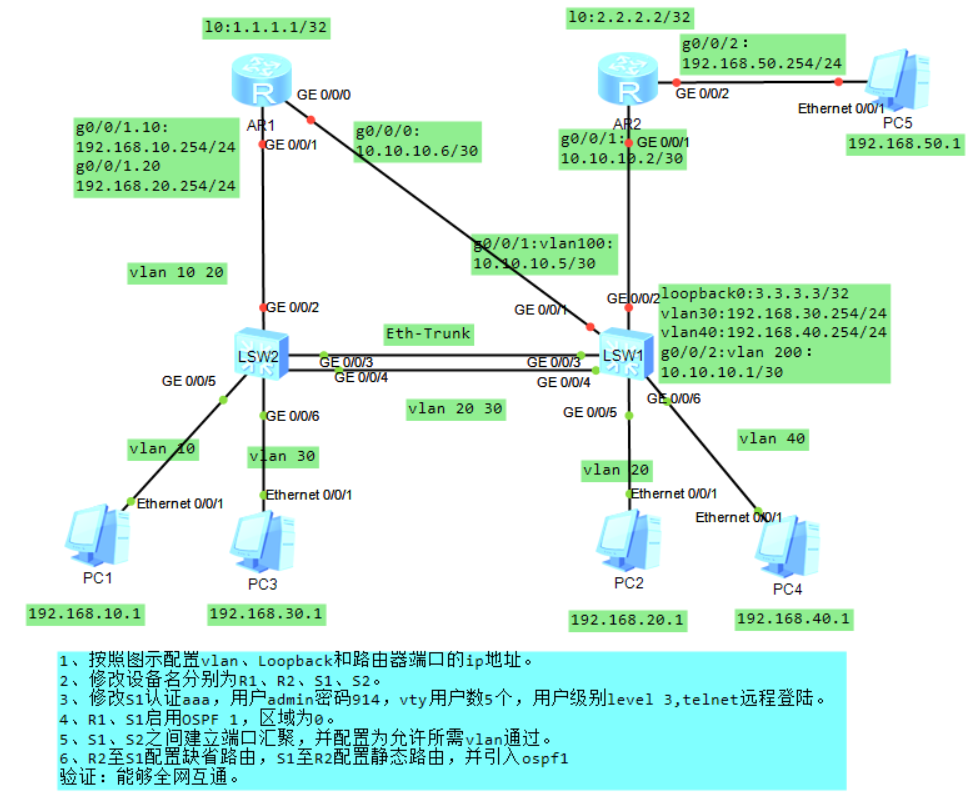

### 交换机
#### 划分VLAN
只有Trunk模式的端口才能发送带标记的报文，到了对方交换机，交换机会将该标记去掉，只将该数据帧转发到属于该vlan的端口上

默认状态下端口仅允许vlan1的发送和接收传输
```c
//批量创建vlan
[S2]vlan batch 10 20 30
//进入g 0/0/5接口
[S2]interface GigabitEthernet 0/0/5
//接口类型 access（端口只能属于一个vlan，始发或递达数据帧，会添加或剥去Tag）
[S2-GigabitEthernet0/0/5]port link-type access
//通过的vlan
[S2-GigabitEthernet0/0/5]port default vlan 10
......
//接口类型 trunk（端口可以接收和发送多个vlan报文，传递数据帧）
[S2-GigabitEthernet0/0/2]port link-type trunk
[S2-GigabitEthernet0/0/2]port trunk allow-pass vlan 10 20
```
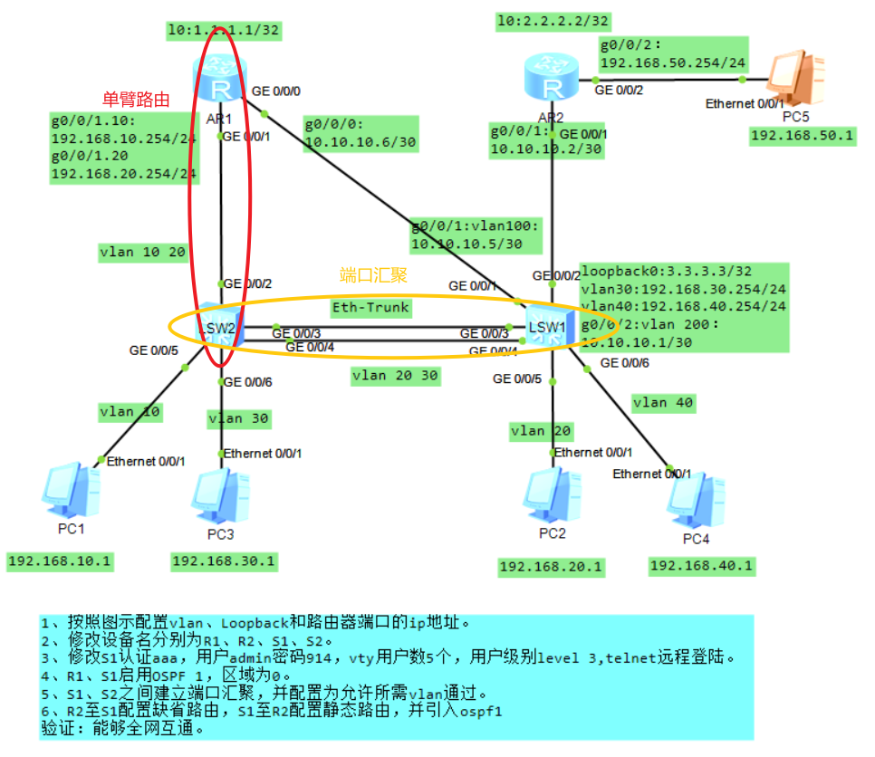
#### 端口汇聚
```c
//创建编号为1的Eth-Trunk端口（两端设备Eth-Trunk端口编号一致）
[S2]interface Eth-Trunk 1
//物理端口GE0/0/3和GE0/0/4加入Eth-Trunk 1端口
[S2-Eth-Trunk1]trunkport g 0/0/3 0/0/4
//接口类型 trunk
[S2-Eth-Trunk1]port link-type trunk
[S2-Eth-Trunk1]port trunk allow-pass vlan 20 30

//对端交换机S2配置相同
[S1]interface Eth-Trunk 1
[S1-Eth-Trunk1]trunkport g 0/0/3 0/0/4
[S1-Eth-Trunk1]port link-type trunk 
[S1-Eth-Trunk1]port trunk allow-pass vlan 20 30
```
#### 三层交换机
```c
[S1]interface LoopBack 0
[S1-LoopBack0]ip address 3.3.3.3 32
//对三层vlan虚拟接口设置ip地址，二层端口不能设置IP地址
[S1]interface Vlanif 30
[S1-Vlanif30]ip address 192.168.30.254 24
[S1-Vlanif30]interface Vlanif 40
[S1-Vlanif40]ip address 192.168.40.254 24
[S1-Vlanif40]interface Vlanif 100
[S1-Vlanif100]ip address 10.10.10.5 30
[S1-Vlanif100]interface Vlanif 200
[S1-Vlanif200]ip address 10.10.10.1 30
```

#### 本地环回地址
1. 路由器管理地址（逻辑接口不会down掉）
2. 作为动态路由协议OSPF、BGP的router id
3. 作为BGP建立TCP连接的源地址
```c
//设置本地环回地址
[S1]interface LoopBack 0
[S1-LoopBack0]ip address 3.3.3.3 32
```

#### 静态路由配置
ip route-static ip-address（目的网络） {mask|mask-length}（目的网络子网掩码）{nexthop-address|interface-type interface number[nexthop-address]}（下一跳地址）[preference preference]（优先级，管理距离，静态路由默认60，数值越小优先级越高）
```c
[S1]ip route-static 2.2.2.2 32 10.10.10.2
[S1]ip route-static 192.168.50.0 24 10.10.10.2
```

#### OSPF配置
```c
//启用OSPF进程，分配进程号1并配置路由标识3.3.3.3
//ospf process-id（进程号） router-id ip-address（路由标识，一般为环回地址）
[S1]ospf 1 router-id 3.3.3.3
//引入静态路由
[S1-ospf-1]import-route static 
[S1-ospf-1]area 0
//指定本路由直连的网段，哪些接口或网段使用OSPF
//network ip-network（网络号） wildcard-mask（反掩码）
[S1-ospf-1-area-0.0.0.0]network 3.3.3.3 0.0.0.0
[S1-ospf-1-area-0.0.0.0]network 192.168.30.0 0.0.0.255
[S1-ospf-1-area-0.0.0.0]network 192.168.40.0 0.0.0.255
[S1-ospf-1-area-0.0.0.0]network 10.10.10.0 0.0.0.3
[S1-ospf-1-area-0.0.0.0]network 10.10.10.4 0.0.0.3
```

### 路由器
#### 配置IP地址
```c
//环回地址IP
[R1]interface LoopBack 0
[R1-LoopBack0]ip address 1.1.1.1 32
//物理端口 GE0/0/0 IP
[R1]interface g 0/0/0
[R1-GigabitEthernet0/0/0]ip address 10.10.10.6 30
```

#### 单臂路由配置
单臂路由又名子接口，实际上是逻辑接口。采用单臂路由，即在路由器上设置多个逻辑子接口，每个子接口都可以单独设置一个IP地址，对应于一个VLAN

**对端交换机用于连接路由器的端口模式应设置为trunk，并允许对应VLAN通过**
```c
//创建 GE0/0/1 子接口10 子接口号一般与对应的VLAN号一致
[R1]interface g 0/0/1.10
//设置802.1Q协议并指定VLAN编号10
[R1-GigabitEthernet0/0/1.10]dot1q termination vid 10
//开启子接口的ARP广播功能
//若不配置此命令，将会导致该子接口无法主动发送ARP广播报文，以及向外转发IP报文
[R1-GigabitEthernet0/0/1.10]arp broadcast enable
//配置子接口IP地址
[R1-GigabitEthernet0/0/1.10]ip address 192.168.10.254 24
//配置 GE0/0/1 子接口20
[R1-GigabitEthernet0/0/1.10]interface g 0/0/1.20
[R1-GigabitEthernet0/0/1.20]dot1q termination vid 20
[R1-GigabitEthernet0/0/1.20]arp broadcast enable
[R1-GigabitEthernet0/0/1.20]ip address 192.168.20.254 24
```


#### 缺省路由配置
缺省路由的配置命令与静态路由一致，把目的网络IP地址和子网掩码设为"0.0.0.0 0"，代表全部网络即可

`[R2]ip route-static 0.0.0.0 0 10.10.10.1`

> 所有设备都做出正确配置后全网可互通
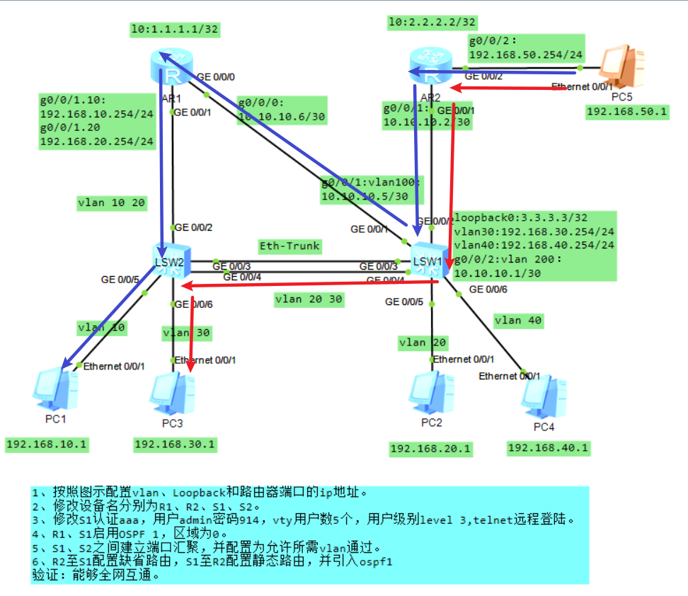

#### OSPF多个域
一系列连续的OSPF路由器构成的网络称为OSPF域（Domain）。OSPF要求区域内的路由器同步LSDB，实现对于网络的一致认知。当网络规模越来越大时，LSDB将变得非常臃肿，设备基于该LSDB进行路由计算，其负担也极大地增加了，此外路由器的路由表规模也变大了，这些无疑都将加大路由器的性能损耗。


- 查看isis路由表
`[R1]dis ospf routing`
- 查看ospf邻接表
`[R1]dis ospf peer brief`
- 查看ospf链路状态表
`[R1]dis ospf lsdb`

`reset ospf process`（重启ospf）
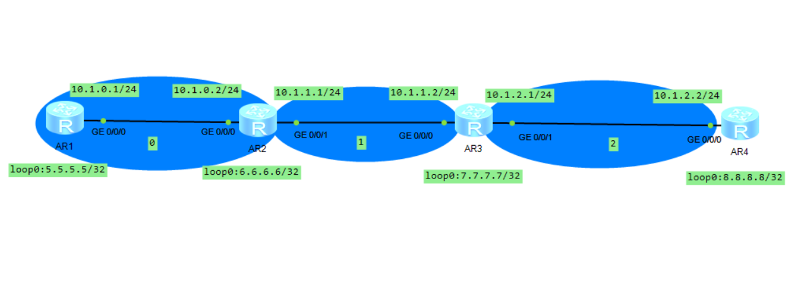
##### 基本配置：

- IR：
```c
//OSPF进程1 router-id 5.5.5.5
[R1]ospf 1 router-id 5.5.5.5
//域0
[R1-ospf-1]area 0
//将该端口加入进程1域0的OSPF
[R1-GigabitEthernet0/0/0]ospf enable 1 area 0.0.0.0
//或者
[R1-ospf-1-area-0.0.0.0]network 5.5.5.5 0.0.0.0
```
- ABR:
```c
[R2]ospf 1 router-id 6.6.6.6
[R2-ospf-1]area 0
//环回地址随便配一个域
[R2-ospf-1-area-0.0.0.0]network 6.6.6.6 0.0.0.0
[R2-ospf-1-area-0.0.0.0]network 10.1.0.2 0.0.0.0
[R2-ospf-1]area 1
[R2-ospf-1-area-0.0.0.1]network 10.1.1.1 0.0.0.0
```
##### 虚连接与DR选举
划分区域后，路由器可以分为两种角色：
- 区域内部路由器（Internal Router）：该类设备的所有接口都属于同一个OSPF区域。如R1和R4。
- 区域边界路由器**ABR**（Area Border Router）：该类设备接口分别连接两个及两个以上的不同区域。如R2和R3。

---
- **虚连接：**
OSPF要求骨干区域必须是连续的，但是并不要求物理上连续，可以使用虚连接使骨干区域在逻辑上连续。虚连接可以在任意两个ABR上建立，但是要求这两个ABR都有端口连接到一个相同的非骨干区域。

非骨干区域（area 2）必须与骨干区域（area 0）相连，不然R4与R1和R2不互通：
```c
//R2和R3互设为域1的虚连接邻居（router-id），延申骨干区域
[R2-ospf-1-area-0.0.0.1]vlink-peer 7.7.7.7
[R3-ospf-1-area-0.0.0.1]vlink-peer 6.6.6.6
```
- **在MA网络中选举DR：**
DR（Designated Router，指定路由器）负责在MA网络建立和维护邻接关系并负责LSA的同步。
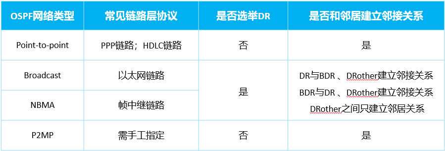

选举DR：
使用逻辑结构简单的直连网络时维护DR浪费性能

OSPF的网络类型是根据接口的数据链路层封装自动设置的。图中的路由器采用以太网接口互联，因此这些接口的网络类型缺省均为Broadcast。每段链路实际上都是点对点链路，因此在链路上选举DR与BDR是没有必要的。为了提高OSPF的工作效率，加快邻接关系的建立过程，可以把这些互联接口的网络类型都修改为P2P

```c
//取消选举DR，区域中每个节点的所有端口都配置一遍
[R3-GigabitEthernet0/0/1]ospf network-type p2p
//选举DR时的优先级（越大越优先）
[R3-GigabitEthernet0/0/1]ospf dr-priority 100
```

##### 特殊区域
- **Stub区域：**
Stub区域的ABR不向Stub区域内传播它接收到的AS外部路由，Stub区域中路由器的LSDB、路由表规模都会大大减小。
  - 为保证Stub区域能够到达AS外部，Stub区域的ABR将生成一条缺省路由（使用3类LSA描述）。
  - 配置Stub区域时需要注意下列几点：
    - 骨干区域不能被配置为Stub区域。
    - Stub区域中的所有路由器都必须将该区域配置为Stub。
    - Stub区域内不能引入也不接收AS外部路由。
    - 虚连接不能穿越Stub区域。

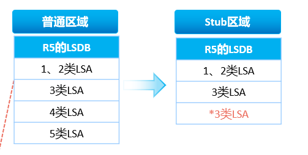
- **Totally Stub区域：**
  - Totally Stub区域既不允许AS外部路由在本区域内传播，也不允许区域间路由在本区域内传播。
  - Totally Stub区域内的路由器通过本区域ABR下发的缺省路由（使用3类LSA描述）到达其他区域，以及AS外部。

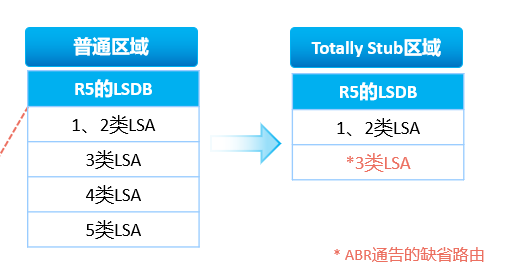
- **NSSA区域与Totally NSSA区域：**
  - NSSA区域能够引入外部路由，同时又不会学习来自OSPF网络其它区域引入的外部路由。
  - Totally NSSA与NSSA区域的配置区别在于前者在ABR上需要追加no-summary关键字。
  - **NSSA区域内发布7类LSA**
```c
//将域1配置为stub区域
[R3-ospf-1-area-0.0.0.1]stub
[R2-ospf-1-area-0.0.0.1]stub
//将域1配置为totally stub区域
[R3-ospf-1-area-0.0.0.1]stub no-summary
[R2-ospf-1-area-0.0.0.1]stub no-summary
//将域1配置为nssa区域
[R3-ospf-1-area-0.0.0.1]nssa
[R2-ospf-1-area-0.0.0.1]nssa
//将域1配置为totally nssa区域
[R3-ospf-1-area-0.0.0.1]nssa no-summary
[R2-ospf-1-area-0.0.0.1]nssa no-summary
```


##### 认证、路由汇总及LSA
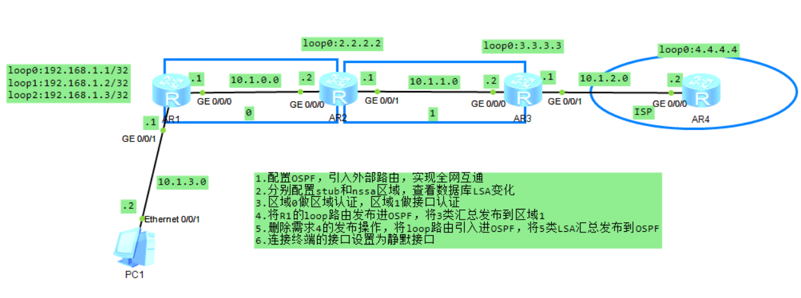
- **OSPF报文认证:**
OSPF支持报文认证功能，只有通过认证的OSPF报文才能被接收。

路由器支持两种OSPF报文认证方式，当两种认证方式都存在时，优先使用接口认证方式：
- 区域认证方式：一个OSPF区域中所有的路由器在该区域下的认证模式和口令必须一致。
- 接口认证方式：相邻路由器直连接口下的认证模式和口令必须一致。

```c
//区域认证，区域内节点全部配置
[R1-ospf-1-area-0.0.0.0]authentication-mode md5 1 plain huawei
[R2-ospf-1-area-0.0.0.0]authentication-mode md5 1 plain huawei

//接口认证，只需要链路两端接口配置
[R2-GigabitEthernet0/0/1]ospf authentication-mode md5 1 plain huawei
[R3-GigabitEthernet0/0/0]ospf authentication-mode md5 1 plain huawei
```

- **LSA:**
LSA是OSPF进行路由计算的关键依据。
- 常见LSA类型：
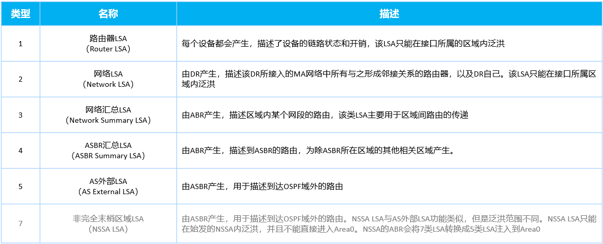
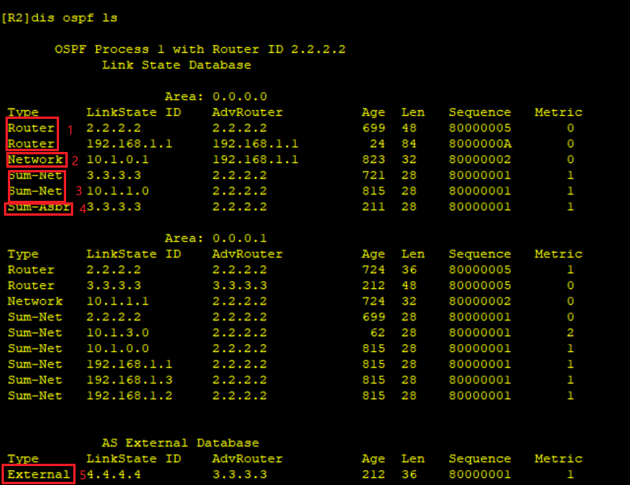

OSPF区域间路由信息传递是通过ABR产生的Network Summary LSA（3类LSA）实现的。
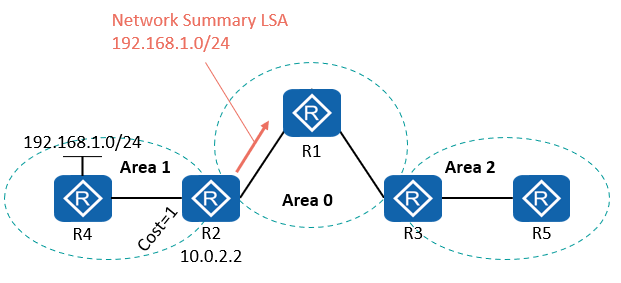

AS-external LSA（5类LSA）：由ASBR产生，描述到达AS外部的路由，该LSA会被通告到所有的区域（除了Stub区域和NSSA区域）。
```c
//引入外部直连路由
[R1-ospf-1]import-route direct 
```

**ASBR**（AS Boundary Router）：自治系统边界路由器。只要一台OSPF设备引入了外部路由，它就成为了ASBR。如R1和R3.

- **路由汇总：**
路由汇总又被称为路由聚合，即是将一组前缀相同的路由汇聚成一条路由，从而达到减小路由表规模以及优化设备资源利用率的目的，我们把汇聚之前的这组路由称为精细路由或明细路由，把汇聚之后的这条路由称为汇总路由或聚合路由。
  - 在ABR执行路由汇总：对区域间的路由执行路由汇总。
  - 在ASBR执行路由汇总：对引入的外部路由执行路由汇总。
```c
//ABR设备进行路由汇总
[R2-ospf-1-area-0.0.0.0]abr-summary 192.168.1.0 255.255.255.252
//ASBR进行路由汇总
[R1-ospf-1]asbr-summary 192.168.1.0 255.255.255.252
//过滤3类LSA，只能在ABR上使用，不论是自己产生的还是从别的路由器收到的都能过滤
[R4]acl 2000
[R4-acl-basic-2000]rule 0 deny source 192.168.0.0 0.0.3.255
[R4-acl-basic-2000]rule 5 permit
[R4-ospf-1-area-0.0.0.0]filter 2000 import 
//或者
[R4-ospf-1-area-0.0.0.1]filter 2000 export
```
汇总结果：
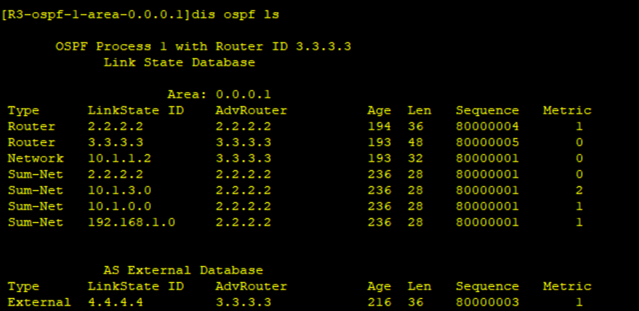


- **Silent-Interface：**
通过Silent-Interface的配置，增强OSPF的组网适应能力，减少系统资源的消耗。
  - Silent-Interface不会接收和发送OSPF报文。
  - Silent-Interface的直连路由仍可以发布出去。

到达该接口的路由将被通告到OSPF，使得其他设备能够访问Server。由于该接口上未连接任何其他OSPF路由器，因此管理员将该接口配置为Silent-Interface，该接口将不再收发Hello报文，从而避免了对Server的性能降低。

```c
//配置g0/0/1为静默接口
[R1-ospf-1]silent-interface g0/0/1
//通告下发缺省路由
default-route-advertise
```


