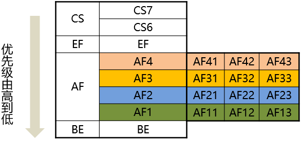
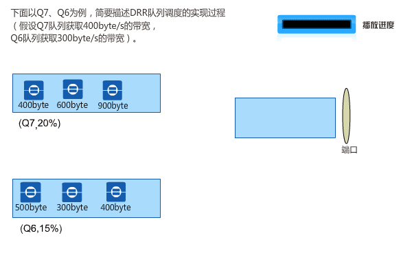
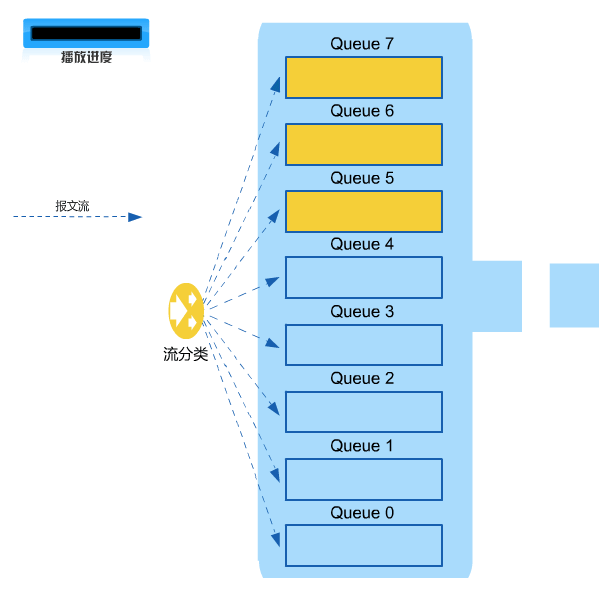
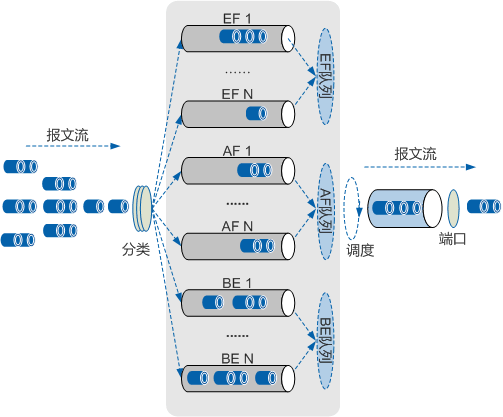

# 拥塞控制（华为）
## 常用命令
- 进入系统视图：
`<Huawei>system-view`
- 关闭信息中心：
`[Huawei]undo info-center enable`
- 删除某条配置：
`[Huawei]undo xxxx`
- 更改名称：
`[Huawei]sysname S2`
- 查看当前配置：
```c
[S2]display current-configuration`
[S2-GigabitEthernet0/0/1]display this
<S1>display ip interface brief Vlanif 30
```

- 查看路由表：
`[S2]dis ip routing-table`
- 保存配置：
`<S1>save`
- 删除所有静态路由
`undo ip rou static all`

## 基础
传统的网络设备在处理报文转发时，会依据先到达的报文优先被转发的机制进行处理，所以这样就会导致当网络发生拥塞时，一些关键业务的通信质量就得不到保障（如语音延迟、视频卡顿、关键业务无法通信等），进而影响到客户体验。

QoS服务模型：
- 尽力而为的服务模型（Best Effort Services Model）
- 综合服务模型（Integrated Services Model）
- 区分服务模型（Differentiated Services Model）

## 报文分类
对进入DiffServ域的流量按照一定的规则进行分类，然后根据不同类别的流量提供不同的服务。
### 简单分类
报文分类可依据不同链路类型传输的不同类别的报文，且其自身所含有的标识QoS优先级的字段值来进行分类。
- 根据IEEE 802.1Q定义，VLAN TAG中的PRI字段用于标识QoS服务等级（取值范围0~7）。
- 对于MPLS报文，通常将标签信息中的EXP域作为MPLS报文的CoS域，与IP网络的ToS域等效，用来区分数据流量的服务等级（取值范围0~7）。
- IP报文使用IP-Precedence字段标识其优先级（取值范围0~7）。

在RFC2474中对IPv4报文头的ToS字段进行了重新定义，称为DS（Differentiated Services）字段。
- 数字形式：DSCP取值范围为0~63；
- 关键字表达方式：用关键字标识的DSCP值。

- AFxy中，x代表不同的类别，根据不同的分类后续可以定义进入相对应的队列，y代表当队列被装满的时候丢包的概率，例如AF1类中的报文，其中丢包概率由小到大排序为AF11<AF12<AF13。
- 不同关键字常用于标识不同报文（可自行定义）：
  - CS6和CS7默认用于协议报文，而且是大多数厂商设备的硬件队列里最高优先级的报文，因为如果这些报文无法接收的话会引起协议中断。
  - EF常用于承载语音的流量，因为语音要求低延迟，低抖动，低丢包率，是仅次于协议报文的最重要的报文。
  - AF4用来承载语音的信令流量，这里大家可能会有疑问为什么这里语音要优先于信令呢？ 其实是这样的，这里的信令是电话的呼叫控制，你是可以忍受在接通的时候等待几秒钟的，但是绝对不能允许在通话的时候的中断。所以语音要优先于信令。
  - AF3可以用来承载IPTV的直播流量，直播的实时性很强，需要连续性和大吞吐量的保证。
  - AF2可以用来承载VOD（Video on Demand：视频点播）的流量，相对于直播流量来说，VOD对实时性要求没那么强烈，允许有时延或者缓冲。
  - AF1可以用来承载普通上网业务。
### 复杂分类
复杂流分类是指根据五元组（源地址、目的地址、源端口号、目的端口号、协议号码）等报文信息对报文进行精细的分类（一般的分类依据都局限在封装报文的头部信息，使用报文内容作为分类的标准比较少见）。

缺省应用于网络的边缘位置。报文进入边缘节点时，网络管理者可以灵活配置分类规则。
- 链路层复杂流分类
- IP层复杂流分类
## 拥塞管理
拥塞管理通过队列机制来实现：
1. 将准备从一个接口发出的所有报文放入不同的缓存队列中；
2. 根据各队列间的调度机制实现不同报文的差分转发。

### 调度算法：
- PQ调度：

    PQ调度算法维护一个优先级递减的队列系列并且只有当更高优先级的所有队列为空时才服务低优先级的队列。


- WRR调度：

    加权循环调度WRR（Weight Round Robin）在队列之间进行轮流调度，根据每个队列的权重来调度各队列中的报文流。

    设备根据每个队列的权值进行轮循调度。调度一轮权值减一，权值减到零的队列不参加调度，当所有队列的权限减到0时，开始下一轮的调度。


- DRR调度：

    DRR调度中，Deficit表示队列的带宽赤字，初始值为0。每次调度前，系统按权重为各队列分配带宽，计算Deficit值，如果队列的Deficit值大于0，则参与此轮调度，发送一个报文，并根据所发送报文的长度计算调度后Deficit值，作为下一轮调度的依据；如果队列的Deficit值小于0，则不参与此轮调度，当前Deficit值作为下一轮调度的依据。（Deficit值每轮调度之前加上分配的带宽值，小于0则不参加分配）


- WFQ调度：
  - 不同的队列获得公平的调度机会，从总体上均衡各个流的延迟。
  - 短报文和长报文获得公平的调度：如果不同队列间同时存在多个长报文和短报文等待发送，让短报文优先获得调度，从而在总体上减少各个流的报文间的抖动。
  - 高优先权的报文获得优先调度的机会多于低优先权的报文。


- PQ+WRR调度：

    根据配置将接口上的8个队列分为两组，一组（例如Queue7、Queue6、Queue5）采用PQ调度，另一组（例如Queue4、Queue3、Queue2、Queue1和Queue0队列）采用WRR调度。**设备上只有LAN侧接口支持PQ+WRR调度。**

    在调度时，设备首先按照PQ方式调度Queue7、Queue6、Queue5队列中的报文流，只有这些队列中的报文流全部调度完毕后，才开始以WRR方式循环调度其他队列中的报文流。Queue4、Queue3、Queue2、Queue1和Queue0队列包含自己的权值。重要的协议报文和有低延时需求的业务报文应放入采用PQ调度的队列中，得到优先调度的机会，其余报文放入以WRR方式调度的各队列中。


- CBQ调度：

    CBQ（Class-based Queueing）基于类的加权公平队列是对WFQ功能的扩展，为用户提供了定义类的支持。
  - CBQ首先根据IP优先级或者DSCP优先级、输入接口、IP报文的五元组等规则来对报文进行分类，然后让不同类别的报文进入不同的队列。
  - 对于不匹配任何类别的报文，送入系统定义的缺省类。
  - CBQ提供三类队列：
    - EF队列：满足低时延业务
    - AF队列：满足需要带宽保证的关键数据业务
    - BE队列：满足不需要严格QoS保证的尽力发送业务


| 类型 | 优点 | 缺点 |
| -- | -- | -- |
| FIFO | 实现简单，处理速度快 | 不能有差别地对待优先级不同的报文 |
| PQ | 低延迟业务能得到保障 | 低优先级队列可能出现“饿死”现象 |
| WRR | 避免了低优先级队列的“饿死”现象 | 不平等调度；低时延业务得不到保障 |
| WFQ | 按权重实现公平调度；自动分类，配置简单 | 低时延业务得不到保障；无法支持自定义类 |
| PQ+WFQ | 低时延业务能得到保障；按权重实现公平调度等 | 无法支持自定义类 |
| CBQ | 支持自定义类 | 耗费较多的系统资源 |

### 拥塞避免
由于每个队列长度有限，当某一队列已经被装满时，传统的处理方法会将后续向该队列发送的报文全部丢弃，直至拥塞解除，这种处理方式称为尾丢弃（Tail Drop）。

尾丢弃缺点：
1. 引发TCP全局同步现象 
   - 对于TCP报文，如果大量的报文被丢弃，将造成TCP超时，从而引发TCP慢启动，使得TCP减少报文的发送。当队列同时丢弃多个TCP连接的报文时，将造成多个TCP连接同时进入拥塞避免和慢启动状态以调整并降低流量，这就被称为TCP全局同步现象。这样多个TCP连接发往队列的报文将同时减少，而后又会在某个时间同时出现流量高峰，如此反复，使网络资源利用率低。
   - RED（Random Early Detection）技术：RED通过随机地丢弃数据报文，让多个TCP连接不同时降低发送速度，从而避免了TCP的全局同步现象。使TCP速率及网络流量都趋于稳定。
     - RED为每个队列的长度都设定了阈值门限，并规定： 
       - 当队列的长度小于低门限时，不丢弃报文。 
       - 当队列的长度大于高门限时，丢弃所有收到的报文。 
       - 当队列的长度在低门限和高门限之间时，开始随机丢弃到来的报文。方法是为每个到来的报文赋予一个随机数，并用该随机数与当前队列的丢弃概率比较，如果大于丢弃概率则报文被丢弃。队列越长，报文被丢弃的概率越高。
2. 引起TCP饿死现象（尾丢弃无法对流量进行区分丢弃）
   - 后续发往该队列的大量TCP报文将进行尾丢弃，并造成Window Size减小，TCP流量整体减小，而UDP流量并不会减少，反而可能会占满整个队列，造成TCP饿死现象。
3. 无差别地丢弃（尾丢弃无法对流量进行区分丢弃）
   - 尾丢弃很可能导致大量非关键数据被转发，而大量关键数据被丢弃。
  
- WRED：

    基于RED技术，又实现了WRED（Weighted Random Early Detection）技术，可实现每一种优先级都能独立设置报文的丢包的高门限、低门限及丢包率，报文到达低门限时，开始丢包，到达高门限时丢弃所有的报文，随着门限的增高，丢包率不断增加，最高丢包率不超过设置的最大丢包率，直至到达高门限，报文全部丢弃。这样按照一定的丢弃概率主动丢弃队列中的报文，从一定程度上避免了尾丢弃带来的所有缺点。

    WRED技术可以通过对不同优先级数据包或队列设置相应的丢弃策略，以实现对不同流量进行区分丢弃。


