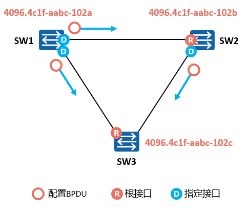
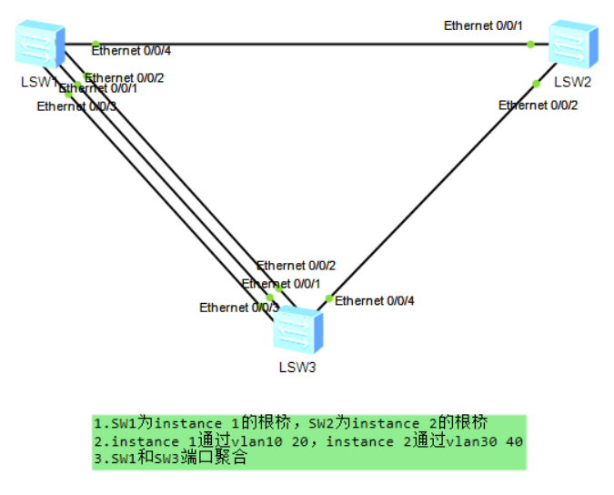
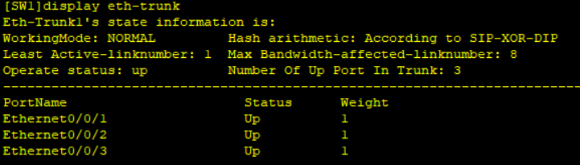
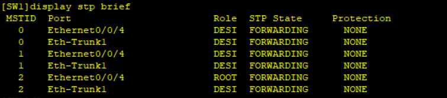
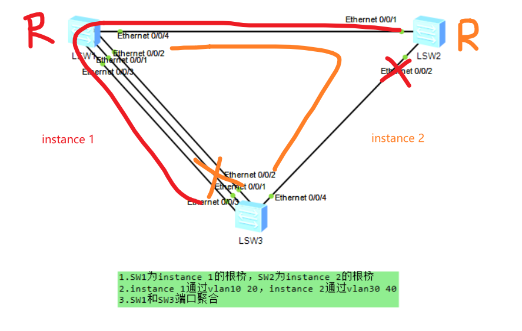
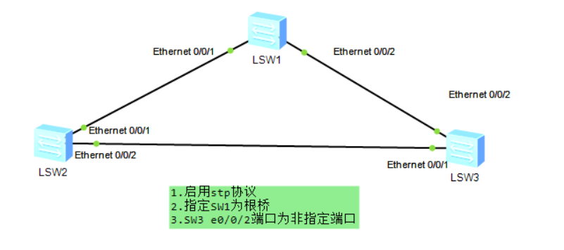
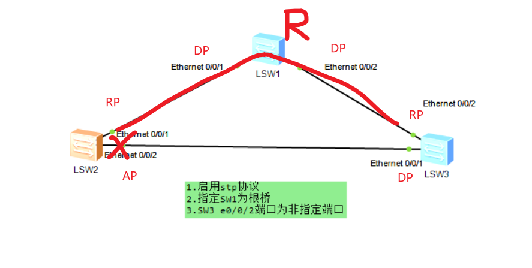
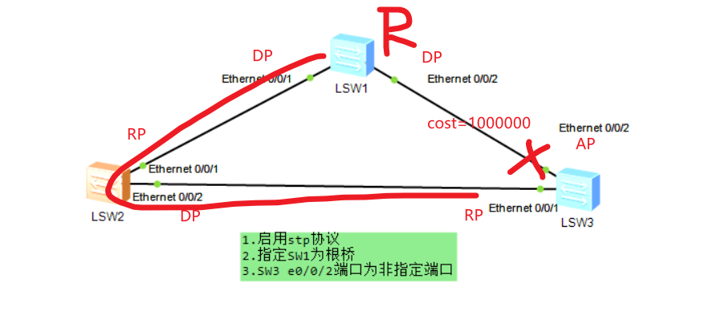

# 生成树协议（华为）
## 常用命令
- 进入系统视图：
`<Huawei>system-view`
- 关闭信息中心：
`[Huawei]undo info-center enable`
- 删除某条配置：
`[Huawei]undo xxxx`
- 更改名称：
`[Huawei]sysname S2`
- 查看当前配置：
```
[S2]display current-configuration`
[S2-GigabitEthernet0/0/1]display this
<S1>display ip interface brief Vlanif 30
```

- 查看路由表：
`[S2]dis ip routing-table`
- 保存配置：
`<S1>save`
- 删除所有静态路由
`undo ip rou static all`
## STP


### 选举依据：
1. 根桥ID（RootID）
2. 跟路径开销（RootPathCost）
3. 指定桥ID（DesignatedBridgeID）
4. 指定端口ID（DesignatedPortID）

**值越小优先度越高**


### 基础配置
```c
//批量创建vlan
[SW1]vlan batch 10 20 30 40
//进入非聚合的物理端口
[SW1]int e0/0/4
//指定端口类型为trunk
[SW1-Ethernet0/0/4]port link-type trunk 
//端口允许通过的vlan ID
[SW1-Ethernet0/0/4]port trunk allow-pass vlan 10 20 30 40
```
**所有交换机均进行以上配置**
### 端口聚合
```c
//创建聚合端口Eth-Trunk 1
[SW1]int Eth-Trunk 1
//指定端口类型为trunk
[SW1-Eth-Trunk1]port link-type trunk 
//端口允许通过的vlan ID
[SW1-Eth-Trunk1]port trunk allow-pass vlan 10 20 30 40
//将e0/0/1加入虚拟聚合端口
[SW1-Eth-Trunk1]int e0/0/1
[SW1-Ethernet0/0/1]eth-trunk 1
//同理，将e0/0/2 e0/0/3加入虚拟聚合端口
......
//或者
[SW1-Eth-Trunk1]trunkport e 0/0/1 0/0/2 0/0/3

//查看聚合端口状态
[SW3]display eth-trunk 
```

### MSTP
```c
//切换stp模式为mstp（默认）
[SW1]stp mode mstp、
//进入stp域配置
[SW1]stp region-configuration
//配置域名为‘huawei’
[SW1-mst-region]region-name huawei
//实例1通过vlan10 20
[SW1-mst-region]instance 1 vlan 10 20
//实例2通过vlan30 40
[SW1-mst-region]instance 2 vlan 30 40
//激活上述配置
[SW1-mst-region]active region-configuration
```
**所有交换机均进行以上配置**
```c
//设置SW1为实例1首选根桥
[SW1]stp instance 1 root primary
//设置SW1为实例2备选根桥
[SW1]stp instance 2 root secondary
//同理对SW2设置
[SW2]stp instance 1 root secondary
[SW2]stp instance 2 root primary 

//查看stp协议状态
[SW1]display stp brief 
```


### STP练习

```c
//设置stp模式
[SW1]stp mode stp
```
**所有交换机均进行以上配置**
```c
//指定SW1为根桥
[SW1]stp root primary 
```

```c
//指定SW1为根桥
[SW1]stp root primary 
```

根接口选举出来后，将在网络中每条链路的两端选举指定端口，选举依据依次为：
1. 跟路径开销（RootPathCost）
2. 指定桥ID（DesignatedBridgeID）
3. 指定端口ID（DesignatedPortID）

根接口和指定端口选举完成后，在一台交换机上，既不是根接口，又不是指定接口的接口被称为非指定接口，非指定接口将被阻塞，不再转发用户数据帧和，但可以接受处理BPDU。
因此：
1. 根桥上的端口都是指定端口
2. 一条链路上有一端为根接口，另一端必然为指定端口

题中三条链路最初cost都为默认的200000，因此与根桥直接相连的SW2 e0/0/1和SW3 e0/0/2被选为根接口，SW2 e0/0/2和SW3 e0/0/1都不是根端口，因此将产生一个指定端口和一个非指定端口

为了将SW3 e0/0/2设为非指定端口，需要将SW3 e0/0/1选为根接口，因此需要修改右侧链路cost大于左侧链路cost与下侧链路cost之和。此时在右侧链路中，由于根桥的端口必为指定端口，因此SW3 e0/0/2成为非指定端口。