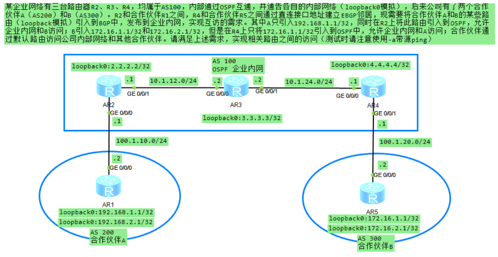
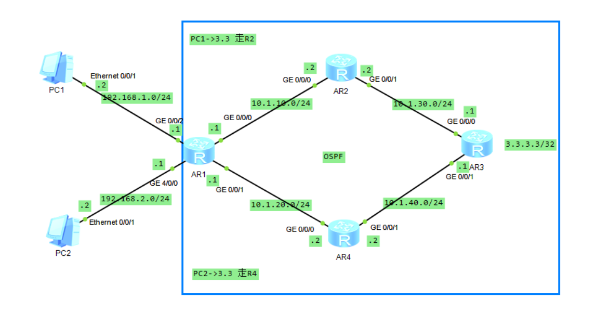
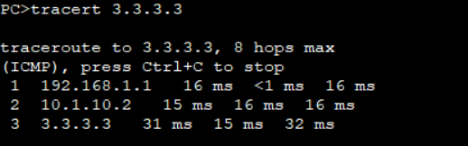
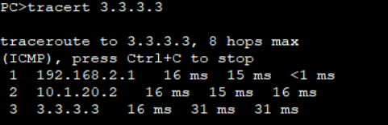
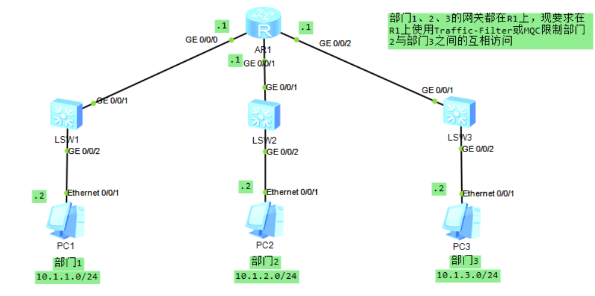

# 路由与流量控制（华为）
## 常用命令
- 进入系统视图：
`<Huawei>system-view`
- 关闭信息中心：
`[Huawei]undo info-center enable`
- 删除某条配置：
`[Huawei]undo xxxx`
- 更改名称：
`[Huawei]sysname S2`
- 查看当前配置：
```c
[S2]display current-configuration`
[S2-GigabitEthernet0/0/1]display this
<S1>display ip interface brief Vlanif 30
```

- 查看路由表：
`[S2]dis ip routing-table`
- 保存配置：
`<S1>save`
- 删除所有静态路由
`undo ip rou static all`
## 路由控制
路由控制可以通过路由策略（Route-Policy）实现，路由策略应用灵活而广泛，有以下几种常见方式：
- 控制路由的发布：通过路由策略对发布的路由进行过滤，只发布满足条件的路由。
- 控制路由的接收：通过路由策略对接收的路由进行过滤，只接收满足条件的路由。
- 控制路由的引入：通过路由策略控制从其他路由协议引入的路由条目，只有满足条件的路由才会被引入。


### 匹配工具1：访问控制列表
访问控制列表（Access Control List，**ACL**）是一个**匹配工具**，能够对报文及路由进行匹配和区分。

ACL由若干条permit或deny语句组成。每条语句就是该ACL的一条规则，每条语句中的permit或deny就是与这条规则相对应的处理动作。

#### 通配符
通配符是一个32比特长度的数值，用于指示IP地址中哪些比特位需要严格匹配，哪些比特位无需匹配。

基于ACL规则定义方式的划分：

| 分类 | 编号范围 | 规则定义描述 |
| :---- | :---- | :---- |
| 基本ACL | 2000~2999 | 仅使用报文的源IP地址、分片信息和生效时间段信息来定义规则。 |
| 高级ACL |3000~3999 | 可使用IPv4报文的源IP地址、目的IP地址、IP协议类型、ICMP类型、TCP源/目的端口、UDP源/目的端口号、生效时间段等来定义规则。 |
| 二层ACL | 4000~4999 | 使用报文的以太网帧头信息来定义规则，如根据源MAC地址、目的MAC地址、二层协议类型等。 |
| 用户自定义ACL | 5000~5999 | 使用报文头、偏移位置、字符串掩码和用户自定义字符串来定义规则。 |
| 用户ACL | 6000~6999 | 既可使用IPv4报文的源IP地址或源UCL（User Control List）组，也可使用目的IP地址或目的UCL组、IP协议类型、ICMP类型、TCP源端口/目的端口、UDP源端口/目的端口号等来定义规则。 |

- 创建基本ACL
```c
//使用编号（2000～2999）创建一个数字型的基本ACL，并进入基本ACL视图。
[Huawei] acl [ number ] acl-number [ match-order config ]
//使用名称创建一个命名型的基本ACL，并进入基本ACL视图。
[Huawei] acl name acl-name { basic | acl-number } [ match-order config ]

//在基本ACL视图下，通过此命令来配置基本ACL的规则。
[Huawei-acl-basic-2000] rule [ rule-id ] { deny | permit } [ source { source-address source-wildcard | any } | time-range time-name ] 
```


### 匹配工具2：IP前缀列表
IP前缀列表（IP-Prefix List）是将路由条目的网络地址、掩码长度作为匹配条件的过滤器，可在各路由协议发布和接收路由时使用。

不同于ACL，IP-Prefix List能够同时匹配IP地址前缀长度以及掩码长度，增强了匹配的精确度。

```c
//创建IPv4地址前缀列表
[Huawei] ip ip-prefix ip-prefix-name [ index index-number ] { permit | deny } ipv4-address mask-length [ match-network ] [ greater-equal greater-equal-value ] [ less-equal less-equal-value ]
```
- ip-prefix-name：指定地址前缀列表的名称。
- index index-number：指定本匹配项在地址前缀列表中的序号。
- permit：指定地址前缀列表的匹配模式为允许。
- deny：指定地址前缀列表的匹配模式为拒绝。
- ipv4-address mask-length：指定IP地址和指定掩码长度。
- greater-equal greater-equal-value：指定掩码长度匹配范围的下限。
- less-equal less-equal-value：指定掩码长度匹配范围的上限。

### 策略工具1：Filter-Policy
Filter-Policy（过滤-策略）是一个很常用的路由信息过滤工具，能够对接收、发布、引入的路由进行过滤，可应用于IS-IS、OSPF、BGP等协议。

- 在**距离矢量路由协议**(如BGP)中，设备之间传递的是路由信息，如果需要对这种路由信息进行某种过滤，可以使用Filter-Policy实现。
- 在**链路状态路由协议**（如OSPF）中，各路由设备之间传递的是LSA信息，然后设备根据LSA汇总成的LSDB信息计算出路由表。但是Filter-Policy只能过滤路由信息，无法过滤LSA（**只能过滤引入的路由**）。
  - Filter-Policy入方向过滤（import）对OSPF计算出来的路由（加载到路由表之前）进行过滤，而不会对LSA进行过滤。
  - Filter-Policy出方向过滤（export）过滤路由信息和从其他协议引入的路由。

- OSPF:
```c
//按照过滤策略，设置OSPF对接收的路由进行过滤。
[Huawei-ospf-100] filter-policy { acl-number | acl-name acl-name | ip-prefix ip-prefix-name | route-policy route-policy-name [ secondary ] } import

//按照过滤策略，设置对引入的路由在向外发布时进行过滤。
[Huawei-ospf-100] filter-policy { acl-number | acl-name acl-name | ip-prefix ip-prefix-name | route-policy route-policy-name } export [ protocol [ process-id ] ]
```

- IS-IS：
```c
//配置IS-IS路由加入IP路由表时的过滤策略。
[Huawei-isis-1] filter-policy { acl-number | acl-name acl-name | ip-prefix ip-prefix-name | route-policy route-policy-name } import

//配置IS-IS对已引入的路由在向外发布时进行过滤的过滤策略。
[Huawei-isis-1] filter-policy { acl-number | acl-name acl-name | ip-prefix ip-prefix-name | route-policy route-policy-name } export [ protocol [ process-id ] ]
```
- BGP：
```c
//配置对接收的路由信息进行过滤。
[Huawei-bgp-af-ipv4] filter-policy { acl-number | acl-name acl-name | ip-prefix ip-prefix-name } import

//配置对发布的路由进行过滤，只有通过过滤的路由才被BGP发布。
[Huawei-bgp-af-ipv4] filter-policy { acl-number | acl-name acl-name | ip-prefix ip-prefix-name } export [ protocol [ process-id ] ]

//配置向对等体（组）发布或从对等体（组）接收路由时的过滤策略。
[Huawei-bgp-af-ipv4] peer { group-name | ipv4-address } filter-policy { acl-number | acl-name acl-name } { import | export }
```
- acl-number：指定基本访问控制列表号。整数形式，取值范围是2000～2999。
- acl-name acl-name：指定访问控制列表名称。字符串形式，不支持空格，区分大小写，长度范围是1～32，以英文字母a～z或A～Z开始。
- ip-prefix ip-prefix-name：指定地址前缀列表名称。字符串形式，长度范围是1～169，不支持空格，区分大小写。当输入的字符串两端使用双引号时，可在字符串中输入空格。
- route-policy route-policy-name：指定路由策略名称。字符串形式，区分大小写，不支持空格，长度范围是1～40。当输入的字符串两端使用双引号时，可在字符串中输入空格。
- secondary：设置优选次优路由。

### 策略工具2：Route-Policy
Route-Policy是一个策略工具，用于过滤路由信息，以及为过滤后的路由信息设置路由属性。

一个Route-Policy由一个或多个节点（Node）构成，每个节点都可以是一系列条件语句（匹配条件）以及执行语句（执行动作）的集合，这些集合按照编号从小到大的顺序排列。
- 每个节点内可包含多个条件语句。节点内的多个条件语句之间的关系为“与”，即匹配所有条件语句才会执行本节点内的动作。
- 节点之间的关系为“或”，route-policy根据节点编号大小从小到大顺序执行，匹配中一个节点将不会继续向下匹配。

  - permit或deny：指定Route-Policy节点的匹配模式为允许或拒绝。
  - node：指定Route-Policy的节点号。整数形式，取值范围是0～65535。
  - if-match子句：定义该节点的匹配条件。
  - apply子句：定义针对被匹配路由执行的操作，用来设置匹配成功的路由的属性。
```c
//创建Route-Policy
[Huawei] route-policy route-policy-name { permit | deny } node node
//（可选）配置if-match子句
[Huawei-route-policy] if-match {  acl | cost | interface | ip-prefix ···}
//（可选）配置apply子句
[Huawei-route-policy] apply {  cost | cost-type {type-1 | type-2} |   ip-address next-hop | preference ···}
```
- route-policy route-policy-name { permit | deny } node node
- permit：指定Route-Policy节点的匹配模式为允许。如果路由与节点所有的if-match子句匹配成功，则执行此节点apply子句；否则，进行下一节点。
- deny：指定Route-Policy节点的匹配模式为拒绝。如果路由与节点所有的if-match子句匹配成功，则该路由将被拒绝通过；否则进行下一节点。
- node：指定Route-Policy的节点号。当使用Route-Policy时，node的值小的节点先进行匹配。一个节点匹配成功后，路由将不再匹配其他节点。全部节点匹配失败后，路由将被过滤。整数形式，取值范围是0～65535。




```c
//创建基本ACL
[R4]acl 2000
//严格匹配172.16.1.1
[R4-acl-basic-2000]rule permit source 172.16.1.1 0
//过滤出方向引入的路由
[R4-ospf-1]filter-policy 2000 export 

//创建基本ACL
[R1]acl 2000
//严格匹配192.168.1.1
[R1-acl-basic-2000]rule permit source 192.168.1.1 0
//过滤出方向引入的路由
[R4-ospf-1]filter-policy 2000 export 
```

## 策略路由
PBR（Policy-Based Routing，策略路由）：PBR使得网络设备不仅能够基于报文的目的IP地址进行数据转发，更能基于其他元素进行数据转发，例如源IP地址、源MAC地址、目的MAC地址、源端口号、目的端口号、VLAN-ID等等。

用户还可以使用ACL匹配特定的报文，然后针对该ACL进行PBR部署。

若设备部署了PBR，则被匹配的报文优先根据PBR的策略进行转发，即P**BR策略的优先级高于传统路由表**。

PBR与Route-Policy类似，由多个节点组成，每个节点由匹配条件（条件语句）和执行动作（执行语句）组成。
- 每个节点内可包含多个条件语句。
- 节点内的多个条件语句之间的关系为“与”，即匹配所有条件语句才会执行本节点内的动作。
- 节点之间的关系为“或”，PBR根据节点编号从小到大顺序执行，匹配当前节点将不会继续向下匹配。

### PBR与路由策略区别
| 名称 | 操作对象 | 描述 |
| --: | --: |  --: |
| 路由策略 | 路由信息 | 路由策略是一套用于对路由信息进行过滤、属性设置等操作的方法，通过对路由的操作或控制，来影响数据报文的转发路径 |
| PBR | 数据报文 | PBR直接对数据报文进行操作，通过多种手段匹配感兴趣的报文，然后执行丢弃或强制转发路径等操作 |

---
- 接口PBR
  - 接口PBR只对转发的报文起作用，对本地始发的报文无效。
  - 接口PBR调用在接口下，对接口的入方向报文生效。缺省情况下，设备按照路由表的下一跳进行报文转发，如果配置了接口PBR，则设备按照接口PBR指定的下一跳进行转发。
- 本地PBR
  - 本地PBR对本地始发的流量生效，如：本地始发的ICMP报文。
  - 本地PBR在系统视图调用。

```c
//创建策略路由和策略点，若策略点已创建则进入本地策略路由视图。
[Huawei] policy-based-route policy-name { deny | permit } node node-id
//设置IP报文的匹配条件，缺省情况下，策略路由中未配置匹配条件，可以设置使用ACL匹配IP地址，也可以设置匹配报文长度。
[Huawei-policy-based-route-PBR-10] if-match acl acl-number
[Huawei-policy-based-route-PBR-10] if-match packet-length min-length max-length
//（可选1）指定PBR中报文的出接口，缺省情况下，策略路由中未配置报文出接口。配置成功后，将匹配策略点的报文从指定出接口发送出去。报文的出接口不能为以太接口等广播型接口。
[Huawei-policy-based-route-PBR-10] apply output-interface interface-type interface-number
//（可选2）设置PBR中报文的下一跳，当该策略点未配置出接口时，匹配策略点的报文被发往指定的下一跳。
[Huawei-policy-based-route-PBR-10] apply ip-address next-hop ip-address1 [ ip-address2 ]
//（可选3）全局PBR调用
[Huawei] ip local policy-based-route Policy-name
//（可选4）接口PBR调用
[Huawei-GigabitEthernet0/0/0] ip policy-based-route Policy-name 
```

- 当ACL的rule配置为permit时，设备会对匹配该规则的报文执行本地策略路由的动作：
  - 本地策略路由中策略点为permit时对满足匹配条件的报文进行策略路由；
  - 本地策略路由中策略点为deny时对满足匹配条件的报文不进行策略路由，即根据目的地址查找路由表转发报文。
- 当ACL配置了rule，如果报文未匹配上任何规则，则根据目的地址查找路由表转发报文。
- 当ACL的rule配置为deny或ACL未配置规则时，应用该ACL的本地策略路由不生效，即根据目的地址查找路由表转发报文。


## MQC
MQC（Modular QoS Command-Line Interface，模块化QoS命令行）是指通过将具有某类共同特征的数据流划分为一类，并为同一类数据流提供相同的服务，也可以对不同类的数据流提供不同的服务。

MQC包含三个要素：
- 流分类（traffic classifier）
  - 定义一组流量匹配规则，以对报文进行分类。
- 流行为（traffic behavior）
  - 用来定义执行的动作，支持报文过滤、重标记优先级、重定向、流量统计等动作。
- 流策略（traffic policy）。
  - 将流分类和流行为绑定，对分类后的报文执行对应流行为中定义的动作。一个流策略可以绑定多个流分类和流行为。
  - 流分类 ---> 流行为
  - 流策略存在方向(inbound、outbound)的概念，策略中的流行为匹配入、出方向的报文，对匹配中的报文执行相应的流动作。

MQC的流行为支持重定向报文，因此可以使用MQC实现IP单播策略路由。

流策略不同于PBR，PBR只能调用在三层接口，而流策略支持调用在二层接口。

```c
//创建流分类
//缺省情况下，流分类中各规则之间的关系为“或”（or）。
[Huawei] traffic classifier classifier-name [ operator { and | or } ]
//创建流行为
//根据实际情况定义流行为中的动作，只要各动作不冲突，都可以在同一流行为中配置。
[Huawei] traffic behavior behavior-name
//创建流策略，并绑定流分类与流行为
[Huawei] traffic policy policy-name	
[Huawei-trafficpolicy-policyname] classifier classifier-name behavior behavior-name
```



```c
[R1]acl 3000
[R1-acl-adv-3000]rule 5 permit ip source 192.168.1.0 0.0.0.255 destination 3.3.3.3 0
//流分类
[R1]traffic classifier 1.0 operator or
[R1-classifier-1.0]if-match acl 3000
//流行为
[R1]traffic behavior 1.0
[R1-behavior-1.0]redirect ip-nexthop 10.1.10.2

[R1]acl 3001
[R1-acl-adv-3001]rule 5 permit ip source 192.168.2.0 0.0.0.255 destination 3.3.3.3 0
//流分类
[R1]traffic classifier 2.0 operator or
[R1-classifier-2.0]if-match acl 3001
//流行为
[R1]traffic behavior 2.0
[R1-behavior-2.0]redirect ip-nexthop 10.1.20.2

//流策略
[R1]traffic policy 3.3
[R1-trafficpolicy-3.3]classifier 1.0 behavior 1.0
[R1-trafficpolicy-3.3]classifier 2.0 behavior 2.0

[R1-GigabitEthernet0/0/2]traffic-policy 3.3 inbound 
[R1-GigabitEthernet4/0/0]traffic-policy 3.3 inbound 
```
PC1走R2到达R3：


PC2走R4到达R3：




Traffic-Filter配置方法：
```c
//配置acl拒绝部门1访问部门3，并放通其他所有流量
[R1]acl 3000
[R1-acl-adv-3000]rule 1 deny ip source 10.1.2.0 0.0.0.255 destination 10.1.3.0 0.0.0.255
[R1-acl-adv-3000]rule 2 permit ip
//在GE0/0/2接口出方向调用Traffic-Filter
[R1-GigabitEthernet0/0/2]traffic-filter outbound acl 3000
```

MQC配置方法：
```c
//配置acl匹配部门2访问部门3的流量
[R1]acl 3001
[R1-acl-adv-3001]rule 1 permit ip source 10.1.2.0 0.0.0.255 destination 10.1.3.0 0.0.0.255
//创建流分类2-3，流行为2-3
[R1]traffic classifier 2-3
[R1-classifier-2-3]if-match acl 3001
[R1]traffic behavior 2-3
[R1-behavior-2-3]deny
//创建流策略，绑定流分类2-3与流行为2-3
[R1]traffic policy 2-3
[R1-trafficpolicy-2-3]classifier 2-3 behavior 2-3
//在接口GE0/0/1入向调用流策略2-3
[R1-GigabitEthernet0/0/1]traffic-policy 2-3 inbound 
```
>为匹配ACL规则的报文指定报文过滤动作时，如果此ACL中的rule规则配置为permit，则设备对此报文采取的动作由流行为中配置的deny或permit决定；

>如果此ACL中的rule规则配置为deny，则无论流行为中配置了deny或permit，此报文都被丢弃。
