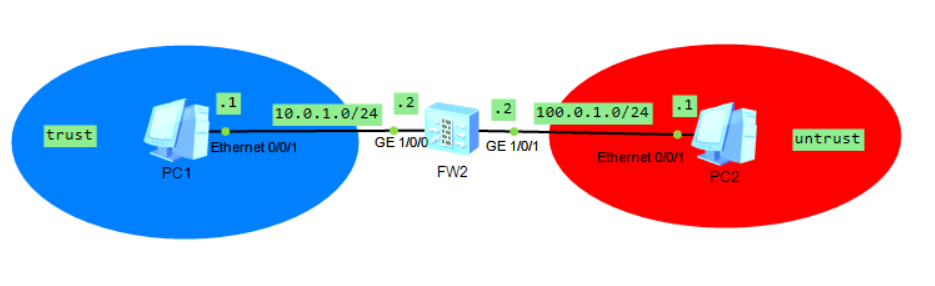
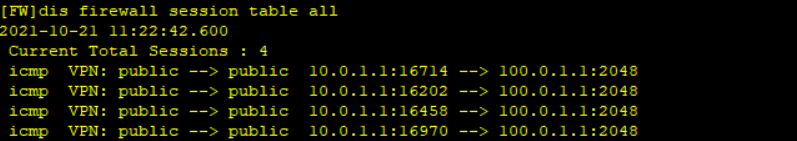

# 防火墙（华为）
## 常用命令
- 进入系统视图：
`<Huawei>system-view`
- 关闭信息中心：
`[Huawei]undo info-center enable`
- 删除某条配置：
`[Huawei]undo xxxx`
- 更改名称：
`[Huawei]sysname S2`
- 查看当前配置：
```c
[S2]display current-configuration`
[S2-GigabitEthernet0/0/1]display this
<S1>display ip interface brief Vlanif 30
```

- 查看路由表：
`[S2]dis ip routing-table`
- 保存配置：
`<S1>save`
- 删除所有静态路由
`undo ip rou static all`

## 基础
### 常用命令
```c
//查看会话表
[FW]dis firewall session table
//查看会话表详细信息
[FW]dis firewall session table verbose 
```
防火墙主要用于保护一个网络区域免受来自另一个网络区域的网络攻击和网络入侵行为。

路由器与交换机的本质是转发，防火墙的本质是控制。

防火墙与路由器的差别：
1. 背景：
   - 路由器的产生是基于对网络数据包路由而产生的。路由器需要完成的是将不同网段的数据包进行有效的路由管理。路由器所关心的是：能否将不同的网段的数据包进行路由从而进行通讯。
   - 防火墙是产生于人们对于安全性的需求。数据包是否可以正确的到达、到达的时间、方向等不是防火墙关心的重点，重点是这个数据包是否应该通过、通过后是否会对网络造成危害。
2. 目的：
   - 路由器的根本目的是：保持网络和数据的“通”。
   - 防火墙根本的的目的是：保证任何非允许的数据包“不通”。
3. 核心技术：
   - 路由器核心的ACL列表是基于简单的包过滤，属于OSI第三层过滤。从防火墙技术实现的角度来说，防火墙是基于状态包过滤的应用级信息流过滤。
4. 安全策略：
   - 路由器的默认配置对安全性的考虑不够周全，需要做高级配置才能达到一些防范攻击的作用，其针对安全性的规则的部分比较复杂，配置出错的概率较高。
   - 有些防火墙的默认配置即可以防止各种攻击，更人性化的防火墙都是使用图形界面进行配置的，配置简单、出错率低。
## 安全区域
安全区域（Security Zone）是一个或多个接口的集合，是防火墙区别于路由器的主要特性。防火墙通过安全区域来划分网络、标识报文流动的“路线”，一般来说，当报文在不同的安全区域之间流动时，才会受到控制。

华为防火墙产品上默认已经提供了三个安全区域，分别是Trust、DMZ和Untrust：
- Trust区域，该区域内网络的受信任程度高，通常用来定义内部用户所在的网络。
- DMZ区域，该区域内网络的受信任程度中等，通常用来定义内部服务器所在的网络。
- Untrust区域，该区域代表的是不受信任的网络，通常用来定义Internet等不安全的网络。

防火墙上提供了Local区域，代表防火墙本身。凡是由防火墙主动发出的报文均可认为是从Local区域中发出，凡是需要防火墙响应并处理（而不是转发）的报文均可认为是由Local区域接收。
| 安全区域 | 安全级别 | 说明 |
| -- | -- | -- |
| Local | 100 | 设备本身，包括设备的各接口本身。 |
| Trust | 85 | 通常用于定义内网终端用户所在区域。 |
| DMZ | 50 | 通常用于定义内网服务器所在区域。 |
| Untrust | 5 | 通常用于定义Internet等不安全的网络。 |
## 状态检测和会话机制
状态检测防火墙使用基于连接状态的检测机制，将通信双方之间交互的属于同一连接的所有报文都作为整体的数据流来对待。在状态检测防火墙看来，同一个数据流内的报文不再是孤立的个体，而是存在联系的。为数据流的第一个报文建立会话，数据流内的后续报文直接根据会话进行转发，提高了转发效率。

状态检测防火墙是这样解决包过滤技术的不足的：
- 首先我们还是需要在防火墙上设定规则1，允许PC访问Web服务器的报文通过。
- 当报文到达防火墙后，防火墙允许报文通过，同时还会针对PC访问Web服务器的这个行为建立会话（Session），会话中包含了PC发出的报文信息，如地址和端口等。
- 当Web服务器回应给PC的报文到达防火墙后，防火墙会把报文中的信息与会话中的信息进行比对，发现报文中的信息与会话中的信息相匹配，并且符合协议规范对后续包的定义，则认为这个报文属于PC访问Web服务器行为的后续回应报文，直接允许这个报文通过。


## 安全策略配置

```c
//默认用户密码
admin
Admin@123
//修改密码
Huawei@123

//配置端口IP，G0/0/0默认为管理口
[FW-GigabitEthernet1/0/0]ip a 10.0.1.2 24
[FW-GigabitEthernet1/0/1]ip a 100.0.1.2 24

[FW]firewall zone trust 
[FW-zone-trust]add int g1/0/0
[FW]firewall zone untrust 
[FW-zone-untrust]add int g1/0/1

//添加新的区域isp1
//firewall zone isp1 id 4
//设置该区域安全级别
//set priority 80

//配置安全策略
[FW]security-policy 
//default action deny(默认配置拒绝)
//新建规则t-u
[FW-policy-security]rule name t-u
//源区域和目的区域
[FW-policy-security-rule-t-u]source-zone trust
[FW-policy-security-rule-t-u]destination-zone untrust 
//源IP和目的IP
[FW-policy-security-rule-t-u]source-address 10.0.1.1 32
[FW-policy-security-rule-t-u]destination-address 100.0.1.1 32
//icmp协议
[FW-policy-security-rule-t-u]service icmp
//允许通行
[FW-policy-security-rule-t-u]action permit 

//查看会话表
[FW]dis firewall session table
//查看会话表详细信息
[FW]dis firewall session table verbose 
```
- 会话表：

