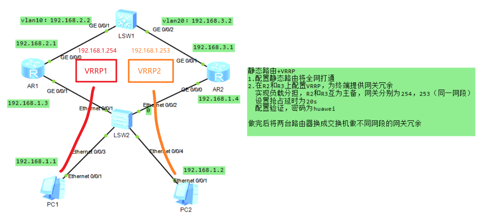

# 静态路由及VRRP（华为）
## 常用命令
- 进入系统视图：
`<Huawei>system-view`
- 关闭信息中心：
`[Huawei]undo info-center enable`
- 删除某条配置：
`[Huawei]undo xxxx`
- 更改名称：
`[Huawei]sysname S2`
- 查看当前配置：
```
[S2]display current-configuration`
[S2-GigabitEthernet0/0/1]display this
<S1>display ip interface brief Vlanif 30
```

- 查看路由表：
`[S2]dis ip routing-table`
- 保存配置：
`<S1>save`
- 删除所有静态路由
`undo ip rou static all`
## VRRP
VRRP通过把几台路由设备联合组成一台虚拟的“路由设备”，使用一定的机制保证当主机的下一跳路由设备出现故障时，及时将业务切换到备份路由设备，从而保持通讯的连续性和可靠性。

- **VRID：**
一个VRRP组（VRRP Group）由多台协同工作的路由器（的接口）组成，使用相同的VRID（Virtual Router Identifier，虚拟路由器标识符）进行标识。属于同一个VRRP组的路由器之间交互VRRP协议报文并产生一台虚拟“路由器”。一个VRRP组中只能出现一台Master路由器

- **虚拟IP地址及虚拟MAC地址：**
虚拟路由器拥有自己的IP地址以及MAC地址，其中IP地址由网络管理员在配置VRRP时指定，一台虚拟路由器可以有一个或多个IP地址，通常情况下用户使用该地址作为网关地址。而虚拟MAC地址的格式是“0000-5e00-01xx”，其中xx为VRID。

- 查看vrrp状态:
`[R1]dis vrrp`
- 查看静态路由表:
`[R1]dis ip routing-table protocol static `
### 基本配置及静态路由

```c
//批量创建vlan
[SW1]vlan b 10 20
//虚拟vlan绑定IP
[SW1]int Vlanif 10
[SW1-Vlanif10]ip a 192.168.2.2 24
[SW1-Vlanif10]int vlanif 20
[SW1-Vlanif20]ip add 192.168.3.2 24
//端口绑定虚拟vlan（三层）
[SW1]int g0/0/1
[SW1-GigabitEthernet0/0/1]p l a
[SW1-GigabitEthernet0/0/1]port default vlan 10
[SW1-GigabitEthernet0/0/1]int g0/0/2
[SW1-GigabitEthernet0/0/2]p l a
[SW1-GigabitEthernet0/0/2]port default vlan 20
//配置静态路由
[SW1]ip route-static 192.168.1.0 24 192.168.2.1
[SW1]ip route-static 192.168.1.0 24 192.168.3.1

//路由器R1绑定IP
[R1]int g0/0/0
[R1-GigabitEthernet0/0/0]ip address 192.168.2.1 24
[R1-GigabitEthernet0/0/0]int g0/0/1
[R1-GigabitEthernet0/0/1]ip address 192.168.1.3 24
//配置静态路由
[R1]ip route-static 192.168.3.0 24 192.168.2.2

//路由器R2绑定IP
[R2]int g0/0/1
[R2-GigabitEthernet0/0/1]ip a 192.168.3.1 24
[R2-GigabitEthernet0/0/1]int g0/0/0
[R2-GigabitEthernet0/0/0]ip a 192.168.1.4 24
//配置静态路由
[R2]ip route-static 192.168.2.0 24 192.168.3.2
```
- **VRRP负载分担:** 通过创建多个虚拟路由器，每个物理路由器在不同的VRRP组中扮演不同的角色，不同虚拟路由器的Virtual IP作为不同的内网网关地址可以实现流量转发负载分担。

配置两套虚拟路由，均衡负载，冗余互为主备
```c
[R1]int g0/0/1
//配置虚拟IP
[R1-GigabitEthernet0/0/1]vrrp vrid 1 virtual-ip 192.168.1.254
//优先级130（默认100，越大越优先）
[R1-GigabitEthernet0/0/1]vrrp vrid 1 priority 130
//抢占时延20s
[R1-GigabitEthernet0/0/1]vrrp vrid 1 preempt-mode timer delay 20
//认证方式为MD5，密码为'huawei'
[R1-GigabitEthernet0/0/1]vrrp vrid 1 authentication-mode md5 huawei
[R1-GigabitEthernet0/0/1]vrrp vrid 2 virtual-ip 192.168.1.253
//抢占时延20s
[R1-GigabitEthernet0/0/1]vrrp vrid 2 preempt-mode timer delay 20
//认证方式为MD5，密码为'huawei'
[R1-GigabitEthernet0/0/1]vrrp vrid 2 authentication-mode md5 huawei

[R2]int g0/0/0
//配置虚拟IP
[R2-GigabitEthernet0/0/0]vrrp vrid 1 virtual-ip 192.168.1.254
//抢占时延20s
[R2-GigabitEthernet0/0/0]vrrp vrid 1 preempt-mode timer delay 20
//认证方式为MD5，密码为'huawei'
[R2-GigabitEthernet0/0/0]vrrp vrid 1 authentication-mode md5 huawei
//配置虚拟IP
[R2-GigabitEthernet0/0/0]vrrp vrid 2 virtual-ip 192.168.1.253
//优先级130（默认100，越大越优先）
[R2-GigabitEthernet0/0/0]vrrp vrid 2 priority 130
//抢占时延20s
[R2-GigabitEthernet0/0/0]vrrp vrid 2 preempt-mode timer delay 20
//认证方式为MD5，密码为'huawei'
[R2-GigabitEthernet0/0/0]vrrp vrid 2 authentication-mode md5 huawei
```
