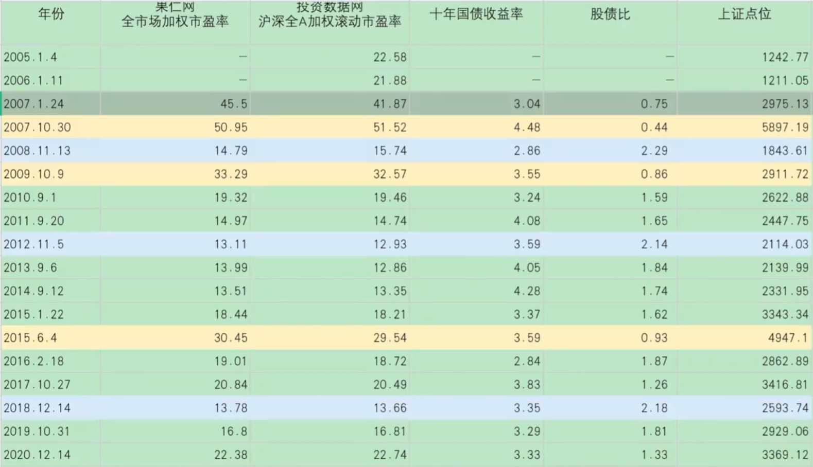
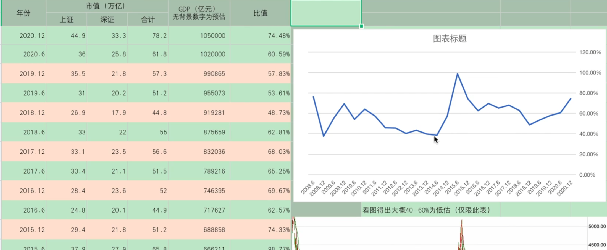
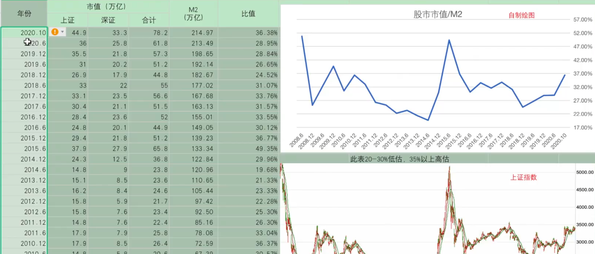
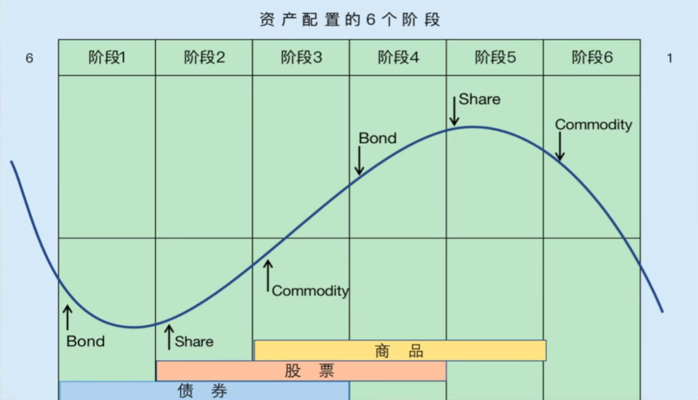
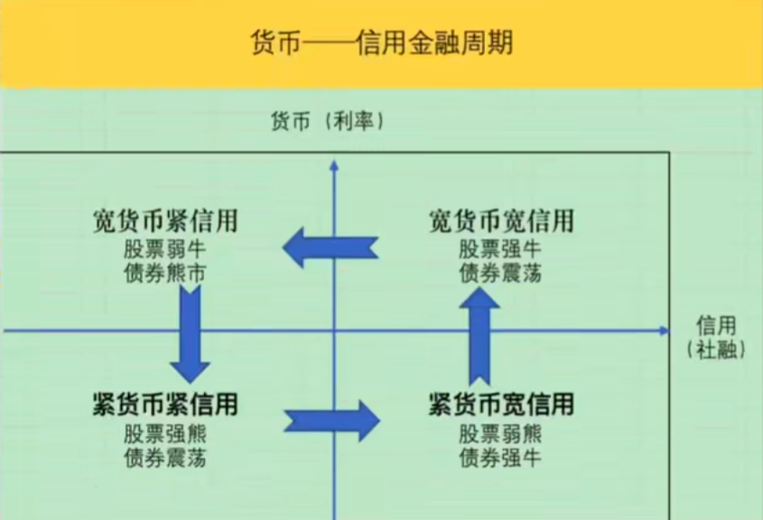
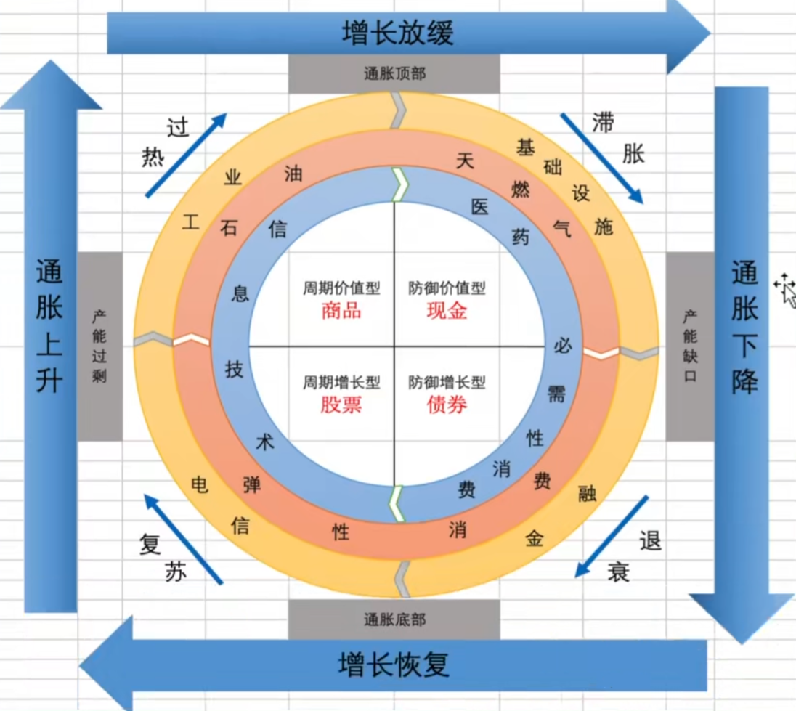

# 基金定投

@import "[TOC]" {cmd="toc" depthFrom=2 depthTo=3 orderedList=false}

<!-- code_chunk_output -->

- [为什么基金定投](#为什么基金定投)
- [定投误区](#定投误区)
  - [总结](#总结)
- [定投的前提](#定投的前提)
  - [什么适合定投](#什么适合定投)
  - [什么不适合定投](#什么不适合定投)
  - [总结](#总结-1)
- [估值](#估值)
  - [市盈率指数百分位](#市盈率指数百分位)
  - [股债比](#股债比)
  - [巴菲特指标](#巴菲特指标)
  - [A股市值/M2](#a股市值m2)
  - [用经济周期判断](#用经济周期判断)
- [投资目的](#投资目的)
  - [赚块钱](#赚块钱)
  - [赚零花钱](#赚零花钱)
  - [强制储蓄](#强制储蓄)
  - [攒教育金/退休金](#攒教育金退休金)
  - [资产增值](#资产增值)
- [投资年限](#投资年限)
  - [定投时间不能太短](#定投时间不能太短)
  - [定投时间不能太长](#定投时间不能太长)
- [用多少钱定投](#用多少钱定投)
- [公式：计算平均年化收益](#公式计算平均年化收益)

<!-- /code_chunk_output -->

## 为什么基金定投
> 基金定投:定期的购买基金

- 无法精确的判断市场的高点和低点，就只好用定投的方式来分散风险，摊低成本
- 定投的优势：降低人为因素，譬如追涨杀跌、频繁操作、情绪恐慌、在用数据验证之后来规定纪律去帮助我们投资

## 定投误区
1. 定投随时都可以，在长期年限里面不需要管市场点位
   - 定投计算器：https://www.howbuy.com/fundtool/calfundaip.htm
   - 市场行情：
        1. **震荡市（尾部略涨）、震荡市（略跌）**：在尾部略涨和尾部略跌的两种震荡市中，充分的展现了定投平抑波动的特性，上涨和下跌都更平缓了，回撤的减少在长期而言会大幅提高收益
        2. **下跌熊市**：非常适合定投可以逐步的摊低成本和一次性买入相比减少大幅损失
        3. **上涨牛市**：不适合定投随着点位的走高，越定投成本越高，反而不如一次性买入收益高
        4. **先下跌后上涨（微笑曲线）**：非常适合定投开始下跌时成本逐步降低，后面开始上涨后因为累积足够的资金，收益迅速拉升
        5. **先上涨后下跌（哭泣曲线）**：不适合定投随着上涨成本越来越高，资金也越来越多后面下跌可能就是满仓迎接下跌，损失很大
    - 总结：随机进入市场无法确定是定投还是一把买入好，震荡市、下跌熊市、微笑曲线都很适合定投（以最基本的定期定额为例）上涨牛市、哭泣曲线都不适合定投，这只是简单判断。

2. 把定投当存钱，一直存而不取
    **定投第一原则就是止盈不止损**

3. 学会定投就能赚钱

### 总结
**定投不是任何时间都可以，要择时，还要择市。定投前要想好何时止盈，不能只存不取**

## 定投的前提
### 什么适合定投
1. 宽基指数基金（沪深 300、中证 500、上证 50、创业板等）
2. 行业指数基金、混合基金、主动基金、股票基金这些不能一概而论，有的适合定投，有的不适合；有时候适合定投，有时候不适合。
### 什么不适合定投
1. 个股：鱼龙混杂可能好多年一直不涨，甚至一直下跌，更可能退市。但是可以用定投的思路建仓
2. 券商指数：证券是反身性行业，牛市来临越涨业绩越好，估值越低。熊市来临越跌估值越高，和其它行业都完全不一样。
   1. 定投的机会成本太高，因为它不是长期上涨，很容易倒在黎明前
   2. 右侧追击策略比定投更有效
3. 货币基金：收益稳定，几乎无波动，没有左侧
4. 债券基金：债券波动小，也没有左侧
5. 商品基金：强周期性，大周期来了一波涨上天，然后十几年不涨
6. 周期行业指数：化工、煤炭、钢铁、有色、石油等
   1. 举例有色来说：
      1. 周期指数不是长期向上的，往往是周期来了就一波暴涨，
      2. 周期未来时定投时间成本太高
      3. 利用经济周期的6阶段来判断周期，提前进行分批买入来配置更为有效

### 总结
**标的长期上涨，且有波动性才适合定投**

定投时间不能太短（几个月），也不能太长(5年以上)，定投的时间越长，平均年化收益越小。投的越久，越难获得高收益，虽然时间越长风险越低。
(10个一级行业，医药、可选消费、必须消费、金融、能源、材料、工业、信息、电信、公用事业)

## 估值
判断何时是高位，何时是低位

### 市盈率指数百分位
全A等权市盈率百分比(**30%低估、30-70%正常、70%高估**)
https://www.legulegu.com/stockdata/a-ttm-lyr
- 全A：所有A股
- 等权：给每只股票同样的权重，加权就是权重不一样，如此银行股权重大，市盈率低，小公司权重低，市盈率高无法反应市场真实变化(上证指数10年不涨就是这样)
- 百分比：譬如市盈率PE为50，在历史数据中小于50的数据是230次于i0的数据是140次，那么50的百分位就是230/(230+140)=62.16%，意思是比过去62%的数据为止都要高。
- 市盈率(PE)=市值/净利润
  - 如果PE是20，代表现在买入，投资者20年可以回本，每年收益率5%(PE倒数)
  - 适用于利润稳定的公司或行业，如医药、消费、食品、饮料;不适用于利润不稳定或周期行业，如化工、有色钢铁、地产、互联网、高科技、生物工程等
- 市净率(PB)=市值/净资产
  - 适用于重资产公司或行业，如大盘股、基建行业、市盈率无法估值的周期行业
  - 不适用于初创公司、高科技、科创板
各类市盈率的数据来源于中证官网、Wind、choice和各个机构，因为基础数据、指数PE计算方法各有不同，而PE百分位计算规则也不一致，所以会出现不一致的情况(有的用静态，有的用动态)
**主要用此方法判断上证 50、沪深 300、中证 500、创业板的百分位**

其它平台现成的估值数据:
- 集思录 https://www.jisilu.cn/data/indicator/
- 乌龟量化 https://wglh.com/chinaindicespe/sh000985/
- 理杏仁 https://www.lixinger.com/analytics/index/dashboard/value (需要会员)
- 果仁网 https://guorn.com/stock/history?his=1&index=000300,0.M.指数日行情_加权平均市盈率.0,1
- 蛋卷 https://danjuanfunds.com/djmodule/value-center?channel=1300100141
- 且慢 https://qieman.com/idx-eval
- 亿牛网 https://eniu.com/qu/sz399300

### 股债比

> 指标逻辑:利率和股市有一定的跷跷板关系，利率下调，资金成本降低，市场资金充沛，就容易流入股市，使之上涨。资金也会在债市和股市中间不断选择，扣除风险因素后，必然倾向于收益更高的市场。
利率下调也也是企业降低经营成本，有助于改善业绩，利好股市.

所以如果股市的收益率和无风险收益率比值在1的时候，肯定选择无风险收益率，而不是风险很大的股市

**股债比主要用于大行情的判断，而不是做波段**，它细化到很短的日期内也是会失灵的。

> 也叫做股权风险溢价、格雷厄姆指数
- **股票盈利收益率/无风险收益率**，比值越大，代表股票越有投资价值，比值越小，代表股票风险越大。
- **股票盈利收益率=股票市盈率的倒数，无风险收益率=十年期国债收益率**
- 20年12月21日，万德全A市盈率23.52，盈利收益率4.25，十年国债收益率3.31，比值1.28
- 投资数据网“股债比
https://www.touzid.com/macro/national-debt.html#/
- 乐咕乐股“股债比”
https://www.legulegu.com/stockdata/china-10-year-bond-yield
- 集思录“十年期国债收益率
https://www.jisilu.cn/data/indicator/
- 果仁网“全市场加权市盈率
https://guorn.com/stock/history?his=1&sector=4,0.M.板块 PEPB_平均 PE.0,1
- 投资数据网“沪深全A加权滚动市盈率
https://www.touzid.com/indice/fundamental.html#/tz100000

股债比接近1基本都是高估，风险极大，股债比接近2的时候极度低估。所以根据结论操作，在股债比接近1的时候把持仓分成3-5分，在3个月内分批卖出

### 巴菲特指标
> 上市公司总市值/GDP(准确的为GNP，但是在中国和 GDP 差距不大)

具体以什么为准，我们使用一个统计口径，然后自己作出图表后，自己分析百分比对应的A股点位，网上写的比较多的是70%以下低估，70-90%正常，90%以上高估

- 乐咕乐股 https://www.legulegu.com/stockdata/marketcap-gdp
- 理杏仁 https://www.lixinger.com/analytics/macro/main/gdp
- 上海证券交易所:http://www.sse.com.cn/market/stockdata/statistic/
- 深圳证券交易所:http://www.szse.cn/market/overview/index.html
- GDP 数据:国家统计局 https://data.stats.gov.cn/easyquery.htm?cn=C01

### A股市值/M2
A股总市值/M2，然后看百分比值多处的历史位置

> M2:社会上货币供应的数量(全社会的钱)，包括流通中的现金、居民和企业活期存款、居民和企业定期存款。

> 指标逻辑:M2代表货币供应量，M2增涨代表货币供应的多，那么钱会进入社会各个领域，更会优先进去房市和股市，利好股市，比值降低代表货币供应充足，但是钱还没进入到股市，所以股市还没长起来，总市值也就没有拾升，所以比值才低。而总市值拾升后比值就会变大。代表股市开始上涨，如果比值过大，代表社会上的钱过度进入股市，泡沫开始形成

- 国家统计局:https://data.stats.gov.cn/adv.htm?m=advquery&cn=C01
- 理杏仁M2 数据:https://www.lixinger.com/analytics/macro/main/money-supply

### 用经济周期判断
> 根据美林“投资时钟”经济周期可以划分为:衰退一复苏一过热一胀，与之对应的主要投资品种则为:**衰退(债券)一复苏(股票)一过热(商品)一胀(现金)**
> 
> 为什么在4个周期要选择这4大类的投资品种，而不是选其它?
> 因为它们相关性最低。

更细一步根据《积极型资产配置指南》一书，经济周期可以分为6个阶段，每个阶段的大类资产涨幅互不相同，既可以根据当下各类资产的涨幅来判断所处的周期阶段，也可以根据各种就经济指标来判断周期的位置

**周期不一定是按照顺序发展，偶尔也会跳过某个阶段，或者倒回上个阶段，但是大部分时间是按照顺序发展，且下面各个判别的指标和建议的配比也只是客观存在，不排除市场紊乱风格颠倒的情况。**

判断经济周期的指标:利率、库存、PMI、社融、M2、CPI、PPI、伦铜、CRB、信用利差等等

#### 各个阶段的各类资产配置推荐比例:
1. 阶段 1:衰退
   - 标志：通胀下行，利率下行，大家觉得股市不好，跌入熊市
   - 配置：债券60%，股票30%，现金10%(债券分几次买人，可转债优先，长债优先;股票定投，超配大盘股，以股息率为主的资金密集型行业因为利率大幅下跌而收益最大，如上证50，沪深300，中证红利)
2. 阶段 2:复苏初期
   - 标志：通胀到底，利率到底，债券已经走出牛市
   - 配置：债券30%，股票45%，现金15%(利率债信用债均配，长债优先;股票大小盘均配)
3. 阶段 3：复苏末期
   - 标志：通胀开始上升，利率由跌转升，股票明显右侧
   - 配置：债券20%，股票60%，现金10%，商品10%(长短债均配;股票超配周期和中小创，如创业板、中证500、有色;商品超配黄金，均配原油和其他商品)
4. 阶段 4：过热初期
   - 标志：股市大涨，周期品大涨，利率提升，债券转熊
   - 配置：债券10%，股票60%，现金10%，商品20%(债券短债为主，也可用货基代替;股票加大原材料和能源股的配置，做好止盈准备;商品均配黄金、原油和其他)
5. 阶段 5：过热末期
   - 标志：通胀高企，PPI明显上涨，大宗商品价格大涨，利率大幅提升，央行开始加息
   - 配置：债券10%，股票25%，现金40%，商品25%（债券短债为主，也可用货基代替;股票煤飞色舞（煤炭、有色），时刻警惕，不断降低股票仓，并转入大消费、白酒、医药）
6. 阶段 6：滞胀
   - 配置：现金50%，债券缓慢加到20%，明知道股票下跌但依然还要拿30%，可以用定投思路
 
 

 

 

 ## 定投择时
 定投时间优先次序:**大熊市中段>估值中位数以下的震荡市>低估值区域>牛市尾端>牛市的初期**
- 大熊市中段:熊市点位不断创新低，定投可以避免一次性投入造成的资金损失过大，也可以随着市场下跌而摊低成本，因为刚开始定投资金少，反而越跌越放心，知道未来只要稍微一涨，便能马上从负转正；
- 中位数以下震荡市:中位数市场可上可下，无法判断时采用定投逐步累积资本、后期上涨因为前期有累积所以获利可观。后期下跌也可以持续定投摊低成本，从中位数下跌空间有限，越跌风险越小;
- 低估值区域:不知道熊市何时结束，不知道什么时候会上涨，采用定投避免资金一次性投入后长期不涨，而浪费资金的机会成本。
- 牛市尾端:市场已经极度高估，随时可能下跌，此时定投还不如等市场下跌一些再开始，否则资金在高位接盘。如果此时开始定投，因为刚开始定投资金少，获利也有限，且越投下跌风险越大。
- 牛市初期:此时定投会出现越定投市场越涨，资金成本越高，定投到最后资金累积较多，到最后是小仓位迎接上涨重仓迎接暴跌.
**综上所述，我们在不知道后市走势如何的情况下，只需要知道当前的估值区域，便可选择相应胜率更大的方式来决定是否开始定投。**

## 投资目的
### 赚块钱
看见市场的好，想去乘一波东风，赚个快钱就走，不考虑长期持有
这种情况请不要定投，不要入市，以免钱打了水漂

### 赚零花钱
只想赚 2000的零花钱，不去管平均年化，不去管百分之多少止盈，只需要在适合定投的行情下开始定投，等你赚到2000块就退出来。
需要好好计算每个月定投多少，然后在不同的收益率下看需要多久能赚到2000

用excel 的IRR 函数计算
| 赚到2000 | 每月定投500元 | 每月定投1000元 | 每月定投2000元 |
| ---- | -------- | --------- | --------- |
| 一年   | 66.73%   | 32.14%    | 15.74%    |
| 两年   | 15.56%   | 7.89%     | 3.97%     |

如果每月投 2000，行情不错的情况下一年就能赚到 2000,差一点的话两年也能赚到2000了。每月投 500要赚到2000，如果年化低于15%可能要两年以上的时间了。如果下跌记住“止盈不止损”，不赚到 2000 坚决不出来。

### 强制储蓄
不过分关注收益率，只要不亏损，比银行存款高就可以，当作强制来管理。虽然可以把定投当作强制储蓄，但是也需要根据自己的预期和风险承受能力来设置止盈点，否则长期定投不知道无非就是一直在坐过山车。
比如每月固定存2000，看不同利率5年或10年后的金额

理财计算器：https://money.wengu8.com/fulicalculator/ 或用 FV、IRR 函数计算
| **月存金额** | **年利率** | **年限** | **复利方式** | **总额（元）**   |
| -------- | ------- | ------ | -------- | ----------- |
| 2,000    | 5%      | 5      | 月复利      | ¥136,578.88 |
| 2,000    | 5%      | 10     | 月复利      | ¥311,858.58 |
| 2,000    | 8%      | 5      | 月复利      | ¥147,933.40 |
| 2,000    | 8%      | 10     | 月复利      | ¥368,331.35 |

（此处年利率转换月利率直接除以12，并不考虑复利的转换）

### 攒教育金/退休金
今年30岁，想50岁退休，退休后没有大项消费了，只需要每月2w的生活费就足够。那么一年需要24w生活费如果想要靠无风险收益获得每年24w，按年化5%算，起码需要480w，然后需要用20年来攒到480w，分析按不同的收益率每月需要定投多少钱。
理财计算器：https://money.wengu8.com/fulicalculator/ 或用 PMT函数计算
| 方案  | 月存金额（元） | 年利率 | 期数（月） | 复利方式 |
| --- | ------- | --- | ----- | ---- |
| 方案一 | 11,650  | 5%  | 240   | 月复利  |
| 方案二 | 8,100   | 8%  | 240   | 月复利  |
| 方案三 | 6,270   | 10% | 240   | 月复利  |
| 方案四 | 4,810   | 12% | 240   | 月复利  |

### 资产增值
若想资产以滚雪球的方式一直持续增值，还是需要用到大类资产配置来管理资产，定投只适用于股票配置下某些特定的时段，无法覆盖全时段。
比如你在熊市或者低估值区域开始定投，投到牛市上涨以后止盈退出，那退出后的资金怎么操作呢?此时是牛市后半段，又不能重新开始定投，除了放货币基金还有其他的增值方式吗?
如果是大类资产配置就可以有多种方式来安排资金，所以基金定投一定要认清它的局限性

## 投资年限
**禁区：**
1. **中途中止**
2. **不止盈**

### 定投时间不能太短
一般定投需要把总资金分24或者 36份，每月投一份或半月投一份，也就是花2-3年来定投。如果定投时间太短,
- 一是市场可能波动不够，使定投无效。比如你只定投6-12个月，在6个月定投完之后股市很有可能还在下跌，或者继续震荡，并没有上涨达到你的止盈点。但你的定投资金已经用完，此时该怎么办?
如果你有资金可以追加，但是如果你本身只准备了这么多闲钱来定投，无法追加就非常难受了，但股市在 2-3年的任意一个时间段都会有足够的波动，上涨下跌的波动足够大，有足够的机会来止盈
- 二是无法平抑股市的波动来摊低成本，定投最主要的目的就是平抑波动来摊低成本，定投的时间越短，越和一把嗦买人的效果接近，失去定投的效果

### 定投时间不能太长
很多人想把定投当作长期储蓄，投个5年10年等以后自己买房、出国留学、儿子上学、女儿结婚的时候拿出来用。
这样是不可取的，因为投的时间越长，平均年化收益越小，这个往往伴随设立了过高的年化而产生。譬如你设立年化25%止盈，投一年没有达到25%，无法止盈，那么第二年就需要总收益56.25%才能止盈(定投年化是需要考虑复利的，公式为:(1+年化)^Y)，而第三年则需要达到 95.31%才能止盈，以此类推，定投的时间越久就越难获得高收益，越难止盈。
所以此时必须降低你的收益预期，比如定投三年还达不到总收益率95%，那就降低为70%止盈，算下来三年平均年化是19.34%(公式为:(1+成立收益)^(1/Y)-1)
所以，虽然定投越长，正收益的概率越大，风险越小，但是并不是收益率越高，因为你在中途坐过山车的儿率大大增加了
定投计算器：https://www.howbuy.com/fundtool/calfundaip.htm

| 至2021.1   | 总收益     | 年限 | 平均年化收益 |
| ------ | ------- | -- | ------ |
| 2005.1 | 179.94% | 16 | 6.65%  |
| 2007.1 | 127.04% | 14 | 6.03%  |
| 2009.1 | 124.65% | 12 | 6.98%  |
| 2011.1 | 115.52% | 10 | 7.98%  |
| 2013.1 | 97.08%  | 8  | 8.85%  |
| 2015.1 | 58.89%  | 6  | 8.02%  |
| 2017.1 | 45.74%  | 4  | 9.87%  |
| 2019.1 | 35.63%  | 2  | 16.46% |

## 用多少钱定投
- 方法一，年龄划分:
人在年轻的时候虽然没储蓄，但是收入会随着工作经验的增加而增长，到了老年虽然有了储蓄,但是比年轻时更需要保障，且大多数收人都不如年轻时有增长的潜力。所以年轻的时候可以把大部分资金用于定投，因为你未来有足够的时间来等待止盈。也有持续的收入来保障你持续定投，而随着年龄的增长更多的钱应该用来保障眼下的生活，而不再是定投去等待未来的收益
30岁前投资亏了但得到了经验，持续的收入能填平亏损，而60岁后就只能用30%甚至更少的钱去投资（特指高风险投资），否则亏损的是人生

- 方法二，根据资产配置:
譬如你可用于投资的钱是100w，股票50%，债券50%，其中投资于股票的50w有10W投资沪深 300，那么在沪深 300适合定投的时候，就可以把10w分成24份，一份4166，每个月投一份，后面止盈后继续转配置

总结:
1. 一旦开始定投一定不要止损，也就是中止定投，所以在定投开始前一定要规划好充足的资金。
2. 越年轻，可用于投资的资金比例越大，越年老越应保守
3. 如果用闲钱投资(非可持续性收入的钱)，最好制定至少3年的定投预期，以防止市场极端情况长期连续下跌而导致资金过早耗尽

## 公式：计算平均年化收益
1. 算数平均法和几何平均法的收益计算
算数平均法：
$$收益率=总收益/总成本$$
不考虑资金的先后投入
$$平均年化=总收益率/时间$$
不考虑复利的作用
2. 几何平均法：收益率，用IRR或者XIRR计算，考虑了资金先后投入的占用成本问题平均年化，考虑了资金复利的问题。
   - 五个指标(本金、年化、总收益率、到期金额、年限 Y)
   1. 知道总收益，算平均年化
   公式：$$年化=(1+总收益率)\sqrt Y-1=(1+总收益率)^{1/Y}-1$$
   其中Y为年限
   2. 知道平均年化，算总收益
   公式：$$总收益=本金*[(1+年化)^Y-1]$$
   excel里可用:=POWER(1+年化,Y)
   不会公式网上用计算器:http://www.ab126.com/goju/1718.html
3. 72 法则和 115 法则。
用72/年化得到的年数，就是几年翻一倍，用115/年化，就是几年翻3倍
