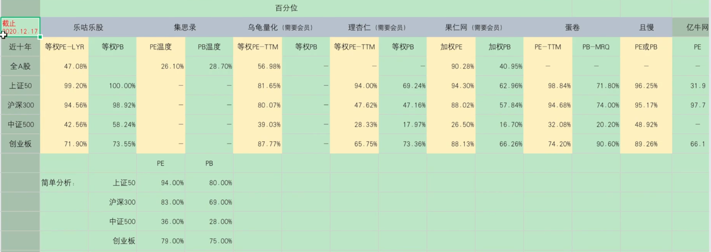

# 基金定投

@import "[TOC]" {cmd="toc" depthFrom=2 depthTo=3 orderedList=false}

<!-- code_chunk_output -->

- [为什么基金定投](#为什么基金定投)
- [定投误区](#定投误区)
  - [总结](#总结)
- [定投的前提](#定投的前提)
  - [什么适合定投](#什么适合定投)
  - [什么不适合定投](#什么不适合定投)
  - [总结](#总结-1)
- [估值](#估值)
  - [市盈率指数百分位](#市盈率指数百分位)
  - [股债比](#股债比)

<!-- /code_chunk_output -->

## 为什么基金定投
> 基金定投:定期的购买基金

- 无法精确的判断市场的高点和低点，就只好用定投的方式来分散风险，摊低成本
- 定投的优势：降低人为因素，譬如追涨杀跌、频繁操作、情绪恐慌、在用数据验证之后来规定纪律去帮助我们投资

## 定投误区
1. 定投随时都可以，在长期年限里面不需要管市场点位
   - 定投计算器：https://www.howbuy.com/fundtool/calfundaip.htm
   - 市场行情：
        1. **震荡市（尾部略涨）、震荡市（略跌）**：在尾部略涨和尾部略跌的两种震荡市中，充分的展现了定投平抑波动的特性，上涨和下跌都更平缓了，回撤的减少在长期而言会大幅提高收益
        2. **下跌熊市**：非常适合定投可以逐步的摊低成本和一次性买入相比减少大幅损失
        3. **上涨牛市**：不适合定投随着点位的走高，越定投成本越高，反而不如一次性买入收益高
        4. **先下跌后上涨（微笑曲线）**：非常适合定投开始下跌时成本逐步降低，后面开始上涨后因为累积足够的资金，收益迅速拉升
        5. **先上涨后下跌（哭泣曲线）**：不适合定投随着上涨成本越来越高，资金也越来越多后面下跌可能就是满仓迎接下跌，损失很大
    - 总结：随机进入市场无法确定是定投还是一把买入好，震荡市、下跌熊市、微笑曲线都很适合定投（以最基本的定期定额为例）上涨牛市、哭泣曲线都不适合定投，这只是简单判断。

2. 把定投当存钱，一直存而不取
    **定投第一原则就是止盈不止损**

3. 学会定投就能赚钱

### 总结
**定投不是任何时间都可以，要择时，还要择市。定投前要想好何时止盈，不能只存不取**

## 定投的前提
### 什么适合定投
1. 宽基指数基金（沪深 300、中证 500、上证 50、创业板等）
2. 行业指数基金、混合基金、主动基金、股票基金这些不能一概而论，有的适合定投，有的不适合；有时候适合定投，有时候不适合。
### 什么不适合定投
1. 个股：鱼龙杂可能好多年一直不涨，甚至一直下跌，更可能退市。但是可以用定投的思路建仓
2. 券商指数：证券是反身性行业，牛市来临越涨业绩越好，估值越低。熊市来临越跌估值越高，和其它行业都完全不一样。
   1. 定投的机会成本太高，因为它不是长期上涨，很容易倒在黎明前
   2. 右侧追击策略比定投更有效
3. 货币基金：收益稳定，几乎无波动，没有左侧
4. 债券基金：债券波动小，也没有左侧
5. 商品基金：强周期性，大周期来了一波涨上天，然后十几年不涨
6. 周期行业指数：化工、煤炭、钢铁、有色、石油等
   1. 举例有色来说：
      1. 周期指数不是长期向上的，往往是周期来了就一波暴涨，
      2. 周期未来时定投时间成本太高
      3. 利用经济周期的6阶段来判断周期，提前进行分批买入来配置更为有效

### 总结
**标的长期上涨，且有波动性才适合定投**

定投时间不能太短（几个月），也不能太长(5年以上)，定投的时间越长，平均年化收益越小。投的越久，越难获得高收益，虽然时间越长风险越低。
(10个一级行业，医药、可选消费、必须消费、金融、能源、材料、工业、信息、电信、公用事业)

## 估值
判断何时是高位，何时是低位

### 市盈率指数百分位
全A等权市盈率百分比(**30%低估、30-70%正常、70%高估**)
https://www.legulegu.com/stockdata/a-ttm-lyr
- 全A：所有A股
- 等权：给每只股票同样的权重，加权就是权重不一样，如此银行股权重大，市盈率低，小公司权重低，市盈率高无法反应市场真实变化(上证指数10年不涨就是这样)
- 百分比：譬如市盈率PE为50，在历史数据中小于50的数据是230次于i0的数据是140次，那么50的百分位就是230/(230+140)=62.16%，意思是比过去62%的数据为止都要高。
- 市盈率(PE)=市值/净利润
  - 如果PE是20，代表现在买入，投资者20年可以回本，每年收益率5%(PE倒数)
  - 适用于利润稳定的公司或行业，如医药、消费、食品、饮料;不适用于利润不稳定或周期行业，如化工、有色钢铁、地产、互联网、高科技、生物工程等
- 市净率(PB)=市值/净资产
  - 适用于重资产公司或行业，如大盘股、基建行业、市盈率无法估值的周期行业
  - 不适用于初创公司、高科技、科创板
各类市盈率的数据来源于中证官网、Wind、choice和各个机构，因为基础数据、指数PE计算方法各有不同，而PE百分位计算规则也不一致，所以会出现不一致的情况(有的用静态，有的用动态)
**主要用此方法判断上证 50、沪深 300、中证 500、创业板的百分位**

其它平台现成的估值数据:
- 集思录 https://www.jisilu.cn/data/indicator/
- 乌龟量化 https://wglh.com/chinaindicespe/sh000985/
- 理杏仁 https://www.lixinger.com/analytics/index/dashboard/value (需要会员)
- 果仁网 https://guorn.com/stock/history?his=1&index=000300,0.M.指数日行情_加权平均市盈率.0,1
- 蛋卷 https://danjuanfunds.com/djmodule/value-center?channel=1300100141
- 且慢 https://qieman.com/idx-eval
- 亿牛网 https://eniu.com/qu/sz399300

### 股债比

> 也叫做股权风险溢价、格雷厄姆指数
- **股票盈利收益率/无风险收益率**，比值越大，代表股票越有投资价值，比值越小，代表股票风险越大。
- **股票盈利收益率=股票市盈率的倒数，无风险收益率=十年期国债收益率**
- 20年12月21日，万德全A市盈率23.52，盈利收益率4.25，十年国债收益率3.31，比值1.28
- 投资数据网“股债比
https://www.touzid.com/macro/national-debt.html#/
- 乐咕乐股“股债比”
https://www.legulegu.com/stockdata/china-10-year-bond-yield
- 集思录“十年期国债收益率
https://www.jisilu.cn/data/indicator/