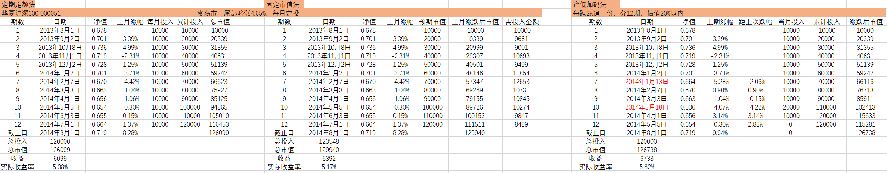

# 基金定投

@import "[TOC]" {cmd="toc" depthFrom=2 depthTo=3 orderedList=false}

<!-- code_chunk_output -->

- [为什么基金定投](#为什么基金定投)
- [定投误区](#定投误区)
  - [总结](#总结)
- [定投的前提](#定投的前提)
  - [什么适合定投](#什么适合定投)
  - [什么不适合定投](#什么不适合定投)
  - [总结](#总结-1)
- [估值](#估值)
  - [市盈率指数百分位](#市盈率指数百分位)
  - [股债比](#股债比)
  - [巴菲特指标](#巴菲特指标)
  - [A股市值/M2](#a股市值m2)
  - [用经济周期判断](#用经济周期判断)
- [投资目的](#投资目的)
  - [赚块钱](#赚块钱)
  - [赚零花钱](#赚零花钱)
  - [强制储蓄](#强制储蓄)
  - [攒教育金/退休金](#攒教育金退休金)
  - [资产增值](#资产增值)
- [投资年限](#投资年限)
  - [定投时间不能太短](#定投时间不能太短)
  - [定投时间不能太长](#定投时间不能太长)
- [用多少钱定投](#用多少钱定投)
- [公式：计算平均年化收益](#公式计算平均年化收益)
  - [算数平均法和几何平均法的收益计算](#算数平均法和几何平均法的收益计算)
  - [IRR（内部收益率）](#irr内部收益率)
  - [XIRR（资金加权收益率）](#xirr资金加权收益率)
  - [PMT、PV、FV 计算投资收益](#pmt-pv-fv-计算投资收益)
- [定投策略](#定投策略)
  - [定期定额法](#定期定额法)
  - [支付宝的估值策略和均线策略](#支付宝的估值策略和均线策略)
  - [固定市值法](#固定市值法)
  - [逢低加码法](#逢低加码法)
- [止盈策略](#止盈策略)
  - [常见问题](#常见问题)
  - [盈利目标止盈法（收益率止盈）](#盈利目标止盈法收益率止盈)
  - [盈利点止盈减半续投（收益率止盈）](#盈利点止盈减半续投收益率止盈)
  - [多次平均止盈法（估值止盈）](#多次平均止盈法估值止盈)
  - [最大回撤止盈法（最大回撤止盈）](#最大回撤止盈法最大回撤止盈)
  - [顾比均线止盈法](#顾比均线止盈法)
  - [多次平衡止盈法](#多次平衡止盈法)
  - [周期结束止盈法](#周期结束止盈法)
- [基金定投知识点](#基金定投知识点)
  - [基金净值和收益率](#基金净值和收益率)
  - [场内场外基金定投的优劣、实操、对比](#场内场外基金定投的优劣-实操-对比)

<!-- /code_chunk_output -->

## 为什么基金定投
> 基金定投:定期的购买基金

- 无法精确的判断市场的高点和低点，就只好用定投的方式来分散风险，摊低成本
- 定投的优势：降低人为因素，譬如追涨杀跌、频繁操作、情绪恐慌、在用数据验证之后来规定纪律去帮助我们投资

## 定投误区
1. 定投随时都可以，在长期年限里面不需要管市场点位
   - 定投计算器：https://www.howbuy.com/fundtool/calfundaip.htm
   - 市场行情：
        1. **震荡市（尾部略涨）、震荡市（略跌）**：在尾部略涨和尾部略跌的两种震荡市中，充分的展现了定投平抑波动的特性，上涨和下跌都更平缓了，回撤的减少在长期而言会大幅提高收益
        2. **下跌熊市**：非常适合定投可以逐步的摊低成本和一次性买入相比减少大幅损失
        3. **上涨牛市**：不适合定投随着点位的走高，越定投成本越高，反而不如一次性买入收益高
        4. **先下跌后上涨（微笑曲线）**：非常适合定投开始下跌时成本逐步降低，后面开始上涨后因为累积足够的资金，收益迅速拉升
        5. **先上涨后下跌（哭泣曲线）**：不适合定投随着上涨成本越来越高，资金也越来越多后面下跌可能就是满仓迎接下跌，损失很大
    - 总结：随机进入市场无法确定是定投还是一把买入好，震荡市、下跌熊市、微笑曲线都很适合定投（以最基本的定期定额为例）上涨牛市、哭泣曲线都不适合定投，这只是简单判断。

2. 把定投当存钱，一直存而不取
    **定投第一原则就是止盈不止损**

3. 学会定投就能赚钱

### 总结
**定投不是任何时间都可以，要择时，还要择市。定投前要想好何时止盈，不能只存不取**

## 定投的前提
### 什么适合定投
1. 宽基指数基金（沪深 300、中证 500、上证 50、创业板等）
2. 行业指数基金、混合基金、主动基金、股票基金这些不能一概而论，有的适合定投，有的不适合；有时候适合定投，有时候不适合。
### 什么不适合定投
1. 个股：鱼龙混杂可能好多年一直不涨，甚至一直下跌，更可能退市。但是可以用定投的思路建仓
2. 券商指数：证券是反身性行业，牛市来临越涨业绩越好，估值越低。熊市来临越跌估值越高，和其它行业都完全不一样。
   1. 定投的机会成本太高，因为它不是长期上涨，很容易倒在黎明前
   2. 右侧追击策略比定投更有效
3. 货币基金：收益稳定，几乎无波动，没有左侧
4. 债券基金：债券波动小，也没有左侧
5. 商品基金：强周期性，大周期来了一波涨上天，然后十几年不涨
6. 周期行业指数：化工、煤炭、钢铁、有色、石油等
   1. 举例有色来说：
      1. 周期指数不是长期向上的，往往是周期来了就一波暴涨，
      2. 周期未来时定投时间成本太高
      3. 利用经济周期的6阶段来判断周期，提前进行分批买入来配置更为有效

### 总结
**标的长期上涨，且有波动性才适合定投**

定投时间不能太短（几个月），也不能太长(5年以上)，定投的时间越长，平均年化收益越小。投的越久，越难获得高收益，虽然时间越长风险越低。
(10个一级行业，医药、可选消费、必须消费、金融、能源、材料、工业、信息、电信、公用事业)

## 估值
判断何时是高位，何时是低位

### 市盈率指数百分位
全A等权市盈率百分比(**30%低估、30-70%正常、70%高估**)
https://www.legulegu.com/stockdata/a-ttm-lyr
- 全A：所有A股
- 等权：给每只股票同样的权重，加权就是权重不一样，如此银行股权重大，市盈率低，小公司权重低，市盈率高无法反应市场真实变化(上证指数10年不涨就是这样)
- 百分比：譬如市盈率PE为50，在历史数据中小于50的数据是230次于i0的数据是140次，那么50的百分位就是230/(230+140)=62.16%，意思是比过去62%的数据为止都要高。
- 市盈率(PE)=市值/净利润
  - 如果PE是20，代表现在买入，投资者20年可以回本，每年收益率5%(PE倒数)
  - 适用于利润稳定的公司或行业，如医药、消费、食品、饮料；不适用于利润不稳定或周期行业，如化工、有色钢铁、地产、互联网、高科技、生物工程等
- 市净率(PB)=市值/净资产
  - 适用于重资产公司或行业，如大盘股、基建行业、市盈率无法估值的周期行业
  - 不适用于初创公司、高科技、科创板
各类市盈率的数据来源于中证官网、Wind、choice和各个机构，因为基础数据、指数PE计算方法各有不同，而PE百分位计算规则也不一致，所以会出现不一致的情况(有的用静态，有的用动态)
**主要用此方法判断上证 50、沪深 300、中证 500、创业板的百分位**

其它平台现成的估值数据:
- 集思录 https://www.jisilu.cn/data/indicator/
- 乌龟量化 https://wglh.com/chinaindicespe/sh000985/
- 理杏仁 https://www.lixinger.com/analytics/index/dashboard/value (需要会员)
- 果仁网 https://guorn.com/stock/history?his=1&index=000300,0.M.指数日行情_加权平均市盈率.0,1
- 蛋卷 https://danjuanfunds.com/djmodule/value-center?channel=1300100141
- 且慢 https://qieman.com/idx-eval
- 亿牛网 https://eniu.com/gu/sz399300

### 股债比

> 指标逻辑:利率和股市有一定的跷跷板关系，利率下调，资金成本降低，市场资金充沛，就容易流入股市，使之上涨。资金也会在债市和股市中间不断选择，扣除风险因素后，必然倾向于收益更高的市场。
利率下调也也是企业降低经营成本，有助于改善业绩，利好股市.

所以如果股市的收益率和无风险收益率比值在1的时候，肯定选择无风险收益率，而不是风险很大的股市

**股债比主要用于大行情的判断，而不是做波段**，它细化到很短的日期内也是会失灵的。

> 也叫做股权风险溢价、格雷厄姆指数
- **股票盈利收益率/无风险收益率**，比值越大，代表股票越有投资价值，比值越小，代表股票风险越大。
- **股票盈利收益率=股票市盈率的倒数，无风险收益率=十年期国债收益率**
- 20年12月21日，万德全A市盈率23.52，盈利收益率4.25，十年国债收益率3.31，比值1.28
- 投资数据网“股债比
https://www.touzid.com/macro/national-debt.html#/
- 乐咕乐股“股债比”
https://www.legulegu.com/stockdata/china-10-year-bond-yield
- 集思录“十年期国债收益率
https://www.jisilu.cn/data/indicator/
- 果仁网“全市场加权市盈率
https://guorn.com/stock/history?his=1&sector=4,0.M.板块 PEPB_平均 PE.0,1
- 投资数据网“沪深全A加权滚动市盈率
https://www.touzid.com/indice/fundamental.html#/tz100000

股债比接近1基本都是高估，风险极大，股债比接近2的时候极度低估。所以根据结论操作，在股债比接近1的时候把持仓分成3-5分，在3个月内分批卖出

### 巴菲特指标
> 上市公司总市值/GDP(准确的为GNP，但是在中国和 GDP 差距不大)

具体以什么为准，我们使用一个统计口径，然后自己作出图表后，自己分析百分比对应的A股点位，网上写的比较多的是70%以下低估，70-90%正常，90%以上高估

- 乐咕乐股 https://www.legulegu.com/stockdata/marketcap-gdp
- 理杏仁 https://www.lixinger.com/analytics/macro/main/gdp
- 上海证券交易所:http://www.sse.com.cn/market/stockdata/statistic/
- 深圳证券交易所:http://www.szse.cn/market/overview/index.html
- GDP 数据:国家统计局 https://data.stats.gov.cn/easyquery.htm?cn=C01

### A股市值/M2
A股总市值/M2，然后看百分比值多处的历史位置

> M2:社会上货币供应的数量(全社会的钱)，包括流通中的现金、居民和企业活期存款、居民和企业定期存款。

> 指标逻辑:M2代表货币供应量，M2增涨代表货币供应的多，那么钱会进入社会各个领域，更会优先进去房市和股市，利好股市，比值降低代表货币供应充足，但是钱还没进入到股市，所以股市还没长起来，总市值也就没有拾升，所以比值才低。而总市值拾升后比值就会变大。代表股市开始上涨，如果比值过大，代表社会上的钱过度进入股市，泡沫开始形成

- 国家统计局:https://data.stats.gov.cn/adv.htm?m=advquery&cn=C01
- 理杏仁M2 数据:https://www.lixinger.com/analytics/macro/main/money-supply

### 用经济周期判断
> 根据美林“投资时钟”经济周期可以划分为:衰退一复苏一过热一胀，与之对应的主要投资品种则为:**衰退(债券)一复苏(股票)一过热(商品)一胀(现金)**
> 
> 为什么在4个周期要选择这4大类的投资品种，而不是选其它?
> 因为它们相关性最低。

更细一步根据《积极型资产配置指南》一书，经济周期可以分为6个阶段，每个阶段的大类资产涨幅互不相同，既可以根据当下各类资产的涨幅来判断所处的周期阶段，也可以根据各种就经济指标来判断周期的位置

**周期不一定是按照顺序发展，偶尔也会跳过某个阶段，或者倒回上个阶段，但是大部分时间是按照顺序发展，且下面各个判别的指标和建议的配比也只是客观存在，不排除市场紊乱风格颠倒的情况。**

判断经济周期的指标:利率、库存、PMI、社融、M2、CPI、PPI、伦铜、CRB、信用利差等等

#### 各个阶段的各类资产配置推荐比例:
1. 阶段 1:衰退
   - 标志：通胀下行，利率下行，大家觉得股市不好，跌入熊市
   - 配置：债券60%，股票30%，现金10%(债券分几次买人，可转债优先，长债优先;股票定投，超配大盘股，以股息率为主的资金密集型行业因为利率大幅下跌而收益最大，如上证50，沪深300，中证红利)
2. 阶段 2:复苏初期
   - 标志：通胀到底，利率到底，债券已经走出牛市
   - 配置：债券30%，股票45%，现金15%(利率债信用债均配，长债优先;股票大小盘均配)
3. 阶段 3：复苏末期
   - 标志：通胀开始上升，利率由跌转升，股票明显右侧
   - 配置：债券20%，股票60%，现金10%，商品10%(长短债均配;股票超配周期和中小创，如创业板、中证500、有色;商品超配黄金，均配原油和其他商品)
4. 阶段 4：过热初期
   - 标志：股市大涨，周期品大涨，利率提升，债券转熊
   - 配置：债券10%，股票60%，现金10%，商品20%(债券短债为主，也可用货基代替;股票加大原材料和能源股的配置，做好止盈准备;商品均配黄金、原油和其他)
5. 阶段 5：过热末期
   - 标志：通胀高企，PPI明显上涨，大宗商品价格大涨，利率大幅提升，央行开始加息
   - 配置：债券10%，股票25%，现金40%，商品25%（债券短债为主，也可用货基代替;股票煤飞色舞（煤炭、有色），时刻警惕，不断降低股票仓，并转入大消费、白酒、医药）
6. 阶段 6：滞胀
   - 配置：现金50%，债券缓慢加到20%，明知道股票下跌但依然还要拿30%，可以用定投思路
 
 

 

 

 ## 定投择时
 定投时间优先次序:**大熊市中段>估值中位数以下的震荡市>低估值区域>牛市尾端>牛市的初期**
- 大熊市中段:熊市点位不断创新低，定投可以避免一次性投入造成的资金损失过大，也可以随着市场下跌而摊低成本，因为刚开始定投资金少，反而越跌越放心，知道未来只要稍微一涨，便能马上从负转正；
- 中位数以下震荡市:中位数市场可上可下，无法判断时采用定投逐步累积资本、后期上涨因为前期有累积所以获利可观。后期下跌也可以持续定投摊低成本，从中位数下跌空间有限，越跌风险越小;
- 低估值区域:不知道熊市何时结束，不知道什么时候会上涨，采用定投避免资金一次性投入后长期不涨，而浪费资金的机会成本。
- 牛市尾端:市场已经极度高估，随时可能下跌，此时定投还不如等市场下跌一些再开始，否则资金在高位接盘。如果此时开始定投，因为刚开始定投资金少，获利也有限，且越投下跌风险越大。
- 牛市初期:此时定投会出现越定投市场越涨，资金成本越高，定投到最后资金累积较多，到最后是小仓位迎接上涨重仓迎接暴跌.
**综上所述，我们在不知道后市走势如何的情况下，只需要知道当前的估值区域，便可选择相应胜率更大的方式来决定是否开始定投。**

## 投资目的
### 赚块钱
看见市场的好，想去乘一波东风，赚个快钱就走，不考虑长期持有
这种情况请不要定投，不要入市，以免钱打了水漂

### 赚零花钱
只想赚 2000的零花钱，不去管平均年化，不去管百分之多少止盈，只需要在适合定投的行情下开始定投，等你赚到2000块就退出来。
需要好好计算每个月定投多少，然后在不同的收益率下看需要多久能赚到2000

用excel 的IRR 函数计算
| 赚到2000 | 每月定投500元 | 每月定投1000元 | 每月定投2000元 |
| ---- | -------- | --------- | --------- |
| 一年   | 66.73%   | 32.14%    | 15.74%    |
| 两年   | 15.56%   | 7.89%     | 3.97%     |

如果每月投 2000，行情不错的情况下一年就能赚到 2000,差一点的话两年也能赚到2000了。每月投 500要赚到2000，如果年化低于15%可能要两年以上的时间了。如果下跌记住“止盈不止损”，不赚到 2000 坚决不出来。

### 强制储蓄
不过分关注收益率，只要不亏损，比银行存款高就可以，当作强制来管理。虽然可以把定投当作强制储蓄，但是也需要根据自己的预期和风险承受能力来设置止盈点，否则长期定投不知道无非就是一直在坐过山车。
比如每月固定存2000，看不同利率5年或10年后的金额

理财计算器：https://money.wengu8.com/fulicalculator/ 或用 FV、IRR 函数计算
| **月存金额** | **年利率** | **年限** | **复利方式** | **总额（元）**   |
| -------- | ------- | ------ | -------- | ----------- |
| 2,000    | 5%      | 5      | 月复利      | ¥136,578.88 |
| 2,000    | 5%      | 10     | 月复利      | ¥311,858.58 |
| 2,000    | 8%      | 5      | 月复利      | ¥147,933.40 |
| 2,000    | 8%      | 10     | 月复利      | ¥368,331.35 |

（此处年利率转换月利率直接除以12，并不考虑复利的转换）

### 攒教育金/退休金
今年30岁，想50岁退休，退休后没有大项消费了，只需要每月2w的生活费就足够。那么一年需要24w生活费如果想要靠无风险收益获得每年24w，按年化5%算，起码需要480w，然后需要用20年来攒到480w，分析按不同的收益率每月需要定投多少钱。
理财计算器：https://money.wengu8.com/fulicalculator/ 或用 PMT函数计算
| 方案  | 月存金额（元） | 年利率 | 期数（月） | 复利方式 |
| --- | ------- | --- | ----- | ---- |
| 方案一 | 11,650  | 5%  | 240   | 月复利  |
| 方案二 | 8,100   | 8%  | 240   | 月复利  |
| 方案三 | 6,270   | 10% | 240   | 月复利  |
| 方案四 | 4,810   | 12% | 240   | 月复利  |

### 资产增值
若想资产以滚雪球的方式一直持续增值，还是需要用到大类资产配置来管理资产，定投只适用于股票配置下某些特定的时段，无法覆盖全时段。
比如你在熊市或者低估值区域开始定投，投到牛市上涨以后止盈退出，那退出后的资金怎么操作呢?此时是牛市后半段，又不能重新开始定投，除了放货币基金还有其他的增值方式吗?
如果是大类资产配置就可以有多种方式来安排资金，所以基金定投一定要认清它的局限性

## 投资年限
**禁区：**
1. **中途中止**
2. **不止盈**

### 定投时间不能太短
一般定投需要把总资金分24或者 36份，每月投一份或半月投一份，也就是花2-3年来定投。如果定投时间太短,
- 一是市场可能波动不够，使定投无效。比如你只定投6-12个月，在6个月定投完之后股市很有可能还在下跌，或者继续震荡，并没有上涨达到你的止盈点。但你的定投资金已经用完，此时该怎么办?
如果你有资金可以追加，但是如果你本身只准备了这么多闲钱来定投，无法追加就非常难受了，但股市在 2-3年的任意一个时间段都会有足够的波动，上涨下跌的波动足够大，有足够的机会来止盈
- 二是无法平抑股市的波动来摊低成本，定投最主要的目的就是平抑波动来摊低成本，定投的时间越短，越和一把嗦买人的效果接近，失去定投的效果

### 定投时间不能太长
很多人想把定投当作长期储蓄，投个5年10年等以后自己买房、出国留学、儿子上学、女儿结婚的时候拿出来用。
这样是不可取的，因为投的时间越长，平均年化收益越小，这个往往伴随设立了过高的年化而产生。譬如你设立年化25%止盈，投一年没有达到25%，无法止盈，那么第二年就需要总收益56.25%才能止盈(定投年化是需要考虑复利的，公式为:(1+年化)^Y)，而第三年则需要达到 95.31%才能止盈，以此类推，定投的时间越久就越难获得高收益，越难止盈。
所以此时必须降低你的收益预期，比如定投三年还达不到总收益率95%，那就降低为70%止盈，算下来三年平均年化是19.34%(公式为:(1+成立收益)^(1/Y)-1)
所以，虽然定投越长，正收益的概率越大，风险越小，但是并不是收益率越高，因为你在中途坐过山车的儿率大大增加了
定投计算器：https://www.howbuy.com/fundtool/calfundaip.htm

| 至2021.1   | 总收益     | 年限 | 平均年化收益 |
| ------ | ------- | -- | ------ |
| 2005.1 | 179.94% | 16 | 6.65%  |
| 2007.1 | 127.04% | 14 | 6.03%  |
| 2009.1 | 124.65% | 12 | 6.98%  |
| 2011.1 | 115.52% | 10 | 7.98%  |
| 2013.1 | 97.08%  | 8  | 8.85%  |
| 2015.1 | 58.89%  | 6  | 8.02%  |
| 2017.1 | 45.74%  | 4  | 9.87%  |
| 2019.1 | 35.63%  | 2  | 16.46% |

## 用多少钱定投
- 方法一，年龄划分:
人在年轻的时候虽然没储蓄，但是收入会随着工作经验的增加而增长，到了老年虽然有了储蓄,但是比年轻时更需要保障，且大多数收人都不如年轻时有增长的潜力。所以年轻的时候可以把大部分资金用于定投，因为你未来有足够的时间来等待止盈。也有持续的收入来保障你持续定投，而随着年龄的增长更多的钱应该用来保障眼下的生活，而不再是定投去等待未来的收益
30岁前投资亏了但得到了经验，持续的收入能填平亏损，而60岁后就只能用30%甚至更少的钱去投资（特指高风险投资），否则亏损的是人生

- 方法二，根据资产配置:
譬如你可用于投资的钱是100w，股票50%，债券50%，其中投资于股票的50w有10W投资沪深 300，那么在沪深 300适合定投的时候，就可以把10w分成24份，一份4166，每个月投一份，后面止盈后继续转配置

总结:
1. 一旦开始定投一定不要止损，也就是中止定投，所以在定投开始前一定要规划好充足的资金。
2. 越年轻，可用于投资的资金比例越大，越年老越应保守
3. 如果用闲钱投资(非可持续性收入的钱)，最好制定至少3年的定投预期，以防止市场极端情况长期连续下跌而导致资金过早耗尽

## 公式：计算平均年化收益
### 算数平均法和几何平均法的收益计算
1. 算数平均法：
$$收益率=总收益/总成本$$
不考虑资金的先后投入
$$平均年化=总收益率/时间$$
不考虑复利的作用
2. 几何平均法：
收益率，用IRR或者XIRR计算，考虑了资金先后投入的占用成本问题平均年化，考虑了资金复利的问题。
   - 五个指标(本金、年化、总收益率、到期金额、年限 Y)
   1. 知道总收益，算平均年化
   公式：$$年化=(1+总收益率)\sqrt Y-1=(1+总收益率)^{1/Y}-1$$
   其中Y为年限
   2. 知道平均年化，算总收益
   公式：$$总收益=本金*[(1+年化)^Y-1]$$
   excel里可用:=POWER(1+年化,Y)
   在线复利计算器:https://itool.co/compound-interest
3. 72 法则和 115 法则。
用72/年化得到的年数，就是几年翻一倍，用115/年化，就是几年翻3倍

### IRR（内部收益率）
计算定期定额，定期不定额的定投年化收益率(算保险的年金险和信用卡分期)

格式：
| 期数 | 月投 | 现金流 |
| ------ | ------- | -- |
| 1 | 1000 | -1000 | 
| 2 | 1000 | -1000 | 
| 3 | 1000 | -1000 |
| 4 | 1000 | -1000 |
| 5 | 1000  | -1000 |
| 6 | 1000  | -1000 |
| 7 | 1000  | -1000 |
| 8 | 1000  | -1000 |
| ...... | ......  | ...... |
| 终值 |   |  |
| IRR |   |  |

- 月复利&年复利转换公式
$$年复利=(1+月复利)^{12}-1$$
$$月复利=(1+年复利)^{1/12}-1$$

**备注:**
IRR 显示 num,错误的时候，先检查单元格式。然后可以改为IRR(现金流，预估数字),例如=IRR(B2:B13,0)如果收益率小于10%，预估数字写0，大于0而没有太高，也可以写0.1或0.2

**缺陷:**
**短期大额资金的进出对结果有影响**

### XIRR（资金加权收益率）
计算不定期不定额的定投年化收益率，可以精确定义资金进出日期

> XIRR计算的是年化利率，但是当投资期小于一年时，实际上计算的是以投资期为周期的复利增值后一年的收益率。当大于一年时才是以每年为周期计算的复利增值。

**小结：**
- 两者都是求现金流的内部收益率
- IRR用现金流求预估值，可以不要日期，考虑了占用资金的时间不同而计算出的“实际利率”
- IRR计算的结果是时间间隔的利率，需要转化为年利率
- XIRR现金流和日期都需要，可算定期定额、定期不定额、不定期定额和不定期不定额的定投。计算结果直接为年化利率，比IRR准确
- IRR和XIRR至少有一个正现金流和一个负现金流，否则显示错误值#NUM!

### PMT、PV、FV 计算投资收益
- RATE，利率一一需要多少收益率，=RATE(nper,pmt,py,[fv],[type],[guess])
- NPER，期数一一需要多少年，=NPER(rate,pmt,py,[fv],[type])
- PMT，支付金额一一每期存多少钱，=PMT(rate,nper,py,[fv]，[type])
- PV，现值一一需要多少本钱，=PV(rate,nper,pmt,[fv],[type])
- FV，未来值一一到期有多少钱，=FV(rate,nper,pmt,[pv],[type])
- TPYE，是否期初支付一一各期的付款时间是在期初还是期末
  - 0或省略为期末，代表钱在期末支付。
  - 1为期初，代表钱在开始就要支付，比如交房租，买年金险、每月1号定投基金

备注:
1. 现金流投资的时候分清正负号，贷出为负，收入为正。如PMT和PV为负，FV为正
2. 结果显示错误num，检查单元格格式、把单元格拉宽、检查正负号、检查各数值单位是否统一都是年或者月
3. 定投计算时网上大多tpye采用期末“0”来计算，但是要根据实际情况，警如在有本金的前提下，第一年年初有本金10w，后面每年追加2w则是在第二年的年初追加2W，这里可以认为是第一年的期末，所以用“0”，但是在没有本金的情况下，都是每年年初就投人一笔资金，这里则需要用期初“1”。也可以在有本金10w的情况下，第一年年初就直接追加2w，用期初“0”，但是这样不太合常理，可以直接说成本金12w了，没必要说成10w再去追加什么的。**总之可以用IRR验算。**
4. 在有现值PV时，不要把PV和期初搞混。
5. 如果省略pmt，则必须包括py，如果省略py，则假定为0，则必须包括pmt

## 定投策略
重点：
**定投前制定定投时间，定投总资金量，定投份额
熊市多买，越跌越买，牛市多卖，越涨越卖**

### 定期定额法

### 支付宝的估值策略和均线策略
易方达上证50（110003），估值和均线皆可选
易方达沪深300（110020），估值和均线皆可选
易方达中证500（007028），估值和均线皆可选
易方达创业板（110026），只有均线策略

#### 估值策略
在定投日时，指数估值低估，则定投，非低估（正常或高估），不定投。
   - 高估70%及以上百分位区域
   - 正常30%～70%百分位区域
   - 低估30%及以下百分位区域
1. 优点：普通人容易上手，选择一下就再也不用管了，比普通定投的收益还是有所提高。
2. 缺点：因为支付宝介绍中只用PE来判断估值，你并不知道它的PE是如何计算的，采用动态还是静态，加权还是等权，所以也不知道估值准不准，并且只用PE估值是否单一，比如上证50和沪深300可以用PE估值，但是中证500需要结合PE和PB共同估值比较好，另外把所有操作都交给支付宝选择，赚了亏了自己也不懂原理，学不到东西。
#### 均线策略
参考指标为沪深300、中证500、创业板三个宽基指数，参考均线为180，250，500日平均线，（180日均
线就是最近180个交易日收盘价的平均价）
- 定投前一日指数价格超过参考的均线价格，减少定投，超过的越多，定投金额越少。
- 定投前一日指数价格低于参考的均线价格，加大定投，低的越多，定投的金额越多。但是如果近10日振幅大于
5%，扣款率要比振幅小于5%时少100%。（近10日振幅=指数近10日最高收盘价/近10日最低收盘价-1）

金额会控制在一个范围内，60%≤金额≤210%

1. 优点：均线策略在长期来看，也就是5-7年一个完整的牛熊阶段时，比无脑的定期定额的定投收益有所提高。短期则有可能不如定期定额。
2. 缺点：
   1. 参考指数只有沪深300、中证500、创业板三个，可选较少，如果你买的上证50的指数基金，甚至都无法以上证50指数作为参考指标，其它买行业基金就更不用说了，你买白酒、医药、新能源等都只能选那三个宽基指数作为参考指标，这样毫无意义。
   2. MA180、250、500不懂的新手不知道如何选（实际上选哪个最后结果都相差不大）
   3. 如果市场大跌，本应该加大定投金额，但是如果下跌幅度过大导致振幅过大，均线策略反而让你减少了定投金额，非常不合理。比如沪深300指数2018.9.28-2018.10.18共10个交易日，如果设置的基本定投金额为2000元，10.18日定投的时候，MA500为3654点，沪深300前一日点数为3118，比MA500低14.66%，本应该随着市场下跌加大定投金额，但因为近10日振幅为10%以上，所以只能投80%，1600元。
   4. 如果市场大涨，则应该减少定投金额，甚至涨到牛市后段应该停止定投，但是均线策略没有这一保护机制。比如从2015年初开始沪深300就已经高于MA50050%以上，但是我们按照策略依然每月要定投计划金额的70%，甚至到了6月最疯狂的时候，按照机制依然要每月定投70%，这就非常死板了。
   5. 均线指标最大的缺陷是滞后性，都是由已经产生的价格来绘制的，对未来的趋势具有很大的猜测性。

### 固定市值法
**每月投人对应基金的固定市值**
预计定投12个月，假设第一次定投时基金净值刚好为1。每月投1000市值，就是1000元，如果净值1.32，投1000
市值就是757.57元
第一个月，投入1000元
第二个月，上涨10%，净值1.1，市值1100，预计市值2000.
买入金额=2000-1100=900元
第三个月，下跌25%，净值0.825，市值1500，预计市值3000.
买入金额=3000-1500=1500元
第四个月，下跌15%，净值0.701，市值2550，预计市值4000.
买入金额=4000-2550=1450元
第五个月，上涨20%，净值0.842，市值4800，预计市值5000.
买入金额=5000-4800=200元
第六个月，上涨15%，净值0.968，市值5750，预计市值6000.
买入金额=6000-5750=250元
第七个月，上涨30%，净值1.258，市值7800，预计市值7000.
买入金额=7000-7800=-800元，取出800

1. 优点：能在大幅下跌时极大的摊低成本，牛市的时候不断卖出而降低风险。并且纪律性很强，对人性的考验不强，很容易执行。
2. 缺点：持续下跌的熊市对资金的投人会持续加大，定投开始前要预留足够的资金。牛市也容易丢失掉大部分的利润
新手也可以很快上手，需要一点点操心，且收益很可观。非常推荐

### 逢低加码法
**把资金分成12-30份，每月固定买一份，每当大跌超过2%，再额外多买一份**（2%这个数值不是固定的，可以根据定投的期数或者整体市场的百分位来调整。）

比如你定投某指数，指数估值百分位在30%，在每月正常定投之外每大跌3%，多买一份，这样因为指数本身在低
位，下跌空间不大，如果续大幅下跌，也因为额外追加的份数而及时收集筹码，就算提前把定投的份额用光了，整体的估值也因为在低位持续的下跌，到了很低很低的区间，也不怕子弹打光后面会趴很久。

而如果估值百分位在50%，就可以设为每大跌5%多买一份，因为此时指数上下空间都很大，若额外购买的百分比
设的很小，会造成提前把份额用完的而指数估值还没有降下来的情况。
辅助技巧，定投时间也不固定，原则是估值越低，定投期限越短，这样估值低的时候可以短期在低位收集大量筹码（但是也不把时间缩的过短），估值中等的时候把定投时间拉长以保证在估值慢慢下降的时候我们有足够的筹码慢慢来摊低成本。

原则：
1. 开始定投时，估值越低，份额划分的越少，定投期数越少；估值越高，份额划分越多，期数越多。
2. 开始定投时，估值越低，每小跌2%-3%可额外买一份，估值越高，每大跌5%-6%可额外买一份。
3. 估值高于50%不投

加码方法：
**即时点位，比上一次加码的点位跌幅超2%（第一次追加份额以第一次定投时的点位为基准，每跌2%追加一份）**

逢低加码和固定市值法的区别：
1. 两者都是越跌买的金额越多；
2. 固定市值法上涨会少买，逢低加码法则不会；
3. 固定市值法在定投制定时不容易计算总的定投金额，容易越跌越追加，导致后期资金不够，推荐有增量资金的人群。逢低加码法在最初就可以把资金划分完毕，适用于存量资金的人群。
4. 固定市值法纪律性更强，逢低加码法太灵活比较考验人性。
5. 逢低加码法适合有一定定投经验，且对市场整体感受更敏锐的投资者，在熟练的掌握后资金的使用效率也更高。新手使用容易出错。

标的000051华夏沪深300
实践一：沪深300估值20%（PE-TTM市值加权法，所有时间区间，因为沪深300的编制是以市值加权来编制的）
以下开始定投12个月，开始时间2013.8.1，金额12w分12份，每月固定1号投1w（休息日顺延），每当点位比上一次额外追加份额时的点位低2%时额外多投一份（第一次追加份额以第一次定投时的点位为基准），低4%时多投2份，以此类推。

实践二：沪深300估值40%以下开始定投18个月，每月6666.6共计12w。开始时间2018.4.2，其它同上，每次
跌3%追一份，低6%时多投2份，以此类推。

## 止盈策略

### 常见问题
#### 为什么要止盈
1. 防止坐过山车，长期定投不止盈收益率很差
2. 定投达到止盈点后，此时是赚钱的，但是相对于继续投下去而言是仓位低，如果不止盈继续投，仓位就越来越重，一旦下跌就变成了小仓位赚钱，大仓后迎接下跌。
1. 定投后期钝化效果明显，随着定投到后期期数的增多，金额愈来越大，那新定投金额所能产生的摊低效果就会越来越弱，这就是钝化效果。钝化效果明显后定投就失去了原本的意义，所以需要止盈重新再来。

#### 止盈点多少合适
1. **投资股市长期的合理回报在8-15%（小盘股长期年化在14%，大盘股在11%），定投一般2-3年为一个周期**。按平均年化8%算，3年的收益在26%；按平均年化15%算，3年的收益在52%，所以如果定投3年的合理年化区间应该在30-45%，而平均每年是9-13%。因为我们每次定投不可能都是定投完满仓才止盈，很多情况下定投一半或者一大半就达到止盈点了，所以止盈点不能直接按照股市回报来设立，要适当的高一点。所以15-20%是一个合适的区间。
2. **止盈点设置的过高，虽然收益率越高，但是不一定能达到。**
譬如你设立年化25%止盈，投一年没有达到25%，无法止盈，那么第二年就需要总收益56.25%才能止盈（定投年化是需要考虑复利的，公式为：(1+年化)^Y），而第三年则需要达到95.31%才能止盈。以此类推，定
投的时间越久，就越难获得高收益，越难止盈。
3. **止盈点设置的过低，会导致收益率降低，让定投没有了吸引力。**
譬如你设置年化10%止盈，那么很容易就能达到止盈点，反复的止盈重新定投，结果下来长期的年化可能只有6-7%。
4. 所以给自已设置止盈点的时候要客观合理一点。当定投标的波动大，且自已风险承受能力和预期收益高时，可适当提高止盈点；当市场处于低位，且坚持长期持有，可提高止盈点，等待牛市的到来；如果市场前景不明，上蹿下跳，可降低止盈点，落袋为安。
5. 一旦你发现自己定投的起点错了，定投在了一个高点之上，或者最开始设的止盈点过高，定投很久还没有达到过，那么就需要马上纠正止盈标准，降低年化预期。

#### 如果定投时间较短，就已经达到止盈点，要不要止盈
譬如在定投3个月就已经达到止盈点了，此时因为定投的金额太少，可以不用止盈。如果你担心又跌回去了，其实此时定投金额少，就算跌回去了也可以通过继续定投来摊低成本，也不存在钝化效果，所以不用怕。
**我们可以设置观察期3-6个月，如果你定投计划12个月，那么3个月内就算达到止盈点也不用止盈，如果你定投计划24个月，则6个月内不止盈。**

#### 估值很低的时候（如低于30%）不止盈行不行
低估值20%定投，50%不投，超过80%就卖出。
结论是不行，因为一样会坐过山车，估值并不是每次都从20%一路涨到80%，它有时候估值从20%涨到30%，再跌到20%，但实际点位已经涨了25%再跌回去。低估值区域的止盈刚好让你能在熊市也赚钱。
并且拒绝止盈后整体把定投的时间拉的更长，后面止盈更加困难。

#### 止盈后怎么办
先要区分止盈后的行情，如果止盈后是低估值区域，直接重新划分资金，重新开始定投即可。

如果止盈后是高估值区域或者牛市，此时重新开始定投会让很多人觉得特别难受，觉得不如一把梭买人，但又怕风险。这个时候有两种做法。
1. 继续定投，虽然此时可能已经进人右侧行情，但是因为你设立了止盈点，有了保护机制，后面虽然一边投一边涨不是很友好，但至少不会亏钱，只是少赚一点，到了牛市后期如果突然暴跌，也因为你一直在止盈后重新开始，属于小规模参与，暴跌损失也不大。
2. 止盈后转为资产配置，做一个股债比50-50的组合。每年进行1-2次的再平衡。
比如你持有的基金涨到了100元，需要止盈了，然后可以卖出50元，买入债券。这样就是股票50，债券50，在
半年后如果疯牛行情下股票的50又涨到了80，债券没涨还是50，那么一共是130，接下来卖出15元股票，买人债券，这样就变成了股票65元，债券65元的平衡状态了。从而形成了一个高卖低买的资产平衡。

### 盈利目标止盈法（收益率止盈）
**适用范围：最常见的通用型**
**达到设立的止盈目标无条件止盈，假设你目标平均年化15%，定投一年以内达到了15%就无条件卖出。**定投2年以内达到了32.25%无条件卖出，如果没有就继续持有。到第三年则必须达到52.08%才止盈卖出，因为52.08%的三年总收益算下来平均年化才是15%。**如果连续5年都达不到止盈条件，就必须降低止盈目标**，警如从15%降低为12%。此时5年的总收益达到76.23%即满足要求。
此时止盈有几种情况。**如果股市估值较低，可以全部卖出重新定投**。低估值也会坐过山车，所以必须止盈，并且不止盈继续定投和止盈后重新分12或24期定投，它们的仓位是完全不一样的。
**如果股市估值中等可以卖出一半买人债券**；**如果股市过热就全部卖出买入债券或者货币基金，然后等市场估值降到中位数以下重新开始定投。**

### 盈利点止盈减半续投（收益率止盈）
**适用范围：想在牛市定投，即怕到顶又怕下跌的人，且还不太会看估值。**
比如从沪深300指数2500点开始每月投3000，设定40%止盈点，涨到3500你刚好赚到40%，全部卖出；
（至于之前我们讲过止盈点最好在15-20%，这里为什么是40%，因为和点位有关，如果点位在极度低估
的时候是可以适当提高止盈点的。）
然后每月1500，止盈点设20%，重新开始定投。涨到4200刚好赚到20%，全部卖出；
重新每月750，止盈点10%开始定投。有可能涨不到你赚10%的时候，已经暴跌，但是你大部分资金已经止盈卖
出，所以亏损占比很小
持续定投下去，等到基金盈利为-15%时候，沪深300指数可能在3600左右；
加大定投，每月1500，等基金盈利在-30%时候，可能在2900,
加大定投，每月3000，止盈点恢复为40%。

### 多次平均止盈法（估值止盈）
**适用范围：不愿操心细节，只关注大的行情，不吃鱼头鱼尾，只吃鱼身**
**一旦市场特别高估，把资金分成3-5份，在3个月内分批卖出**。因为疯狂的牛市很少能持续3个月以上，此时把资金分成3-5份逐步卖出，如果未来市场持续涨，逐步卖出的过程中剩下的能继续享受收益，如果暴跌，因为已经卖了几份，也减少了一定的损失，所以无论上涨下跌从心态上都能接受。不会特别的恐惧与贪婪。
判断市场高估的方法我们前面讲过，譬如巴菲特指数、股债比、估值百分位、市值比GDP或M2。
估值止盈最大的缺点就是**容易错失疯狂牛市最后的涨幅**，而那段涨幅往往很肥美。

### 最大回撤止盈法（最大回撤止盈）
**适用范围：牛市和短期涨幅较大的行情，震荡市和熊市最好别用**
**最大回撤是指在选定的时间内，前面最高点与后面最低点的差值。最高点回撤止盈是典型的右侧交易策略，适用于追击券商、强势股票、周期股等等**，譬如21年2月初的有色ETF。在疯牛行情下估值止盈法和收益率止盈法很容易导致止盈过早，丧失最后一段的丰厚利润，且止盈后又会遇到尴尬的继不继续买的问题。所以最高点回撤法止盈可以弥补这一块。

回撤的百分比如何计算？
1. **根据投资资产的波动性来设立**。
**波动性越大，回撤位也就越大。比如沪深300指数在历史大牛市上升途中平均最大回撤在8-10%左右，创业板和中证500在10-15%，所以我们可以对购买沪深300的基金设置一个8%的回撤位。而创业板和中证500设10-15%回撤位**。
2. **根据投资者心理承受能力来设立**。
无论投资者资金量大小，或者投资年限和技巧有多成熟，**在你满仓后，一旦所有本金损失达到15%几乎就是心理承受能力的极限。超过这个值很容易会造成投资心态的崩溃**，而8-10%是一个既能承受住损失，又可以期盼获得超额收益的波动值
3. 俗话说牛市多暴跌，熊市多暴涨，**如果设立的回撤位过低，比如5%，那么在牛市中很容易就被洗下车了**，因为在牛市的上升途中5%的回撤很常见，随便一个波动后面的大牛市就与你无缘。
而**如果设立的太高，比如15%，会承受更多的风险和损失更多的利润**，收益的回撤幅度很大。

所以结合上面的三条，**普通投资者设立8-10%的回撤位是比较合理的**。心理层面能接受波动，震荡的时候也不容易被震下车

建议：
1. **和顾比均线结合使用**，行情不是特别疯狂，可能还有较大上涨空间的时候，优先用离的远的止盈点止盈，行情疯狂的时候，用离的近的止盈点止盈
2. **在最大回撤的基础上加一个锚点，就算没有跌破最大回撤的点，但是跌破了锚点也可以卖出**。比如点位涨到1000点时你收益率50%，你想保住40%的收益率，那么就把934点设为锚点，不管后市是上涨下跌还是震荡，只要跌破了934点，或者在最高位回撤8%，先达到任何一个你都开启止盈。

### 顾比均线止盈法
**适用范围：过热和高估的行情，不适用于震荡市，主要适用于指数基金**
顾比均线全称是顾比移动复合平均线，由澳大利亚的投资家戴若-顾比发明。顾比均线由两组均线组构成，短期组为：3、5、8、10、12、15。长期组为：30、35、40、45、50、60。**短期组代表短期投机者的行为与心理表现，长期组代表中长期投资者的行为与表现**。
所以**在过热或者高估行情的时候，如果价格跌破了短期均线组（以收盘价为准），代表短期的行情可能结束，我们可以卖出一半仓位，而等到长期均线组也跌破的时候，大的趋势可能就结束了，我们就可以清仓了**。
把顾比均线和最高回撤法结合使用，行情不是特别疯狂，可能还有较大上涨空间的时候，优先用离的远的止盈，行情疯狂的时候，用离的近的止盈

实践一：创业板2015年6月，最高点为4037.9，最高点回撤8%的点位是3714，6月15日收盘价3696跌破顾
比均线短期组的最下方一根均线，6月26日收盘价2920跌破长期均线组最下方一根均线。按照止盈策略，6月已经处于疯牛行情，把顾比均线和回撤法结合使用，应以离价格最近的点位来优先止盈，所以此时应该在3714点跌破后就直接清仓。而如果只使用顾比均线法，则应该在3696时卖出一半，2920时清仓，这样也能保住不少利润，不至于最后跌倒谷底1900点左右，甚至最后反弹的最高点也只有2900点。

实践二：上证50，2021年2月，最高点4014，最高点回撤8%为3692，2月22日收盘价3881，跌破全部短期
均线组，3月4日收盘价3708，跌破全部长期均线组，此时上证50虽然近两年涨幅较大，估值也很高，但是并没有到很疯狂的情绪驱动阶段，如果我们想继续多拿一段，就可以用离的远的点位3692来止盈，所以当跌破3881时，虽然跌破了短期均线组，也可以暂时不卖，跌破3708时，跌破了长期均线组也可以再忍忍，直到跌破3692时再开始启动止盈也来得及。（当然从其他方面来分析此处也可以不止盈，跟随回撤调整也行

> 记住顾比均线只是技术指标，是根据已经产生的价格来绘制图形，所以永远是延迟性的，我们只能拿它在情绪主导市场的时候作为一个辅助参考，这样可以避免你也被情绪所洗脑，不能在价值主导市场的时候使用，并且使用的时候也要和其他指标综合来判断。我们主要是借助这个指标发现大的趋势，并跟随上涨或者下跌的趋势，所以震荡市没什么用。

### 多次平衡止盈法
**适用范围：在牛市定投止盈后转为资产配置**
不管是市场高估、普通牛市、还是疯牛，我们都可以在上涨的过程中，把已经盈利的定投止盈后再平衡，卖出股票买人债券，以此来防范不断上涨行情而增加的风险（只列举简单的股5债5的资产配置，不涉及商品和现金类资产），并且平衡后如果市场继续上涨或者暴跌，在半年或者一定时间后可以再次的平衡，恢复到初始比例50-50%。**适合在对行情没有把握的时候使用，股债平衡虽然会在后市上涨时损失一定的利润，但也能极大的防范后市暴跌的风险，更主要是的可以杜绝一些人性带来的原则性错误**。
例如一共100元分期定投，一段时间后投入了70元，但是这70元涨成了85元，需要止盈，此时一共有85+30=115
元，所以可以卖出27.5元后剩57.5元股票，买入30+27.5=57.5元债券。然后每半年平衡一次。恢复至50-50%

### 周期结束止盈法
**适用范围：大宗商品（包含周期类股票）**
我们在前面基金定投第9集讲过，不同的经济周期所对应的投资品种涨幅不同，我们可以根据经济周期来调整各类资产的比例。一旦某个周期过了，我们就可以减少或者清仓相对应的投资品种。

不同时期应持有的主要投资品种为：**衰退（债券）一复苏（股票）一过热（商品）一滞胀（现金）**

因为**债券和股票资产从长期来看都是持续上涨的投资品种，比如在衰退期主要持有债券，但是其他几个经济周期只需要减少债券的持有比例，而非极端时期不需要清仓。股票也是一样，在各个经济周期中只需要加大或减少相应的比例**，只有极少时期需要清仓。但**商品不同，一旦对应经济周期过去，必须清仓**。因为商品（含周期类股票）只有在周期到来的时候才会暴涨，其它时期则毫无反应，也不会像债券和股票资产一样长期处于上涨走势，商品可能在周期没到时5年10年都是一个点位，并且可能在上一个大周期达到高点之后，后面十几年内的好多小周期都再也回不到之前的高点（譬如云南铜业）
所以，此处的周期结束止盈法只是针对大宗商品或者周期类股票的投资而言。对于普通的基金定投只有一点点参考意义。

止盈策略对比：
1. 盈利目标止盈法：通用型，不会错
2. 止盈点减半续投：定投和止盈的一整套策略
3. 多次平均止盈法：根据估值判断行情，分批越涨越卖
4. 顾比均线止盈法：技术指标破位止盈
5. 最高点回撤止盈：用于大牛市或短期暴涨行情
6. 多次平衡止盈法：止盈转资产配置，谁涨卖谁再平衡
7. 周期结束止盈法：根据经济周期调整资产比例

总结：
1. 以盈利目标止盈法为基础，在普通行情如震荡市、低估值、中等估值等情况下使用
2. 随着市场上涨估值变高后，可以使用多次平均止盈法，边涨边卖
3. 进入牛市末期或者疯牛阶段，同时使用最高点回撤和顾比均线止盈法，双保险
4. 持续关注经济周期的阶段，止盈后转入资产配置，然后配合多次再平衡止盈法

## 基金定投知识点
### 基金净值和收益率
1. 单位净值：每日收盘后，「基金总资产价值-各项成本（如管理费等）」/当日基金的总份额数
基金每天的涨跌幅=（今日的单位净值-昨日的单位净值）/昨日的单位净值，单位净值体现的是基金当前的价格
2. 累计净值：当前净值+历史所有分红
   首先我们知道在购买基金后会有一个选项“红利再投资”和“现金分红”，这就和累计净值有关。
   比如，广发稳健增长混合A（270002），2021.4.30单位净值1.748，累计分红21次，共计3.06元，和天天基金网站显示的累计净值4.808一模一样。分红就是基金把现金退还给投资者，目的在于：
   1. 降低基金的单位净值，使其看起来净值不高，好吸引不懂的投资者。
   2. 基金有大量现金而没有很好的投资机会的时候，减少现金留存。
   3. 基金规模缩小，更方便于投资，规模越大越难增长
3. 复权净值：把历史分红再投资的收益也考虑进去。每次基金分红出来的钱再买进去，继续投资，而不是把现金留在账上。红利再投资是不收取申购费的。
（天天基金一一基金排行列表下一一自定义一栏为复权涨幅，因为无法进行直接名称或代码筛选，可以先筛选基金公司，再按代码排序来找）
https://fund.eastmoney.com/data/fundranking.html#tall;c0;r;s1nzf;pn50;ddesc;qsd20240921;qed20250921;qdii;zq;gg;gzbd;gzfs;bbzt;sfbb

在各大基金网站所展现的收益率，其实就是以复权净值来计算的，而成立以来的收益率，就是不考虑申购赎回费用的情况下（当然会扣除管理费），从基金成立就认购基金，持有到现在的收益率（中途不考虑分红）。
有的基金单位净值、累计净值、成立以来收益率和复权净值四个指标一样，因为没有分红，警如易方达创业板ETF联接A（110026）

注意要点：
1. 单位净值只是基金的价格，不管是净值1还是净值5，它的高低和它未来是涨是跌没有任何关系。
2. 累计净值参考意义也不大，毕竞大家投资基金都是选择红利再投资。
3. 复权净值的意义在于公平地对比基金历史业绩，还原基金历史增长率的真实面貌，帮助投资者进行选择。

|    | 单位净值     | 累计净值 | 复权净值 |
| ------ | ------- | -- | ------ |
| 刚成立 | 1 | 1 | 1  |
| 上涨10% | 1.1 | 1.1 | 1.1  |
| 分红0.15 | 0.95 | 1.1 | 1.1  |
| 上涨8% | 1.026 | 1.026+0.95=1.176 | 1.188  |

### 场内场外基金定投的优劣、实操、对比
- 什么是场外，什么是场内
  - 场指的是股票交易市场，中国的A股有上海证券交易所和深圳证券交易所两个交易市场。可以在里面用证券软件买卖股票、可转债、基金。这就是场内。
  - 而场外就是股票交易市场以外的交易平台或场所，通过银行或互联网基金销售平台去购买基金。
  - 购买场外基金就是直接向基金公司购买基金的份额，而买场内基金则是向其他投资者购买基金份额，所以场外购买更准确，没有折价溢价，而场内的价格容易受市场情绪的波动，会产生折价或者溢价的情况。
- 如何查找场外基金对应的场内基金
  - 首先，同一支基金的场内场外是互相对应的，场内场外的涨跌幅几乎是一模一样的，只是偶尔在有折价和溢价的情况下，涨幅波动会略有不同。警如宽基指数的场内ETF和对应场外的ETF联接。
  - 无论是场外还是场内，在天天基金网输入代码，在这支基金首页就可能看到基金类型：“联接基金”或者“ETF一场内”，如005102，再点击“查看相关ETF”就能看到这支场外联接基金对应的场内基金了。
  - 只有场内基金才会有实时的五档交易价格。
- 所有基金都有对应的场外和场内吗？
  - 不是，大多数增强型或者主动型基金，都是只有场外没有场内的。（少数主动型LOF基金才有场内）
  - 一般只有场内ETF基金才有对应的场外基金，它们代码不相同，譬如510330华夏沪深300ETF是场内，对应的场外是000051华夏沪深300ETF联接A(当然还有一个联接C)
  - LOF基金全部都有对应的场内和场外，它们代码相同，警如161725，在蚂蚁财富搜索代码，显示“招商中证白酒指数（LOF）”就可以购买场外的，而在证券软件搜索代码显示“白酒基金”就可以购买场内的。（请注意，它们代码相同不代表它们净值相同）
  - 也有个别只有场内基金，暂时没有对应的场外基金，如：159807科技50ETF。

场外基金覆盖面广，可以买到想要各种类型的基金，但场外基金有时会限购，这时候就只能买场内了。
场内基金品种较少，只有ETF、LOF和封闭式基金可以买卖，且ETF大多以指数为主。