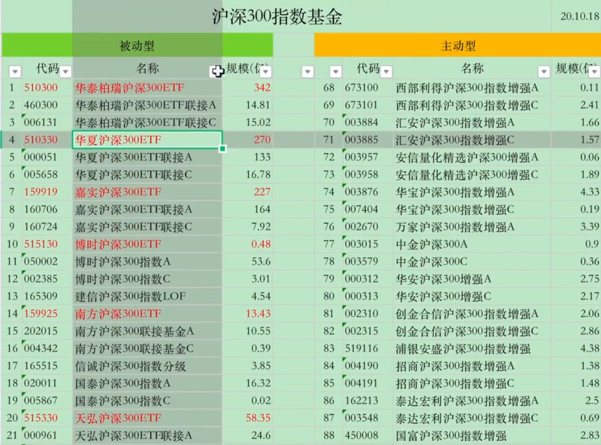
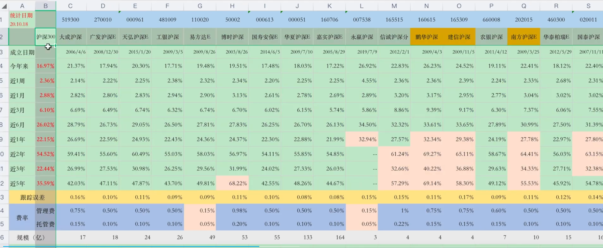

# 指数基金

@import "[TOC]" {cmd="toc" depthFrom=2 depthTo=3 orderedList=false}

<!-- code_chunk_output -->

- [购买方式](#购买方式)
- [复制方式](#复制方式)
- [基金名称类型](#基金名称类型)
- [网站联接](#网站联接)
- [工具](#工具)
- [费用](#费用)
- [选购](#选购)
  - [分辨增强型和被动型](#分辨增强型和被动型)
  - [跟踪误差](#跟踪误差)
  - [普通被动跟随指数基金](#普通被动跟随指数基金)
  - [增强型基金](#增强型基金)
  - [如何挑选被动型指数基金场内/场外](#如何挑选被动型指数基金场内场外)
  - [挑选增强型指数基金](#挑选增强型指数基金)
  - [跟踪误差](#跟踪误差-1)
  - [标准差](#标准差)
  - [夏普比率](#夏普比率)
  - [信息比率](#信息比率)

<!-- /code_chunk_output -->

## 购买方式
1. 场外：基金销售平台
   - 普通指数基金、指数增强基金、指数发起式基金、ETF联接基金、指数分级子基
2. 场内：证券账户
   - 指数分级母基金、指数LOF、ETF

## 复制方式
1. 普通指数基金：完全复制，年跟踪误差不超过4%
2. 指数增强基金：不低于80%复制，年跟踪误差不超过8%
   - 增强方式
        1. 择时
        2. 个股权重优化
        3. 主题及风格权重优化
        4. 量化
        5. 辅助

## 基金名称类型
1. 普通指数基金：指数（型）证券投资基金
2. 指数增强基金：指数增强型证券投资基金
3. 指数发起式基金：指数增强型发起式证券投资基金
   > 基金创立时，基金公司或基金经理持有基金部分份额
4. 指数分级基金：指数分级证券投资基金
   > 母基金+子基金a+子基金b，子基金a为具有固定收益的稳定投资品种，子基金b加杠杆
5. 指数LOF：指数（型）证券投资基金（LOF）
6. ETF：交易型开放式指数证券投资基金
   > 场内购买，场外购买起购点高
7. ETF联接基金：交易型开放式指数投资基金联接基金
   > 仅场外购买

## 网站联接
- 中证指数：https://www.csindex.com.cn/
- 深证、国证指数：http://www.cnindex.com.cn/
- 天天基金网：https://fund.eastmoney.com/

## 工具
- 指数数据（收费）：WIND万德、东方财富choice、理杏仁、果仁网
- 指数估值：雪球APP、基金决策宝APP
- 指数基金分析指标：天天基金网、晨星网
- 场内指数基金数据：集思录、ETF组合宝APP

## 费用
1. 管理费：基金公司，0.15%-1%（年）
2. 托管费：银行，0.05%-0.22（年）
3. 销售服务费：销售平台，0%-0.4%（年）
4. 指数授权费：指数编制公司
5. 申购/赎回费：基金公司
   - 申购费：0%-0.15%（100W以内）
   - 赎回费：0.3%-1.6%（持有一年）

A类基金长期持有划算，C类基金短期持有划算

## 选购
### 分辨增强型和被动型
1. 基金全称
2. 投资目标/理念/策略/范围
3. 费率，管理费
   - 被动型 < 0.5%
   - 增强型 > 0.7%
4. 跟踪误差
   - 被动型：日误差0.35%，年误差4%
   - 主动型：日误差0.5%，年误差7%
5. 看最新的基金招募说明书（最准确）

### 跟踪误差
1. 费率:每支基金的费率不一样，申购/赎回费、管理费、托管费等等
2. 申购费用占比
譬如沪深 300今天涨了1%,但是基金A今天涌入大一批申购,申购金额占了基金总额的1/3那么基金就多出了一大批现金，今天的涨幅就只能算 0.75%。而之后现金的建仓速度更是会和业绩基准造成误差。(业绩基准可以简单理解为跟踪的指数标的)
3. 赎回费用
客户赎回了基金，那么基金的现金就会多出一笔赎回费，和上面同理，现金的变化引起了总体涨幅的变化，这个对有一定规模的基金影响很小。
另外赎回时净值按当日确认,但实际上基金卖掉股票要在确认净值之后。两者价格并不一样意思是你在今天15 点收盘前卖了基金，那么就按照今天收盘时的价格来确认，但是实际上基金公司要把你所卖出的那一部分对应的股票卖掉换钱，要到下一个交易日了，而下一个交易日股票的价格肯定是会产生变动的。
4. 现金留存:每支基金不可能把所有的资金都去购买股票，一定要留一部分钱用以应对赎回。(ETF 没有赎回压力，所以不用留存现金，因为ETF 赎回的时候交付的是一揽子的股票但是也或多或少有一点点现金无法全部买成股票。)
5. 指数重新编制时间差指数每半年会重新编制一次，而指数基金就会根据编制后的指数来卖出指数剔除掉的股票买入新加入的股票，这个时间差就会导致跟踪误差
6. 成分股停牌
基金买入的股票停牌后，就需要对其估值进行重新调整，重新分配权重。而指数不会调整
7. 基金经理的专业水平不同，虽然基金概况里写的都是年跟踪误差不超过 4%，日跟踪误差不超过0.35%，但是长期下来涨幅差距就拉大了
8. 复制的方式不一样，股票的占净值比例不一样，也就是股票持仓比例不一样基金公司可以在保持成分股不变的情况下，做些许调整。
9. 建仓时间，特别是在市场单边上涨或下跌的时候，如果基金建仓太慢，就跟不上市场的涨跌

### 普通被动跟随指数基金
1. 费率低、涨幅多
2. 基金规模大于三亿（小于三亿存在被清盘风险）
### 增强型基金
1. 费率低、涨幅多

### 如何挑选被动型指数基金场内/场外

#### 筛选标准
1. 规模：越大越好
2. 费率：越低越好
3. 平均回报：越大越好
4. 跟踪误差（实际）：越小越好
5. 成立年限：新基金不买
6. 基金公司产品线是否齐全

#### 筛选步骤
1. 初步筛选

   1. 去掉场内ETF基金
   2. 去掉C类基金 
   3. 去掉规模小于3亿的基金
2. 进一步筛选

   1. 标注近1年、2年、3年、5年收益率最高的5只基金
   2. 跟踪误差越小越好
   3. 费率越小越好
   4. 规模越大越好
   5. 综合考虑

### 挑选增强型指数基金
#### 筛选标准
1. 基金经理：实力
   1. 从业时间
   2. 任职基金公司履历（大型基金公司）
   3. 管理基金数量（经验）
   4. 管理基金规模（经验）
   5. 基金管理业绩
   6. 明星基金经理，年度基金经理排行
2. 平均回报：越高越好
3. 跟踪误差：越小越好
4. 基金规模：10亿-100亿最合适（基金经理同时管理的基金规模总和不超过100亿 ）
5. 成立年限：新基金不买，久—点好
6. 费率
7. 评级机构/网站：评级越高越好（晨星评级）
8. 重仓股/持股分布，是否挂羊头卖狗肉
9. 基金公司的实力
10. 标准差：越小越好。数字大，波动大，风险大
   > 基金每月的总回报率相对于平均月回报率的偏差程度
11. 夏普比率：越大越好，**衡量承担单位风险所能获得的收益**。大于1，收益大于风险；小于1，收益小于风险。只适合同类比较（描述的是绝对风险和总收益的关系，简单理解就是绝对收益）
   > **夏普比率=超额收益/标准差**（超额收益=基金收益率-无风险收益率，无风险收益：十年期国债收益率）
   
12. 信息比率：越大越好，越大超额收益越高
   > **信息比率=超额收益/超额收益的标准差**（超额收益=基金收益-业绩基准收益）（描述的是调整后的风险和收益的关系。简单理解就是调整后的收益）。
   信息比率是**衡量基金经理主动管理能力**的指标。信息比率越高，证明基金经理的主动管理能力越强。
   夏普比率的标准差就是基金月收益的一个标准差。而信息比率则是要扣除业绩基准收益之后的一个标准差。

### 跟踪误差
基金组合[P, Portfolio]每日的收益对大盘指数[B, Benchmark]每日的收益的偏离就是跟踪误差（Tracking error），也称主动管理风险（Active risk），**跟踪误差越低证明与大盘的贴合程度越好**
$$Tracking error/Active risk=\sqrt{\frac{\sum(R_P-R_B)^2}{n-1}  }  $$
此时计算周期n=252，周期也可以选择每周或每月

### 标准差
投资组合的标准差体现投资组合的波动性
计算由两个股票或基金组成的投资组合的标准差：
$$\sigma_P=\sqrt{W_A^2\sigma_{K_A}^2+W_B^2\sigma_{K_B}^2+2W_AW_BR(K_A,K_B)\sigma_{K_A}\sigma_{K_B}}$$
其中，$W_A,W_B$分别代表股票A和B的占比。$\sigma_{K_A}$和$\sigma_{K_B}分别代表股票A和B的标准差，$R(K_A,K_B)$代表股票A和B的相关系数：

$$Correl(X,Y)=\frac{\sum{(x-\bar{x})(y-\bar{y})}}{\sqrt{\sum{(x-\bar{x})^2}\sum{(y-\bar{y})^2}}}$$

如果投资组合由三个不同的股票和/或基金混合组成，则

$$
\sigma _P=\sqrt[]{W_A^2\sigma_{K_A}^2+W_B^2\sigma_{K_B}^2+W_C^2\sigma_{K_C}^2+2W_AW_BR(K_A,K_B)\sigma_{K_A}\sigma_{K_B}+2W_AW_CR(K_A,K_C)\sigma_{K_A}\sigma_{K_C}+2W_BW_CR(K_B,K_C)\sigma_{K_B}\sigma_{K_C}} 
$$

### 夏普比率
用来衡量承担**单位风险所能获得的收益**
$$S=\frac{E(r)-r_{f} }{\sigma } $$
其中S表示夏普比率，E(r)表示预期收益率，rf表示无风险收益。E(r)-rf即为超额收益率，为收益曲线的标准差（波动率）

假设投资组合中，风险资产（如股票等）的比例为y，预期收益率为$r_p$，波动率为$\sigma_p$，则无风险资产（如国库券）的比例为（1-y），利率为$r_f$。因此投资组合收益率为：
$$r_c = yr_p+(1-y)r_f$$
标准差为：
$$\sigma_c=y\sigma_p$$
代入夏普比率公式得：
$$S_c = \frac{r_c-r_f}{\sigma_c} =\frac{y(r_p-r_f)+(1-y)(r_f-r_f)}{y\sigma_p}=\frac{r_p-r_f}{\sigma_p}=S_p$$
因此**不管组合中风险资产的比例如何，组合的夏普比率是不会变的**，只能通过调整仓位或加杠杆，改变组合的波动和收益率，这就是资本市场线：
$$r_p = S_p\sigma_p+r_f$$

### 信息比率
基金组合的收益减去大盘基准的收益（Rp - RB），就是超额的收益。这部分超额的收益与跟踪误差的比值，就定义为信息比率（Information Ratio）。**信息比率是衡量基金经理主动管理能力的指标**。信息比率越高，证明基金经理的主动管理能力越强。
$$Information Ratio=\frac{E(R_P-R_B)}{s(R_P-R_B)}$$
影响IR的指标有三个：
1. 信息系数（IC， Information coefficient），就是基金经理预测的精准度，基金经理对股票判断会不会涨，涨多少，涨多久，判断的越精准，主动管理能力越强
2. 转换系数（TC，Transfer coefficient），可以简单理解为限制，基金经理能否将判断能力完全转换成实际的仓位，比如我预测明天某股票涨停，那我满仓买入，肯定能大赚一笔，但公司限制了我最高持仓10%，这时候转换系数就影响到了基金经理的主动管理能力
3. 预测宽度（BR，Breadth），基金经理做独立决策的次数，如果预测的很精准，但就预测这一次，只做了一次决策，那对主动管理能力的影响也不大

等比例改变主动管理组合的权重时，或者改变大盘基准Benchmark的头寸时，都不会影响信息比率：
$$IR_c=\frac{R_C-R_B}{\sigma(R_C-R_B)}=\frac{w_PR_P+(1-W_p)R_B-R_B}{w_P\sigma(R_P-R_B)}=IR_P$$
其中，购买基金[P, Portfolio]的权重为$w_P$，购买大盘[B, Benchmark]的权重为$(1-w_P)$

<!-- 可以得到组合夏普比率、基准夏普比率和信息比率之间的关系，以及他们波动率的关系:
$$SR_P^2=SR_B^2+IR^2$$
$$\sigma _P^2=\sigma_B^2+\sigma_{(R_P-R_B)}^2$$
进一步推导，可以得到主动管理风险的最佳水平：
$$\sigma_{(R_P-R_B)}=\frac{IR}{SR_B}\sigma_B$$
也就是说，可以通过基准[B, Benchmark]的波动率$\sigma_B$、夏普比率和基金经理的信息比率来推算出基金组合[P, Portfolio]最优的波动率$\sigma_{P}*$
现在的基金组合的波动率为σP。

两者相比，可以得到你应该在投资组合中配多少（wp）基金组合：
$$w_P=\sigma_{P}*/sigma_{P}$$
- 如果$\sigma_{P}$ = $\sigma_{P}*$，基金组合的波动率就是最优的波动率，那就可以100%配基金组合，不用购买基准。
- 如果$\sigma_{P}$ < $\sigma_{P}*$，$w_P$ > 1 ，现在基金组合的波动率比最优的波动率还低、还稳定，那么就可以做空基准，来超配基金组合。
- 如果$\sigma_{P}$ > $\sigma_{P}*$ > 0，0 < $w_P$ < 1 ， 现在基金组合的波动率不如最优的波动率，那么就要按比例配置一部分基金组合，另一部分配置基准大盘。 -->