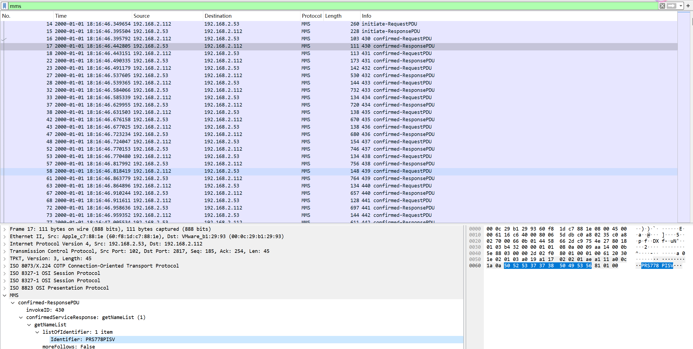

# 工控解题要点
## 一、modbus
MODBUS支持的部分功能代码：
| 功能码代码  | 功能码名称         | 寄存器地址         | 位/字操作  | 操作数量   |
|:------:|:-------------:|:-------------:|:-----:|:------:|
| 01    | 读线圈状态（读比特输出）  | 00001~09999   | 位操作    | 单个或多个  |
| 02    | 读（开关）输入状态       |  10001~19999  | 位操作    | 单个或多个  |
| 03    | 读保持寄存器        |  40001~49999  | 字操作    | 单个或多个  |
| 04    | 读输入寄存器        | 30001~39999   | 字操作    | 单个或多个  |
| 05    | 写单个线圈         |  00001~09999  | 位操作    | 单个     |
| 06    | 写单个保持寄存器      | 40001~49999   | 字操作    | 单个     |
| 15    | 写多个线圈         |  00001~09999  | 位操作    | 多个     |
| 16    | 写多个保持寄存器      |  40001~49999  | 字操作    | 多个     |

> 直接搜索“flag”或“666c”

modbus服务端口：502
> eth.trailer


找报错重传包：
> tcp.analysis.retransmission


> modbus.func_code == 15

写线圈为小端序，写寄存器为大端序，所以每个字节（8位）应该颠倒顺序


解码脚本：
```py {.line-numbers}
# 给定的十六进制字符串
hex_string = "c29e46a64eeaf64e3626c2ae0ec2a22ac24c0c8c1c"
# 将十六进制字符串转换为整数
integer_value = int(hex_string, 16)
# 将整数转换为二进制字符串
binary_string = bin(integer_value)[2:]
# 补全二进制字符串的长度到指定的位数（如果需要）
# 这里假设要补全到整个字符串长度为 64 位
binary_string = binary_string.zfill(64)
print("原始十六进制字符串:", hex_string)
print("转换中间的二进制字符串:", binary_string)


# 将二进制字符串每8位一组进行分组，并逆序每组
reversed_binary_groups = [binary_string[i:i+8][::-1] for i in range(0, len(binary_string), 8)]
# 将逆序后的每组字符合并成一个新的字符串
reversed_binary_string = ''.join(reversed_binary_groups)
print("翻转后的二进制字符串:", reversed_binary_string)


# 将二进制字符串转换为整数
integer_value = int(reversed_binary_string, 2)
# 将整数转换为十六进制字符串
hex_string = hex(integer_value)[2:]
print("转换回的十六进制字符串:", hex_string)
```
解码结果：


## 二、MMS
MMS包主要包含四种类型：
1. initiate-RequestPDU(启动-请求PDU)
2. confirmed-RequestPDU(确认-请求PDU)
   - fileDirectory (77)：mms.confirmedServiceRequest == 77
   - fileRead（73）：mms.confirmedServiceRequest == 73
   - fileOpen（72）：mms.confirmedServiceRequest == 72
3. initiate-ResponsePDU(启动-应答PDU)
   - 初始化给出支持的函数
   - 获取类名
   - 获取支持函数
4. confirmed-ResponsePDU(确认-应答PDU)
   - mms.confirmedServiceResponse == 77
   - mms.confirmedServiceResponse == 73
   - mms.confirmedServiceResponse == 72

> 支持函数中可能包含flag

> 查找可疑文件打开操作（fileOpen）
> 
> 在respond包中记录该次打开的文件ID（**可能存在多次读写操作**）
> 
> 
> (mms) && (mms.confirmedServiceRequest == 73)
> 查看读写（fileRead）请求中是否存在该文件ID
> 
> 查看对应的respond包内容得到可疑文件内容
> 
