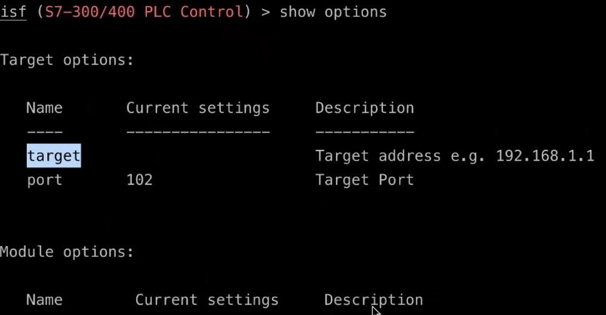
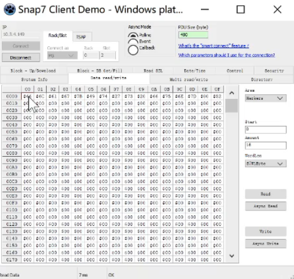
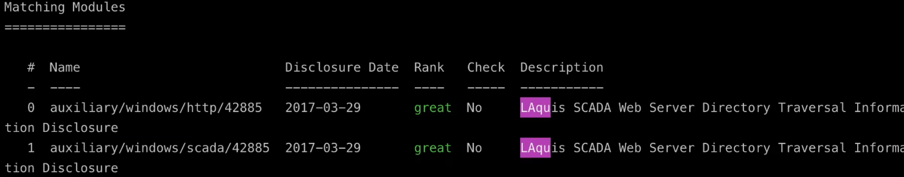
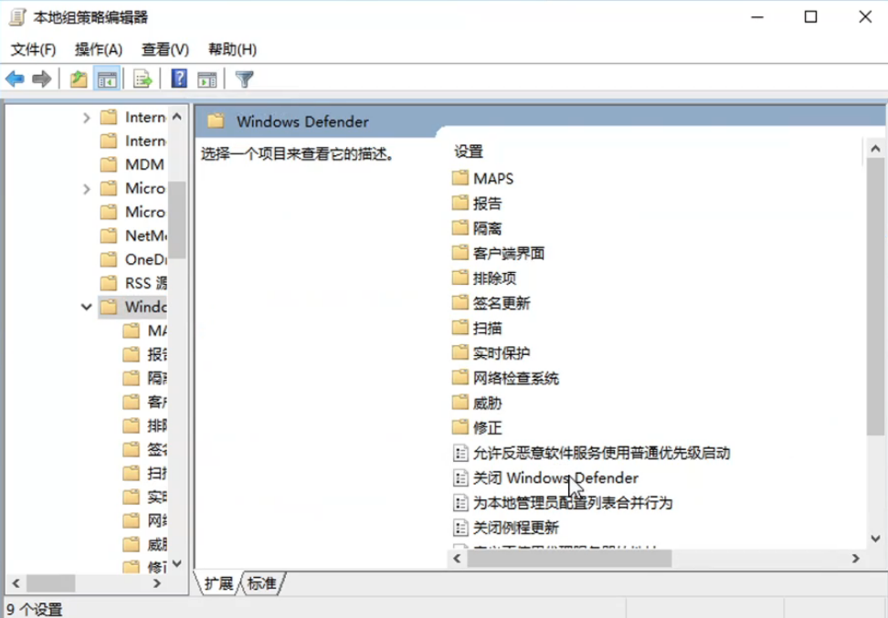

# 工控解题要点
## 一、modbus
MODBUS支持的部分功能代码：
| 功能码代码  | 功能码名称         | 寄存器地址         | 位/字操作  | 操作数量   |
|:------:|:-------------:|:-------------:|:-----:|:------:|
| 01    | 读线圈状态（读比特输出）  | 00001~09999   | 位操作    | 单个或多个  |
| 02    | 读（开关）输入状态       |  10001~19999  | 位操作    | 单个或多个  |
| 03    | 读保持寄存器        |  40001~49999  | 字操作    | 单个或多个  |
| 04    | 读输入寄存器        | 30001~39999   | 字操作    | 单个或多个  |
| 05    | 写单个线圈         |  00001~09999  | 位操作    | 单个     |
| 06    | 写单个保持寄存器      | 40001~49999   | 字操作    | 单个     |
| 15    | 写多个线圈         |  00001~09999  | 位操作    | 多个     |
| 16    | 写多个保持寄存器      |  40001~49999  | 字操作    | 多个     |

> 直接搜索“flag”或“666c”

modbus服务端口：502
> eth.trailer


找报错重传包：
> tcp.analysis.retransmission


> modbus.func_code == 15

写线圈为小端序，写寄存器为大端序，所以每个字节（8位）应该颠倒顺序


解码脚本：
```py {.line-numbers}
# 给定的十六进制字符串
hex_string = "c29e46a64eeaf64e3626c2ae0ec2a22ac24c0c8c1c"
# 将十六进制字符串转换为整数
integer_value = int(hex_string, 16)
# 将整数转换为二进制字符串
binary_string = bin(integer_value)[2:]
# 补全二进制字符串的长度到指定的位数（如果需要）
# 这里假设要补全到整个字符串长度为 64 位
binary_string = binary_string.zfill(64)
print("原始十六进制字符串:", hex_string)
print("转换中间的二进制字符串:", binary_string)


# 将二进制字符串每8位一组进行分组，并逆序每组
reversed_binary_groups = [binary_string[i:i+8][::-1] for i in range(0, len(binary_string), 8)]
# 将逆序后的每组字符合并成一个新的字符串
reversed_binary_string = ''.join(reversed_binary_groups)
print("翻转后的二进制字符串:", reversed_binary_string)


# 将二进制字符串转换为整数
integer_value = int(reversed_binary_string, 2)
# 将整数转换为十六进制字符串
hex_string = hex(integer_value)[2:]
print("转换回的十六进制字符串:", hex_string)
```
解码结果：


## 二、MMS
MMS包主要包含四种类型：
1. initiate-RequestPDU(启动-请求PDU)
2. confirmed-RequestPDU(确认-请求PDU)
   - fileDirectory (77)：mms.confirmedServiceRequest == 77
   - fileRead（73）：mms.confirmedServiceRequest == 73
   - fileOpen（72）：mms.confirmedServiceRequest == 72
3. initiate-ResponsePDU(启动-应答PDU)
   - 初始化给出支持的函数
   - 获取类名
   - 获取支持函数
4. confirmed-ResponsePDU(确认-应答PDU)
   - mms.confirmedServiceResponse == 77
   - mms.confirmedServiceResponse == 73
   - mms.confirmedServiceResponse == 72

> 支持函数中可能包含flag

> 查找可疑文件打开操作（fileOpen）
> 
> 在respond包中记录该次打开的文件ID（**可能存在多次读写操作**）
> 
> 
> (mms) && (mms.confirmedServiceRequest == 73)
> 查看读写（fileRead）请求中是否存在该文件ID
> 
> 查看对应的respond包内容得到可疑文件内容
> 


## 三、S7Communication
ROSCTR: PDU type;即PDU的类型，一般有以下值:
- 0x01:JOB:即作业请求，如，读/写存储器，读/写块，启动/停止设备，设置通信
- 0x02:ACK:即确认相应，这是一个没有数据的简单确认
- 0x03:ACK_DATA:即确认数据相应，一般是响应JOB的请求
- 0x07:USERDATA:即扩展协议，其参数字段包含请求/响应ID，一般用于编程/调试、读取SZL等

parameter和data部分：


示例：


> (s7comm) && (s7comm.param.func == 0x05)
> 查找读写操作的数据部分


> ((s7comm) && (s7comm.param.func == 0x05)) && (s7comm.header.rosctr == 1)
> 过滤写入数据
> 
> 将写入操作包的数据段都导出
```shell
tshark -r flag.pcapng -Y "s7comm && (s7comm.param.func == 0x05) && (s7comm.header.rosctr == 1)" -T fields -e "s7comm.resp.data" > 2.txt
```
> 查看不包含ffff的数据
```shell
cat 2.txt | grep ffff -v
```


> ((s7comm)) && (s7comm.param.func == 0x05)
> 过滤写入数据
> 将写入操作包的数据段都导出并去掉换行
```shell
tshark -r s702.pcapng -Y "((s7comm) && (s7comm.param.func == 0x05))" -T fields -e "s7comm.resp.data"  | tr -d "\n"
```
> 查看16进制解码后的数据
```shell
cat 4.txt | xxd -p -r
```

## 四、PLC启停
> **PLC停止后才能上传恶意程序到PLC设备**
> 打开snap7软件，输入目标IP地址，连接后进行控制
> 
> 

> 启动isf工具
> 
> 使用s7_300攻击模块
> 
> ```show option```查看攻击选项，根据需要填写
> 
> 
> 
> 使用snap7尝试读不同区块
> 
> 修改数据段
> 
> 修改输入
> 

> 下载远程PLC程序
> 设置PCL属性
> 
> 修改IP地址与远端设备同网段
> 
> 点击转至在线按钮，PG/PC接口选择实体网卡，选择目标设备选择显示可访问的网络设备，搜索并转至在线
> 
> 点击从设备中上传
> 
> 修改程序后编译并下载到设备（下载需要PLC STOP状态，可以通过snap程序或isf工具实现）


## 五、SCADA组态攻击
### 5.1 LAquis组态软件：
1. 文件读取：
> 
> 
> 
> 敏感目录：
>  - c:\Documents and Settings\administrator\桌面
>  - document/information.txt  （账号密码文件）

### 5.2 web studio
> 攻击端口为4322
> 
> 
> 
> 先扫描靶机是否开启该端口
> 
> 
> 


## 六、力控
### 6.1 查看管理员账号密码
1. 考点位置


2. 使用peekpassword查看隐藏的密码


---
#### 关闭windows防护软件
1. 运行打开gpedit.msc组策略编辑器
2. 打开计算机配置->管理模板->Windows组件->Windows Defender

3. 启用关闭Windows Defender

4. 选择实时保护。启用关闭实时保护，禁用打开监控行为，禁用扫描所有下载文件和附件

---

### 6.2 力控工程
1. 打开力控程序，选择恢复工程，选择可疑*.PCZ工程文件

2. 工程ID处找到flag

