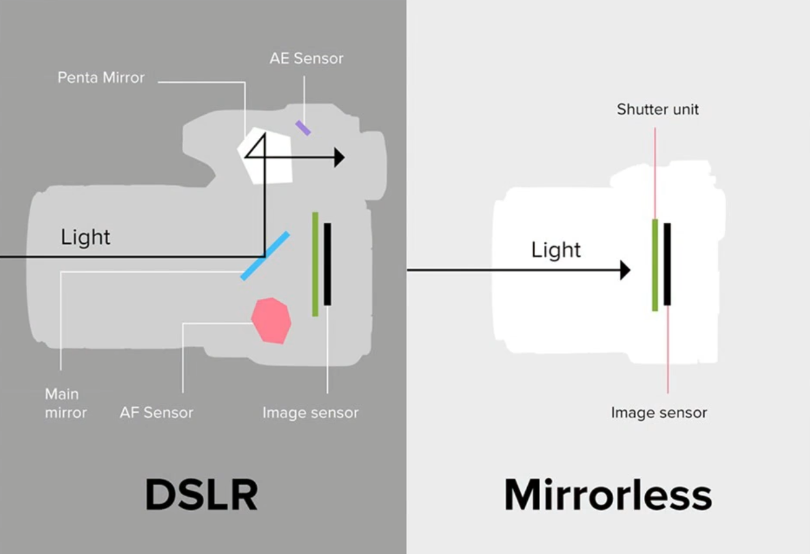
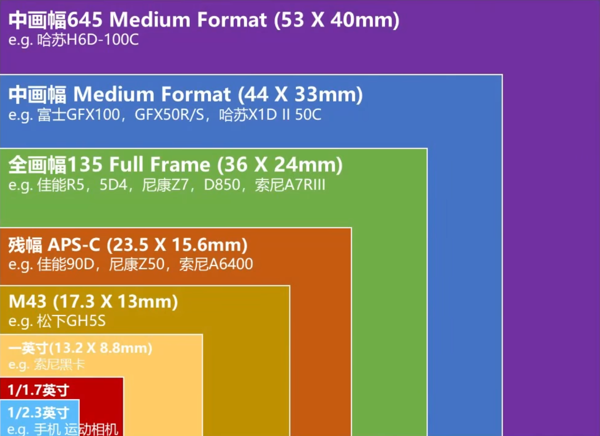
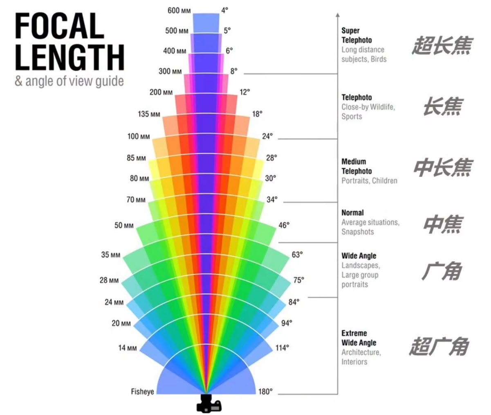
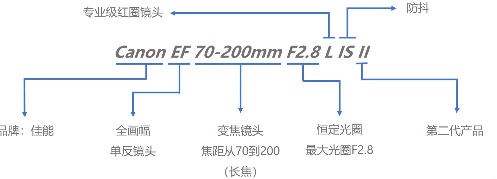
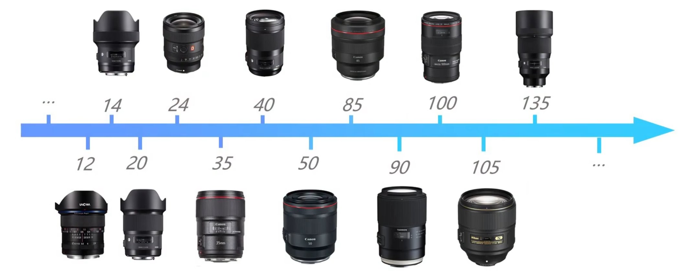

# 了解相机
@import "[TOC]" {cmd="toc" depthFrom=2 depthTo=3 orderedList=false}

<!-- code_chunk_output -->

- [了解相机](#了解相机)
  - [常见相机种类](#常见相机种类)
    - [微单与单反的区别：](#微单与单反的区别)
    - [传感器大小：](#传感器大小)
  - [相机品牌产品线](#相机品牌产品线)
    - [佳能（EOS）](#佳能eos)
    - [尼康](#尼康)
    - [索尼](#索尼)
    - [大疆](#大疆)
  - [相机镜头](#相机镜头)
    - [品牌](#品牌)
    - [焦距](#焦距)
    - [镜头参数](#镜头参数)
      - [镜头信息](#镜头信息)
    - [黑话](#黑话)
    - [变焦镜头](#变焦镜头)
      - [变焦镜头组合](#变焦镜头组合)
      - [定焦镜头](#定焦镜头)
    - [镜头组合推荐](#镜头组合推荐)

<!-- /code_chunk_output -->

## 常见相机种类
可更换镜头相机：
- 微单
- 单反

不可更换镜头相机
- 卡片
- 运动相机

### 微单与单反的区别：

### 传感器大小：

## 相机品牌产品线
### 佳能（EOS）
- 单反：D-EF/EF-S
  - 0D：全系列全画幅单反（5D4/6D2/1DX3）及一款旗舰APS-C单反（7D2）
  - 00D：高端APS-C单反（90D）
  - 000D：终端APS-C画幅数码单反（850D）
  - 0000D：低端APS-C画幅数码单反
- 微单：R-RF/M-EF-M
  - R/RP：一代试水机/全画幅专微
  - R5：高端Full-Frame专微
  - R6：入门Full-Frame专微
  - M5：高端APS-C微单
  - M6：中高端APS-C微单
  - M00：中端APS-C微单
  - M000：低端APS-C微单

### 尼康
- 单反：F-FX/DX
  - D0：全画幅旗舰单反(D6)“速度机”
  - D000：高端（旗舰）全画幅单反(D850/D780)及一款APS-C旗舰单反(D500)
  - D0000：APS-C画幅数码单反
- 微单：Z-FX/DX
  - Z7：全画幅旗舰微单
  - Z6：全画幅中端微单
  - Z5：全画幅低端微单
  - Z50：APS-C微单

### 索尼
微单：A/α-E-FE/E
- A6X00：APS-C画幅微单(A6100 A6400 A6600)
- A7R：画质型全画幅微单(A7R IV)
- A7：均衡型全画幅微单(A7 III)
- A7S：视频型全画幅微单(A7S III)
- A9：速度型全画幅旗舰微单(A9 II)

α7 III= Alpha7 III=A7III= a7M3= ILCE7 III

### 大疆
- Phantom精灵系列
- Inspire悟系列
- Mavic御系列

## 相机镜头
### 品牌
- 原厂：佳能、尼康、索尼
- 副厂：蔡司、适马、腾龙

### 焦距
焦距越小，视角越大，焦距越长，视角越窄

### 镜头参数
- 镜头信息
- 镜头前口径
- 防抖开关
- 防抖模式
  - 模式一：上下左右防抖
  - 模式二：上下防抖
- 对焦模式
  - AF：自动对焦
  - MF：手动对焦
- 锁定按钮
- 对焦/变焦环
#### 镜头信息

防抖：IS（佳能）、VR（尼康）、索尼（OSS）

### 黑话
- 牛头：专业镜头
- 狗头：素质差的便宜镜头
- 大光定：大光圈定焦镜头
- 红圈/金圈/G-Master：佳能、尼康、索尼的代表性专业镜头
- 天涯镜：变焦范围广的镜头
- 小痰盂：体积较小的镜头，50F1.8
- 饼干头：很小很薄的镜头，40F2.8
- 大炮：长焦远射镜头，400F2.8
- “灭门

### 变焦镜头
#### 变焦镜头组合
- 大三元：
  - 16-35/14-24 F2.8
  - 24-70 F2.8
  - 70-200 F2.8
- 小三元：
  - 16-35/11-24 F4
  - 24-70 F4
  - 70-200 F4
- 其他：
  - 18-55（套头）
  - 100-400
  - 150-600

#### 定焦镜头

### 镜头组合推荐
- 只选一支：24-70/24-105
- 选择两支：16-35+70-200/100-400
- 选择三支：两支+50或大三元
- 三支以上：+35 +85等等