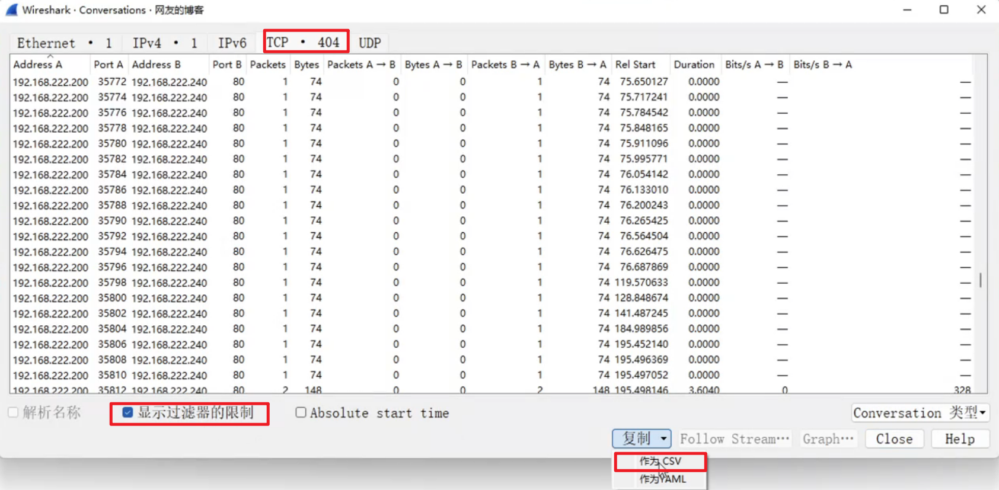
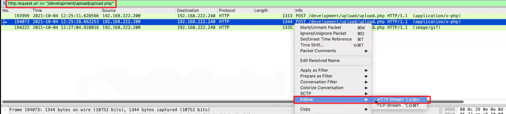
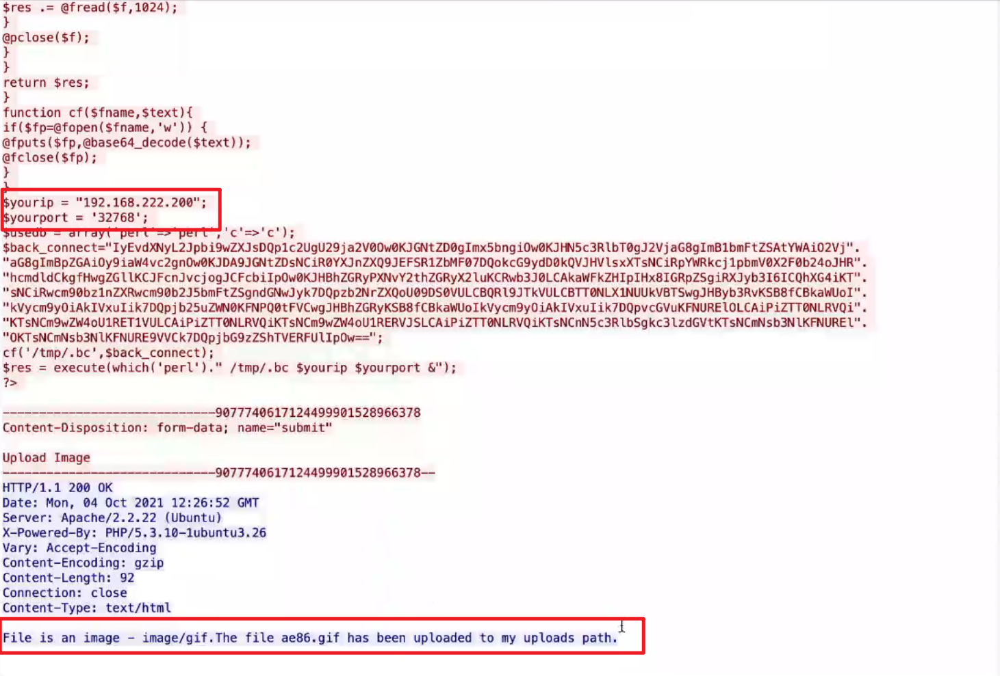
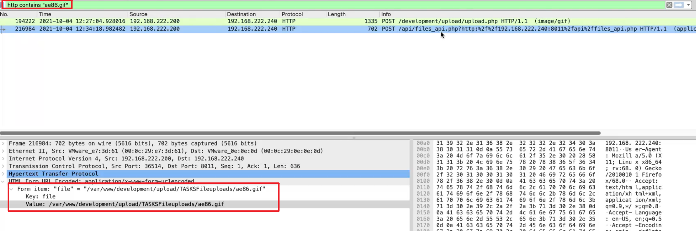
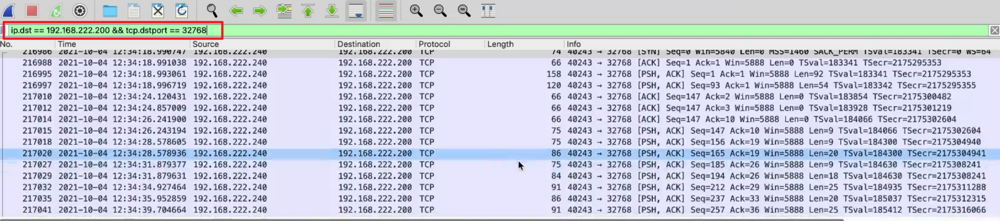

# 流量分析

## 一、HTTP协议：


状态行：
- 1xx：指示信息--表示请求已接收，继续处理
- 2xx：成功--表示请求已被成功接收、理解、接受
  - 200 OK                        //客户端请求成功
- 3xx：重定向--要完成请求必须进行更进一步的操作
- 4xx：客户端错误--请求有语法错误或请求无法实现
  - 400 Bad Request               //客户端请求有语法错误，不能被服务器所理解
  - 403 Forbidden                 //服务器收到请求，但是拒绝提供服务
  - 404 Not Found                 //请求资源不存在，eg：输入了错误的URL
- 5xx：服务器端错误--服务器未能实现合法的请求
  - 500 Internal Server Error     //服务器发生不可预期的错误
  - 503 Server Unavailable        //服务器当前不能处理客户端的请求，一段时间后可能恢复正常


## 二、wireshark
### 修改wireshark时间戳：

### 筛选选中字段：

### 导出流量传输的文件
1. HTTP：

2. TCP：


```bash
# 对应：  == != >  < 
http.request.uri contains flag # 包含

# 查找请求类型是POST的行为
http.request.method == POST

# 查找状态码
http.response.code == 302

# 过滤扫描流量
# 0x12 syn&ack
tcp.flags == 0x12 and  tcp.dstport == 65127
# 筛选服务端响应流量
tcp.flags == 0x12 && ip.src == 192.168.222.240 && ip.dst == 192.168.222.200
ip.addr
```

## 三、扫描流量
> nmap扫描默认端口：65127
> fscan扫描端口随机

### 3.1 服务器开放端口：
1. 筛选扫描流量中服务器成功响应的部分
```bash
tcp.flags == 0x12 && ip.src == 192.168.222.240 && ip.dst == 192.168.222.200
ip.addr
```
2. 点击统计->会话

3. 选择TCP流量，勾选显示过滤器限制，作为CSV复制

4. 新建CSV文件粘贴复制内容，按逗号分割后，筛选统计端口


### 3.2 文件上传流量
1. HTTP协议文件上传使用POST方法，搜索POST方法的流量，找到文件上传功能的脚本“/development/upload/upload.php”
    ```bash
    http.request.method == POST
    ```
    
2. 筛选包含文件上传脚本“/development/upload/upload.php”的HTTP流，依次踪HTTP流查看上传文件内容及是否上传成功
    ```bash
    http.request.uri == "/development/upload/upload.php"
    ```
    
3. 恶意脚本包含IP及端口，为反弹shell，且respond文件上传成功，文件为gif文件，需要通过文件包含利用
    
4. 筛选包含“ae86.gif”的HTTP流量，找到恶意脚本的利用地址
    ```bash
    http contains "ae86.gif"
    ```
    
5. 根据恶意脚本内容筛选反弹shell流量
    