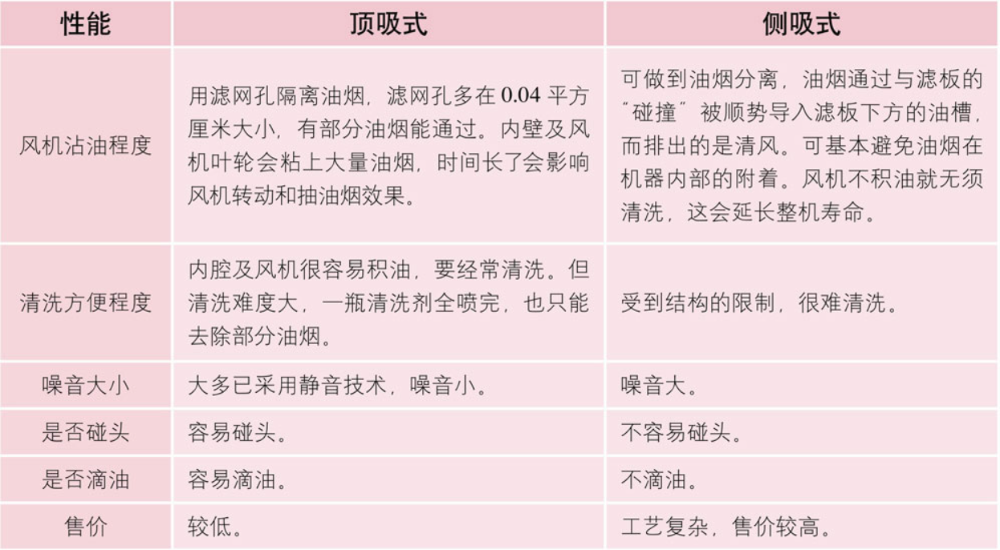

# 装修

施工流程装修的24个步骤、8个阶段：
1. 前期设计，调查。时间越长越好，至少两个月。
2. 施工现场“放样”，图纸交底。
3. 开始水电工程，墙面开槽打孔。
4. 水电管线进场，水泥黄沙少量进场。计算瓷砖用量、木工材料。
5. 水电管线铺设完毕，进行水压试验，然后验收。
6. 水泥黄沙大量进场，泥工修补水电工程的遗留问题。
7. 瓷砖、木工材料进场。木工和泥工可同时施工，以缩短工期。
8. 淋浴房挡水、门槛石、窗台石进场，由泥工预埋。
9. 成品门进场，装门锁（若买免漆门、门套，可略去本步）。
10. 泥工和木工完工，验收。
11. 油漆材料进场、施工。
12. 测量橱柜、卫生间的台盆柜、厨卫天花板的尺寸。
13. 油烟机进场，安装厨卫天花板，预先放置油烟机的排烟管。
14. 安装橱柜、卫生间的台盆柜，门板可先不安装。
15. 厨房的水槽、燃气灶进场。橱柜台面的测量、安装。
16. 油漆工程完工，验收。
17. 贴墙纸（如果需要），然后安装暖气片。
18. 安装定制的家具、灯具、洁具、开关面板、小五金。
19. 铺地板。
20. 安装免漆门、门套、锁具、踢脚线、滑动门、折叠门。
21. 安装家电、窗帘。
22. 油漆扫尾修补，然后“开荒保洁”。
23. 验收并结账，然后通风至少两个月。
24. 入住调试1个月，出问题要及时找施工方解决。

上面这24步可简化为8个阶段：

卫生间地砖施工：
1. 第一步是拉线，弹出高度基准线，再拉横竖两条线，用于瓷砖对齐。
2. 第二步是打底，铺上基层沙。
3. 第三步是在沙上盖砖，用橡皮锤将基层打平、打实。
4. 第四步是将砖掀起，重复一遍基层抹平压实，确保无空鼓后再在基层上抹水泥砂浆。
5. 第五步是再重复一遍盖砖、橡皮锤敲打、避免空鼓的过程。第六步是用布将砖面、砖缝的泥沙擦净

清工辅料：“清工”指人工费，包括水电工、泥瓦工、木工、油工、力工的工资；“辅料”指基础材料，包括水泥、沙子、腻子粉、乳胶漆、胶、钉子、螺丝、砂纸等

承包方式：
1. 全清包：业主自己当包工头，自己找工人施工，自己买所有材料，自己做设计。这种方式最费事，如果控制得好会最省钱，控制不好就难说了。
2. 清包：业主委托包工头，包工头组织工人施工。所有材料都由业主采购。这种方式被“装修游击队”普遍采用，虽然比半包要省一点钱，但业主的辛苦程度和全清包基本一样。
3. 半包：业主委托包工头或装修公司组织工人、购买辅料。主材由业主采购。这种方式被装修公司普遍采用，业主不省钱也不省力。给装修公司的费用中一般包含设计费。
4. 全包：业主把所有工作都给包工头或装修公司，又称“交钥匙工程”。业主很轻松，但对费用根本无法控制。
5. 半全包：介于半包和全包之间，辅材、设计费按半包来收，主材、家具由业主选择和定价，然后交给装修方采购、签收、安装。这样，业主既控制了主材、家具的费用，又避开了具体操作上的麻烦。

施工过程：
1. 设计阶段：至少要2到3个月。其中的1个月用于寻找好的设计师。同时，也要提前3个月到半年去逛建材城和家具城。
2. 施工阶段：要2到3个月（一般不超过3个月）。工期太短不能保证质量，太长则要增加很多费用。如果设计不到位，施工中出现返工、误工、延工的情况非常正常。
3. 通风阶段：至少要两个月。最好在夏天通风，因为温度越高，甲醛释放得越快。所以，最佳的装修时间是春季。不过，通风时间不是越长越好。通风2个月，建材表面的污染都会散发干净。其内部污染的散发是个缓慢的过程，不是几个月能解决的，而是要几年。
4. 调试阶段：要1个月。竣工验收合格并不能说明装修结束、进入保修阶段了，而是需要入住调试。竣工时有很多问题是无法发现的，但使用1个月后能发现。

工种进场的次序大体为：水电工→泥瓦工→木工→油漆工→水电工。而后铺地板、装厨卫用具一般都由厂家的工人负责。最后是安装窗帘，买家具。其流程有一个简单的规律：脏的工作先干，干净的后干；房顶、墙面的工作先干，地面的后干。不过，很多工种的工作是可以交叉进行的，需要协调

五大工种：
1. 电工：确定开关和插座的位置，开槽、铺电管、铺电线。
2. 水工：确定上下水管的位置，开槽、铺水管。
3. 泥瓦工：墙面抹灰、铺贴瓷砖等。如果要拆墙也由他们做。
4. 木工：一直贯穿装修过程的始终，主要是制作天花板、门窗套、家具、踢脚线等。有时木地板的铺设也需他们完成。
5. 油漆工：装修后期才进场，负责墙面、家具、门窗的上漆，以及刷漆前的相关工作：用报纸等保护家中的物件。

验收新房的注意事项：开工前，别忘了验收新房，有问题要及时找物业解决。
1. 墙面、门窗附近是否渗水，或有黄色污渍。
2. 用小锤敲打墙面和地面，看是否开裂或空鼓。
3. 带一个插座小灯，插入插座中，检查是否有电。
4. 记录水表、电表、气表的数字，做到心里有数。
5. 看厨房和卫生间的烟道是否堵塞，可塞入点燃的废纸来测试。
6. 门窗是否开合顺畅、方便锁闭。门的上缝、左右门缝不能超过3毫米，下缝一般为5到8毫米，门套的接缝要严密。

## 拆除工程
最舒服的房子有三个特点：1．通风顺畅；2．采光良好；3．动线便利

空鼓和裂缝处要铲掉重做：
如果原墙面有空鼓（敲击时有空空的声音）或裂缝，要事先处理。处理方法是：将那里的墙面铲掉重做。裂缝的处理方法是：将裂缝处铲成V字形，清除上面的浮灰，然后用903胶结合石膏粉填平裂缝。干后用纸带封上再刮腻子。纸带的辨别方法：用手拉住两边用力扯，扯不断的才是合格产品。在水电改造过程中，墙面会开槽，开槽的位置最后要用水泥或石膏封上。封了石膏后，一般20分钟就可以干。然后和上面的做法一样：用纸带封上石膏，才可以再刮腻子。

**电在上水在下**

不能拆的墙：承重墙、剪力墙

保护地面：可以铺两层板子：一层压型板，一层胶合板。塑料的压型板能防水，也可以挡住重量轻的物体的冲击。如果是木地板、大理石、抛光石英砖，最好铺三层东西：下面铺聚氯乙烯防潮布，中间铺压型板，上面铺胶合板。

**补救排污管，不可用软管**：
如果敲破了排污管，就要挖地。但不能挖地太深，尤其是见到钢筋时不能再挖，否则会把楼下的天花板打穿。你可能要把自己家的地面垫高，以便掩盖重拉了的管线。但由于这根管子很粗，垫高后，卫生间的地面可能比客厅的高出很多，这是要提前考虑的问题。如果高度差不多，可提高卫生间的门槛高度。有的工人在敲破排污管后，可能不看一眼就直接封起来了，或者看到了装作没看到。也有的工人虽然看到了，但嫌麻烦，便把软管塞进排污管中，以此补救。这种补救方法是有很大隐患的，因为软管很容易破，日后清理马桶时不能用高压棒。所以，拆完水管后一定要现场检查。

每个卫生间里都预留了马桶所用的排污管的管口，就算你不喜欢那个位置，马桶也只能安装在那里，否则后患无穷。虽然排污管已经很粗，但只要它在屋内水平铺排，就会降低水流的通畅性，容易造成堵塞。

**不论新房旧房，如果排污管不拆、不移位，管口一定要用干布塞起来。**

**拆除时最好自己在现场，至少也要把要拆除的东西明确写出来，列成表格给包工头。**

## 水电工程
水电四个步骤：
1. 设计水电管线的走向。
2. 在墙面、地面开槽。
3. 埋入水管、电管、暗盒，插入电线。
4. 检测电路，对水路进行试压实验。

三大原则：
1. 不要省钱。其实就算想省也不会省多少，高低端水电材料的差价并不大。
2. 一定要监督。水电工程最后会被掩盖，所以很容易成为偷工减料的目标。水电改造完成后，要用相机把线路一段一段全拍下来，特别是有接头的地方。拍的时候要把管线与墙面的相对位置也拍到位。留下照片存档是为了日后检修时不用抓瞎，当然，最好是永远不再用这些照片。买材料前自己应该计算大概的用量。
3. **严禁横向开槽**。在墙面上横向开槽会严重破坏墙体结构，带来安全隐患。开槽时的价格有差别，承重墙的开槽价格比非承重墙要贵，这些要事先问好。

水路工程：
1. 想好热水器、马桶、洗手盆的准确位置。
2. 想好洗手盆是否要供热水。建议设置热水管，省得后悔。
3. 想好用燃气热水器还是电热水器，临时决定换热水器类型会造成重复建设。若用燃气热水器，要在厨房加电管，上水管，并改燃气管道；若用电热水器，要想好放在卫生间的哪个角落。落地式热水器的热效率高，但占地面积大，不可架在承重墙上。
4. 想好阳台是否需要一个洗手池。如果需要，阳台的水管一定要开槽走暗管。如果走明管，阳光的照射会使管内滋生细菌

电路工程：
1. 插座多比少好。事后发现插座不够用的人很多，但认为插座多的人很少。
2. 插座的位置要配合家具，最好先选好家具，至少也要确定家具的尺寸。否则很可能买回家后才发现，家具把插座的位置挡住了
3. 如果需要，在某些地方（比如卧室）用“双向控制开关”会更方便。
4. 如果有天花板，最好减少上面的射灯数量。因为入住后经常开射灯的人很少，没人总盯着天花板看。而且射灯坏了是不方便换的。
5. 虽然比较麻烦，但最好先算出电器的用电量，并设计好回路。

水电管线：

### 防盗门选购：
防盗门的钢板厚度很重要，拆下猫眼或门锁，就可以看到钢板的截面。质量好的门面钢板可达到1毫米厚（也有的是0.8毫米、0.6毫米），而门框的钢板厚度最好达到2毫米（也有的是1.8毫米、1.5毫米），门锁处的保护性钢板要有3毫米的厚度，否则很容易被踹开、撬开。门锁的档次差别很大，越重的门锁，其锁芯材质越好，因为里面的珠子多。根据相关规定：15分钟内用凿子、螺丝刀、撬棍、电钻等工具不能破开的门，是真正的防盗门。而一般的室内门可在5分钟内破开。门面钢板厚度不低于0.8毫米、门框钢板厚度不低于1.5毫米才叫防盗门。防盗门内应该有几根加强钢筋，最好有石棉等防火、保温、隔音的材料作为填充物。正规防盗门的重量基本都不低于40公斤。

锁芯：
1. A级：最不安全的锁芯，钥匙是单排齿槽，防盗时间为1分钟，熟练的开锁者可在几秒钟内打开。
2. B级：钥匙是双排齿槽，防盗时间为15分钟，熟练的人可以在5分钟内打开。
3. C级：又称超B级，是最复杂最安全的锁芯，钥匙是一侧双子弹槽、一侧蛇形槽，防盗时间为3小时，熟练的开锁者也要花上1小时，甚至始终无法开启

门安装细节：

防盗门材质：

塑料管:
1. PVC管：装修中，它主要作为电线的护套管（全名是U-PVC配电管）。几年前它的产量占塑料管总量的55%，被广泛使用，但近年来受到了PPR管的强烈冲击。由于它有毒，现在一般不用它作为给水管。如果一定要用，只能作为水温不超过45度的给水管。不过，作为排水管、排污管一般是没问题的。
2. PPR管：近年来水管业的领头者，更适合作为水管，尤其是给水管，可用来接暖气片。在131度才会软化，最高工作温度可达95度。加了纤维层的叫F-PPR管，可作为直接饮用水的水管。有的开发商提供的PPR管一掰就会断裂，好的PPR管则只能压扁而不会开裂，而PVC管不论好坏受重压都会裂开。好的PPR管在70度中的使用寿命可达50年以上，但在5度以下会变脆，所以冬季施工要当心，切管时要用锋利刀具缓慢切割。
   - PPR管有冷水管和热水管两种，区别只是薄厚不同。冷水管薄，价格较低，但也没低多少，所以建议全买热水管。热水管的管壁更厚，抗压力更强，更安全。一般家用的是6分管（外直径25毫米）以及相应的6分配件。6分管的管壁厚度有两种：3.5毫米和4.2毫米，一般选择4.2毫米。也可以用4分管（外直径20毫米），管壁厚度有两种：3.4毫米和2.8毫米。

水管品牌：**伟星、日丰**
**水电管铺完后，应该画出管子走向平面图**

打压测试：安装后必须进行现场打压试验。水管渗水一般不是管道本身的问题，而是连接部位的热熔不完全造成的，打压试验可以检测出这个问题。打压时间为30分钟，压力一般要达到8～10千克。

未做打压测试补救：
1. 关闭水管的总开关。
2. 打开房间里的水龙头20分钟，不再滴水后关闭所有水龙头。
3. 关闭马桶、洗衣机等有蓄水功能的设备的进水开关。
4. 打开水管的总开关，20分钟后看水表是否缓慢走动。

水管走线：铺水管有两种方式：走地板下面、走天花板里面。后者的成本高一些，因为必须有天花板，但如果漏水可以及时发现，不会造成太大损失。如果将水管装在地面下，一旦漏水就会把地板泡坏，或要把地板都掀开。不过，水管漏水的概率不高，只要安装后进行打压测试，一般就不会出问题。

三孔插座：二孔中的左孔连零线，右孔连火线。三孔中的上孔连地线，左孔连零线，右孔连火线。

根据国家标准，一般电器的电线用1.5平方，主线用2.5平方，空调等大功率电器用4平方。“平方”指电线的横截面面积，也就是电线的粗细。“1.5平方”就是电线的横截面面积是1.5平方毫米；“2.5平方”就是2.5平方毫米……横截面积越大，能带动的电器的功率越大。照明用电的电线可以1.5平方串联，普通插座用2.5平方毫米串联，大功率电器插座一个一根线。4平方的电线，接地可用1.5平方

电线负荷=电压×系数安培×横切面积。系数安培大约为5-10，在空气中为10左右，被水泥封死则为5左右，在线管中根据空间大小一般在6-8左右。**买电线时，超过总负荷的1.5倍就可以**

空气开关的规格计算很简单，按规范一般是1.5平方的电线配10A的空气开关，2.5平方的电线配16A,4平方的电线配20A。考虑到电压不稳定，也可提高一个档次：1.5平方的配16A,2.5平方的配20A,4平方的配25A。两室的总断路器配2P 40A的一般就够用，三室的总断路器配2P 63A的一般就够用

漏电断路器：
- 漏电断路器检测到电器漏电时，会自动跳闸。如果插座附近有水，是最容易漏电的，此时这条电路上就应该装漏电断路器。
- 漏电断路器又叫漏电保护器、漏电开关、触电保护器等。人身触电或电器漏电时，如果此电器连接着漏电断路器，漏电断路器能迅速切断电源，保障安全。有的漏电断路器兼有过载、短路保护等功能，用于不频繁起、停电动机。

回路设计：
1. 一台空调要用一个回路。4平方的单独回路。
2. 厨房的普通插座用一个回路。4平方电线的单独回路。如果有微波炉、电烤箱，要分别用一根4平方的单独回路。冰箱是常年使用的，最好单独用一个回路，让电线老化得慢一些。
3. 卫生间插座用一个回路。
4. 其他的普通插座用两个回路。
5. 照明灯可用两个回路。可避免照明线路跳闸时，家里一片黑。

厨房电路：
1. 吸油烟机、冰箱、烘碗机，要各有一个专用插座，不能和别的电器穿插使用。
2. 微波炉、电烤箱、电磁炉、电饭煲，应该各有一个专用插座。
3. 其他厨房设备可以共享一个插座。

**开关图画好之后，一定要在家中试验一遍，亲身体验一下。先把所有开关的位置画在墙上，然后感觉其位置是否顺手。**

强弱电安装：
1. 强电、弱电的插座相隔最少30厘米。干扰弱电的主要是在接口的地方，强电的开关和插拔产生的电弧会对弱电产生干扰。电线本身的干扰不大。
2. 强电、弱电最好不要紧挨着平行走线，但如果配电管用钢管代替PVC管，其影响可以忽略。
3. 强电、弱电线路交叉时，要呈90度角跨过。

**配电管的作用主要是防止着火时电线被烧爆。**

如果是铺在墙面或地面下的配电管，一定要用硬管。因为要在它上面盖水泥，用硬管不会变形。如果是在天花板里或木工工程内，可以用软管。如果在用硬管的地方用了软管，管子被挤压变形，管内温度很容易升高，这会导致电线出问题

穿电线时要注意，电线的横截面积不要超过管子横截面积的40%。同一回路的电线应穿入同一根管内，强电线与弱电线不得穿入同一根管内

## 泥瓦工程
检查墙面平整度：
1. 顺平：肉眼看不出墙表面的不平整处就算合格。但如果拿靠尺、垂线去检查墙面，可能会看出不平整。
2. 垂平：无论用靠尺还是垂线去检测，墙面都平整才算合格。一般是用2米长的铝靠尺进行垂直、水平检验，每平方米误差在3毫米以内可忽略；在3到5毫米的要用腻子找平；5到10毫米的要用白水泥加胶找平；超过10毫米的要在墙面凿毛以后用水泥找平。如果原墙面是水泥拉毛，也要先用水泥找平。

墙面基层处理：
1. 检查原墙面水泥层是否有空鼓，如果有就要全部敲下来重抹，以防日后剥落。如果原墙面有裂缝，一定要仔细修补，可在原缝处深挖1厘米重补水泥，干后贴纸带，然后再刮腻子。
2. 如果原墙面有腻子层，建议铲掉重刮，俗称“铲墙皮”。但如果原腻子是防水腻子，可以不铲。用砂纸打磨平整后直接刷漆，也可用砂纸打磨一遍后刷一遍胶，再刮1至2层腻子。

**注意，空调眼、排烟孔要在刮腻子、吊天花板、贴砖之前打好。墙面与顶面的渗水处，一定要待渗水问题解决以后才能进行下一道工序。**

墙面工程：铲墙皮→涂界面剂→石膏找平→刮耐水腻子两三遍并找平→压光打磨→上底漆→上面漆

刮腻子：
1. 将墙面的粉尘清理干净，在局部刮腻子、磨平，板缝作石膏涨缝处理。
2. 腻子或石膏干了后，贴纸带，然后第一遍刮腻子。这次刮的腻子最厚，也最重要，后两次则主要是为了找平。注意腻子要完全干后再刮下一次，否则日后容易脱落或霉变。
3. 第一遍腻子干后，刮第二遍腻子。
4. 第二遍腻子干后，检查并补腻子，这次很关键，要平整，不要太厚。
5. 第三遍腻子干后，将墙面打磨平整，涂底漆。打磨墙面的步骤一定不能少，但因为这会制造出很多灰尘，工人一般不愿意干
6. 底漆一般两小时就能干，而后要刷面漆，面漆要刷两遍或三遍，每遍都要等上一遍干透后才能刷。以上施工必须在天气晴朗、通风的情况下进行，阴雨天一定不要刷。

用水和好腻子后，黏性大、细腻的为好腻子；反之，发散、有针孔的则质量差。所谓“发散”，就是用灰刀铲一些和好的腻子，将刀反过来，如果很快就掉下来，说明黏性小。腻子干燥后，如果手摸不掉白、指甲不能划花、水刷不掉，说明是好腻子。

腻子的好坏不仅与本身的质量有关，还与施工时的操作方法有关。若基层清理不干净，会降低腻子与基层的黏结强度。腻子黏结不牢，会导致裂纹、起皮、脱落。腻子涂层太厚，也会导致这些问题。

腻子的作用：

石膏线要在刮腻子之前装，安装方法有两种：
1. 粘法：如果原墙面有腻子要先铲除，直到露出水泥层（这很重要，否则会导致日后石膏线不断脱落）。然后用胶水调快粘粉，随用随调，避免浪费。可点式涂抹，但两个点之间的间隔不可以太大。石膏线按角度贴上后一定要用力按压，然后把挤出的快粘粉用手指涂到缝隙上，最后用毛刷蘸清水刷石膏线接缝处。
2. 钉法：先在石膏线模具上有线糟的地方钻两个1厘米的洞，比如石膏线是2米长，在两头往中间55厘米的地方钻洞，然后再放到要装的位置用铅笔画好洞的位置。拿下来，用1厘米电钻钻孔，放入塑料涨塞或是木塞。一个人按住石膏线，一个人用自攻钉固定。

水泥开裂原因：
1. 水泥的品质差。水泥出厂后一般要在半年内使用，如果环境潮湿，必须在3个月内用完，而且每半个月要翻一次，以免硬化。不同品种、标号的水泥不能混用。
2. 水泥与沙子的比例不对。打水泥地面，第一层要用粗胚打底，此时水泥与沙子的比例一般是1∶3。由于这一层的表面较粗，颗粒大，刮手，所以还需要再来一层“粉光”，这样表面才会平滑。粉光时的水泥与沙子的比例一般是1∶2。沙子要过筛子才会细腻好看。铺地砖时如果用干铺法，水泥与沙子的比例是1∶3。如果是铺墙砖，一般用湿铺法，水泥与沙子的比例是1∶2。

水泥开裂：
修补裂缝时，要先把裂缝周围清理干净，清除掉裂缝附近容易掉落的渣子。然后浇一点水，使表面湿润，这样就可以增加填补剂的附着力。而后再填入填补剂，并等它干透。每种填补剂干透所需的时间。如果是外墙的水泥开裂，而且已经漏水，要先用环氧树脂灌入裂缝，否则日后还会开裂。如果裂缝在承重墙或梁柱上，且宽度超过3毫米，最好请专业人员来看。如果是因为外墙的开裂造成内墙有壁癌，要先把水泥的表层挖掉，再重新用水泥打底、上防水漆。

水泥铺好后一两天会表面干，半个月后能干90%以上，一个月后能干透。温度在35以上，湿度在20以下，10天就可干透；温度在35以下，湿度在80以上，一个月也干不了

返潮：
如果砌墙的时候砌得太快、时间太短，没完全干透，水汽被封在里面，日后慢慢散发出来，会造成水泥的开裂。

砌墙：
1. 砌墙的红砖一定要先泡湿。因为砖内有很多缝隙，如果不先充分吸水，铺上水泥后会吸收水泥中的水分，造成水泥开裂。实际操作中，有的工人也给红砖泡过水，但没立刻用。半天后用的时候，红砖已经干了。此时如果不重新泡水，水泥仍会开裂。
2. 墙不能一天就砌完，每天只能砌1.2米。就算是为了赶时间，最多也只能砌到1.5米。但不论如何赶，也不能在一天内把墙从地面砌到天花板。因为墙的重量很大，一次砌得太高，下面的部分容易被压歪
3. 用红砖砌好了墙之后，一定要等墙完全干透才能刮腻子、上漆。否则，砖墙内的水汽会被封在里面，日后会慢慢散发出来，造成水泥开裂。一般情况下，红砖砌好后要等3个星期以上才可以进行后面的工序。

地面找平：
1. 在墙面上弹水平线。
2. 在地面做若干个点，这些点都和墙面的水平线平行。
3. 水泥、细沙按比例搅拌均匀，然后铺地面。
4. 水泥砂浆未干透时，进行“收光”处理。这很重要，否则地面容易返沙（又称起沙）。
5. 收光处理后要晾干，在可走人时铺上草席，以便保持水泥的湿潮。此法主要用于水泥公路的施工，家庭装修可能会将其省略。
6. 晾干的几天内要每天进行洒水保养。保持地面不受到风吹，以自然干透为好。如果气温高，水泥的表面会有“快干”现象，其实内部并没干，这容易使人们有错误的判断，并导致日后的水泥开裂

返沙原因：
1. 水泥和沙子一般按1∶3的比例混合，比例不对容易返沙。
2. 水泥加水搅拌是要花力气的，工人搅拌时的态度决定了施工的质量。加水过多也会返沙。
3. 水泥有使用期限，超过期限后强度会降低，受潮后强度也会降低。水泥储存3个月后强度下降15%左右，6个月后下降25%左右，12个月后下降35%左右。优质水泥加水后6小时能凝固，12小时后仍不凝固的为劣质水泥。
4. 沙子的含泥量也很重要，有些河沙的含泥量很高，不建议使用。

轻体墙一般是用轻钢龙骨作为支架，两侧贴石膏板，中间塞入保温板或隔音棉，最后刮腻子、上漆，也可以贴墙纸。墙体厚度一般是10厘米。施工过程是：
1. 先在地面和墙面上用射钉枪固定“天地龙骨”。
2. 在垂直方向固定“竖向龙骨”，然后在其中穿插“穿心龙骨”。
3. 在一侧墙面固定石膏板。
4. 如果想提高隔音效果，可以在轻钢龙骨中间塞入保温板（或隔音棉）。隔音棉的纤维非常细，吸到肚子里会有害健康，所以墙面一定要封好。
5. 在另一侧墙面固定石膏板。然后刮腻子、上漆。

两种主要的砖：
1. 红砖：又称黏土砖，家庭装修一般用红砖砌墙，这样的墙面不容易开裂，后遗症较少。红砖分为85砖、95砖、多孔砖。85砖和95砖是实心砖，结实而且隔音，多孔砖体积较大，且内部有孔。95砖又叫标准砖，较大（240毫米×115毫米×53毫米），主要用于砌墙。85砖较小（190毫米×35毫米×90毫米），一般用于砌灶台，而不用于砌墙。95砖若与多孔砖混用，可节省用量。
2. 加气砖：加气砖的重量轻，一般只相当于红砖的1/5，隔热性能也优于240毫米厚的红砖。由于内部结构像面包一样，均匀分布大量气孔，因此有一般材料没有的吸音性能。现在国家禁止强度等级较低的红砖在5层以上的建筑中使用。许多先进地区已全面禁止使用红砖，而强制使用加气砖。

**红砖墙只能砌在梁下红砖墙只能砌在多层、小高层、别墅一楼以上部分的梁下。所谓梁下，指下一层楼的砖墙位置有梁。非梁下或者高层不允许砌砖墙。砖墙很重，没有梁或不是底楼，可能把楼板压弯**

新旧墙防裂：
铲掉老墙靠近新墙处的石灰层，把老墙凿毛，并在老墙上打洞插入钢筋、膨胀螺丝或钢钉，在砌新墙的时候连这些一起砌进去。如果不方便插入这些钢固件，一定要把老墙表层凿毛后再砌新墙，或凿出一个凹槽后将新墙的红砖嵌在里面后再砌。这能减少新墙老墙交界处开裂的可能。

### 门窗
装窗时，先要把内墙的四角敲掉，装好窗户后要用水泥枪把水泥砂浆灌入缝隙中，直到灌满为止，然后刮掉溢出来的水泥。最后着重把四个角用水泥砂浆灌满。窗户与外墙的交接处要用发泡胶收边，以防雨水渗入窗内，如果封得不严实也会留有缝隙。

装窗时，有的工人会将小木片或纸片暂时塞在窗框下，以保持窗户的水平。但而后工人可能会忘了拿出这些木片，并将其与水泥一起封在窗框里。这些木片会吸水，时间长了会腐烂，并在水泥结构中留下一个小空隙，这会导致漏水。所以，最好不要用小木片固定，要用专用垫片。

现在的窗户主要有两种类型：
1. 塑钢窗：90年代中期被国家积极推广。价格低，性价比较高，现仍被广泛使用。其保温性好，但强度不高，易老化、变形。买时要注意：钢衬厚度“1.5毫米”是国家标准，塑钢的强度安全要靠它。
2. 断桥铝合金窗：是高档窗。强度比塑钢高很多，抗老化能力更强，综合性能高，使用寿命长，装饰效果好，但价格贵。长期居住可选断桥铝，短期居住可选塑钢窗。铝合金窗又分为两种类型：一种是纯铝结构，一种是一半铝一半木结构，前一种的美观程度不如后一种，且手感很凉；后一种的价格更高，且容易磕碰损坏。不管是哪种窗，如果温度变化，窗框与墙的连接处都易产生小裂缝。为防止裂缝处渗水，应填充弹性材料。用水泥砂浆填充，日久会收缩干裂，影响气密、水密和隔音性，现在广泛使用的是发泡胶（又称发泡剂）​。

断桥铝合金窗:
1. 型材：表面光洁、壁厚者为优。其规格很多，如55、60、65、70、75、80等，指的都是窗框的宽度，比如55就是宽55厘米。宽度越大，隔音、保温性能越好，价格也越贵。一般家用选55、60的即可。
2. 五金：主要看腔体里的衬钢，好衬钢是镀锌A3号钢，壁厚至少1.2毫米。现在有些摊点在衬钢上做手脚，降低价格，招揽生意。
3. 断桥：断桥的“桥”应为尼龙，而不应是PVC塑料。如果价格太低，中间的断桥可能用PVC塑料，不仅不结实，而且热胀冷缩会降低保温能力。

铝合金窗最好选品牌厂家的，注意看包装上的名称、厂名、厂址、质量等级等。如果内容不全，文字或图案重影，多是小企业生产的。高档品牌的价格在一平方米1000元以上，中档的在800元左右，低档的在500元左右。一般价格在600元以上的质量比较可靠。

### 瓷砖
瓷砖的价格有两种算法：一种是按片算，一种是按平方米算。砍价时最好按片来算，否则最后折合成片数的时候，吃亏的总是买家

不同房间瓷砖：
1. 卫生间：瓷砖要用质量好的，因为使用率高，又潮湿。
2. 阳台：阳台里的瓷砖没必要用太好的，只要美观、实用就行。因为你不会天天去收拾它，它的作用就是点缀一下局部空间。当然，有阳光的一面可用抗紫外线的，否则容易掉色。
3. 厨房：靠橱柜的一面必须用好一点的瓷砖。天天沾染油、水、洗洁精，不好的砖用不了多久就会掉瓷。厨房不要用哑光砖，否则很难收拾。橱柜的后面可以用便宜一点的。

七种瓷砖：
1. 釉面砖：这是低档的品种，最低有20多元一平方米的，高的可达80元。表面烧有釉层，防污性较强，但耐磨性差，墙砖大都用这种。如果是质量较差的，用作地砖没几年就会将表面的釉面磨掉。根据光泽不同，它分为哑光和亮光两种。厨房一般用亮光，不宜用哑光，因为油渍进入砖面中很难清理。
2. 通体砖：一般说的“防滑砖”大都指它。底料和表面的材质是一样的，所以叫“通体”​。其表面不上釉，所以较粗糙。防滑性和耐磨性比釉面砖好，但花色较少。较少用于墙面。
3. 抛光砖：通体砖的表面经打磨就是抛光砖，其表面比通体砖更光洁，可做出各种仿石、仿木效果。可用于墙面，或走动频率低的地面，如外墙、阳台。
4. 抛釉砖：在抛光砖表面加一层釉，就是抛釉砖。其亮度更高、通透感更好、色彩更丰富，但耐磨性不如抛光砖。抛光砖表面是晶体，很耐磨；抛釉砖表面是釉，耐磨性差。但抛釉砖的防污能力远远超过抛光砖，其价格也比抛光砖贵。这两种砖的表面都很光亮，不仔细辨别很难分清。
5. 玻化砖：这是硬度最高、最耐磨的瓷砖，也叫抛光石英砖。在很多性能（如吸水率、边直度、弯曲强度、耐酸碱性）上都优于上面的四种瓷砖及一般的大理石。制作工艺较复杂，价格较贵，一般在每平方米70元以上，高的可达300元。单块面积越大价格越贵、颜色越深价格越贵。
6. 微晶石：这是最高档、最美观、最昂贵的瓷砖。又称“微晶玻璃”​，因为其表面有一层1毫米厚的玻璃材质的材料。价格一般在每平方米200元以上。主要的缺点是硬度低，容易划出划痕，寿命大大低于玻化砖。也有硬度高的种类，但价格更贵。
7. 马赛克：由众多的小块组成一大块，一般用于小面积的装饰。按材质可分为陶瓷马赛克、大理石马赛克、玻璃马赛克等。

瓷砖要多买：
1. 瓷砖用量的计算方法很简单：算出墙面和地面的面积，扣除门窗的面积，再加上5%的损耗。
2. 瓷砖是很容易损耗的。不过，对于有零星残缺的瓷砖，可以让工人把它贴在看不见的位置，比如镜子、洗手盆、热水器等东西的后面。
3. 宁可多买，以后再退，也不要事到临头急吼补货。补货基本都要自提，非常麻烦，而且那时也可能无货。
4. 多余的瓷砖最后可以退货，这一般都会注明在购买合同上。不过，损坏、沾有水泥等东西的瓷砖就不能退了。

贴瓷砖前要泡水：
1. 清洁瓷砖背面的尘土
2. 瓷砖吸水后会方便粘贴。水泥砂浆的硬化是一个“水化”的过程，水量少会影响硬化的强度。瓷砖浸水可减少吸收水泥砂浆中的水分，提高牢固程度
3. 质量差的瓷砖如果先吸满水，用水泥粘的时候就不会过多地吸收水泥里的水。如果质量差又没泡水，水泥里的水会顺着缝隙进入瓷砖，渗到表面会很难看。
4. 泡水也可检测瓷砖的质量。浸泡后，劣质瓷砖会吸入很多水，优质瓷砖则很少吸水。瓷砖吸水后分量加重，颜色变深。一般浸泡半天来检测质量的好坏，吸水越多越快，质量越不好，原本看不到的裂缝也会显露出来

瓷砖铺好后，主要的检查内容有两个：
1. 平整度：用2米长的铝靠尺靠在瓷砖上，如果贴合得紧密无缝，就是合格的施工。如果没有靠尺，可以将乒乓球放到铺好的瓷砖上，如果乒乓球滚动速度过快，就是地面不平。对于平整度，地砖允许有2毫米误差。
2. 空鼓：用“五点敲击”法。瓷砖贴好后，第二天用螺丝刀把等不尖锐的物品敲击瓷砖的四角和中心，如果有空空的声音就是有空鼓，需要重贴。

拉线的主要目的是使一排的瓷砖对齐，这分为墙面拉线、地面拉线两种：
1. 地面拉线：先将一条直线上两端的瓷砖贴好，在两块瓷砖之间拉一根线。然后再贴中间部分的瓷砖，要使这些瓷砖的边缘全部与线对齐。
2. 墙面拉线：先在墙面上弹线，在墙底部用靠尺作为瓷砖的基座。要保持靠尺完全达到水平，不平之处可以用纸片来调整。再将底层的瓷砖贴在靠尺上，然后逐步往上面贴瓷砖。

贴阳角有两种方法：磨边贴角、用阳角线。
1. 磨边贴角：用机器将瓷砖的边缘磨出45度角，然后将两片瓷砖的边缘贴在一起。这样做出来的阳角是最好看的，但容易有问题：
   1. 品质差的瓷砖砖边不直，磨边时容易爆边，或砖边变薄、变脆，容易破口。
   2. 如果处理不好，两片瓷砖的接合处内部是空心的，这相当于“空鼓”​，如果受到撞击很容易被撞坏。而阳角处恰恰是很容易受到撞击的地方。
   3. 贴后时间长了，瓷砖对接处容易产生缝隙，进灰尘。
2. 阳角线：阳角线能保证包边的平直，并保护瓷砖边角，用圆弧缓和碰撞产生的危害。阳角线有三种：PVC塑料、铝合金、不锈钢。PVC的普及范围广，用量大，价格低，缺点是热稳定性、抗冲击性、抗腐蚀性差，容易老化、变脆、泛黄。

大理石三个问题：
1. 针孔多：任何有颜色的液体，如涂料、饮料、油都很容易浸入大理石的表层，且不易清除。这是大理石的最主要问题。
2. 非常重：如果地面全铺大理石，可能使楼板不堪重负，特别是二层以上。
3. 有放射性：任何建材都有放射性，区别只在于程度不同。比如土壤、水泥、钢材、砖，其中都有放射性元素。当然，放射性最明显的是石材。一般情况下，颜色越深的大理石，放射性越强。不过，优质大理石的辐射很低。

## 卫生间工程
防水工程的步骤：
1. 一般是先以粗胚水泥打底，等水泥干了之后再刷防水涂料。刷涂料前，地面必须平整，不可以有凿孔、凹槽。而后在地面上洒水，排出小孔内的气体。
2. 粉料与液料搅拌时要用电钻，搅拌后放5分钟。如果是人工搅拌要拌10分钟，然后停放10分钟。刷涂料时如果出现气泡，要把气泡刷开。
3. 刷涂料时，第一层要只向一个方向刷。1到2小时后再涂第二层，此时第一层没有完全干透，但手摸不会脱落。这样，两个层面之间将有最好的结合。如果第一层完全干透后再刷第二层，要洒少量水。刷第二层时，毛刷的走向要与第一层相反，或呈90度角，以达到最好的覆盖。
4. 刷墙面不容易刷出厚度，可多刷几遍。刷时会产生1毫米左右的孔缝，所以要分几次刷来增加密度、填充空隙。有人认为防水涂料的层数越多越好，甚至刷了六七层，这并不好。涂料太厚会容易裂开。第5步：刷完1天后再做防水试验。刷完的7天内是养护期，要多养护

卫生间做防水，地面要全刷，淋浴墙要刷1.8米以上，非淋浴墙只刷30厘米。防水涂料刷好后，一般的工人就算是完工了。但负责一点的工人会在墙角四周再刷一层，巩固防水能力。

**填缝剂的作用主要是防水。瓷砖缝隙如果不填缝，水流到瓷砖背面，住上一段时间会发现厨房、卫生间有味道，因为瓷砖内部发霉了。**

填缝剂与水泥类似，没水是不能凝固的。10多年前的房子一般都是用水泥填缝，瓷砖铺好一个月后，缝隙就会变黑。现在则基本都用填缝剂。瓷砖铺好后，填缝是一个很小的工作，但这个环节很容易出问题。比如施工的时间不恰当。填缝剂要等到瓷砖贴好后48小时才可以填，这期间要保持卫生间的空气干燥。如果遇到阴雨天，时间还要拉长。这是为了让瓷砖内的水汽顺着缝隙散出去、干透。如果没干透就上填缝剂，会将水汽封在里面，并导致瓷砖内部发霉。这会将填缝剂染成黄色或黑色。

填缝材料：
1. 白水泥：分为普通白水泥与装饰性白水泥。它的白度低，粘贴强度低，粉化现象严重，砖缝易发黄变脏，在潮湿环境里是霉菌滋生地，直接填较宽的砖缝会产生大量裂缝。唯一的优势是价格低，所以最好不要使用此物，除非极度差钱。
2. 填缝剂：表层强度、白度都高于白水泥。防霉、黏结度高，清洗方便。彩色的填缝剂都暗淡无光泽，配合仿古砖填缝的效果略好，但施工时易污染瓷砖表面，清洗较麻烦，所以很多人用白色填缝剂。但白色的填缝剂使用后与白水泥一样，砖缝很易变脏，所以也有人用黑色填缝剂。
3. 美缝剂：贴完瓷砖后，不要急着用填缝剂。如果而后有刷墙等较脏的工作，很容易将填好的缝弄脏。其实，即使注意保护，使用一段时间后缝隙处也会发黄变黑，即使是进口的填缝剂也一样。要解决这个问题，可用美缝剂。美缝剂涂在填缝剂的表面，起到保护填缝剂的作用。

在门槛下面做“止水墩”​，即一个n形的门槛。在其中填满防水水泥，高度要高于客厅的地面，然后再铺上瓷砖。这就可以增加断水层的高度，挡住“虹吸”效应。在卫生间的防水试验完成后，在等待防水涂料干的时间里，让工人做一个凸起的防水门槛，门槛的四周要上防水胶。门槛不用做得太高，一两厘米即可。

不适合铺在卫生间的两种瓷砖：
1. 现在有一些外观较特殊的瓷砖，比如仿古砖、板岩砖等，它们的表面有凹凸不平的纹路，虽然看似有个性，但非常容易粘灰，很难清理。如果在卫生间内使用，最容易积水。
2. 表面非常光滑的瓷砖也不适合在卫生间使用，否则容易滑倒。卫生间一定要用防滑瓷砖

**卫生间泄水坡的施工标准是：从墙角边缘到地漏，每1米距离下降1厘米的高度。**

### 地漏

**慎选地漏的位置**：
地漏的位置一般会设计在卫生间的四个角落之一。但如果空间很狭小，或在卫生间装了浴缸，就要另外设计它的位置。其位置最好符合以下几点：
1. 要离卫生间的门较远，否则水容易流到门外。
2. 四周没有遮挡物，否则会降低泄水速度。
3. 不要位于一块瓷砖的中间，最好在四片瓷砖的交界处，否则很容易存水。
4. 最好不在动线上，否则很容易踩到水里。
5. 排水管和地漏的走向、位置很重要，如果设计不当，洗手盆和洗衣机的水很容易从其他地漏中溢出。

全世界的马桶都用水封原理来防臭，因为水封是最有效的防臭方式。地漏也一样。很多地漏的水封深度只有2厘米，无法有效阻隔臭气，最好选5厘米深的。但是深度越大，越容易造成排水不畅。所以很多人会把小铁碗儿取下，露出排水管口，但这样就不防臭了。其实，即便不取下小碗儿，水浅的话也很容易干掉。而后，臭气、蟑螂等就出入自由了。

根治臭味，要用“鹅颈弯”防臭、防干功能强的地漏，下水速度大都较慢，有些人不愿意用。此外，一些大楼的开发商为了节省成本，楼内下水管道里不安置“鹅颈弯”​。如果是这样，即使你用了防干地漏，也可能满屋飘臭，你的邻居也都和你一样。想解决这个问题，要在做卫生间下水管道的时候，让泥工将排污管集中到一个“鹅颈弯”上。

淋浴屏”比“淋浴房”实用：
淋浴房把卫生间里的干湿区完全分开，而且洗澡时可以更暖和一些。但缺点很明显：洗澡后打扫起来很麻烦。此外，淋浴房的形状越特别，越容易出问题。其实，比淋浴房更好的是“淋浴屏”​。也就是在卫生间里安装一道玻璃门，再在地上砌一道门槛，只要达到分开干湿区的作用就可以了。

### 马桶

买马桶的注意事项：
1. 孔距：每个楼都有不同的马桶安装孔距，如300毫米、350毫米、400毫米、450毫米等。这是马桶的下水管道口中心位置到墙面的距离，要提前测量计算好。
2. 釉面：质量好的釉面光洁无泡，色泽饱和。检查时，应该摸马桶的下水口里面（那个看不到的地方）​，如果粗糙，以后容易挂脏物。质量略差的马桶，在下水口里面是不上釉的，所以摸起来会比较粗糙。
3. 试坐：买马桶前最好试坐一会，因为每个人的身高、体型不同，别人坐着舒服不等于你坐着舒服。如果高度不合适，坐上去后承重的位置可能在腿部的麻筋上，坐时间稍长就会腿脚发麻。
4. 安装：马桶安装完成后，要在第一时间试一下冲水效果。最简单的方法是：找一个烟头扔进去，能一下就冲下去而且声音不大，就没问题。

马桶的类型众多，按下水方式可分为冲落式、虹吸式：
1. 冲落式：这是传统的马桶，也是低档的马桶，价格便宜。利用水流的冲力来排出污物，内有一个不完整的S弯管道，也可以称之为U弯管道，所以不容易堵。用水量大，噪音较大。
2. 虹吸式：内有一个完整的S弯管道，桶壁坡度较缓，噪音小，但比冲落式容易堵。它又分为两种：
   1. 虹吸喷射式：增设喷射附道，增大水流冲力，加快排污速度。
   2. 虹吸漩涡式：冲水过程既迅速又彻底，是高档马桶。供水管道设于便池下部，并通入池底。水箱与便器合为一体。最大的优点是利用了漩涡和虹吸两种作用：漩涡产生的向心力使污物旋转，然后随虹吸排走。

马桶的排水口有两种：
1. 后排水：也称墙排水，马桶的排水孔在墙上，多出现在老房子或别墅中
2. 下排水：也称地排水，马桶的排水孔在地上，现在多数房屋用这种排水方式。市场里的产品也大多是这种。排水孔的管道口是很大的，大到地漏盖子都能掉下去。如果卫生间的地漏已经安装，而马桶没装，要注意这个管道口，一定要用东西将其塞住

### 洗手盆
洗手盆又称洗脸盆、面盆、台盆等，有三种类型：台下盆、台上盆、立柱盆。
1. 台下盆：将盆体嵌在台面以下，优点是好清理，缺点是安装麻烦，如果工人的技术不好，可能会反复几次。开孔在工厂开比现场开好，现场打磨很费时间，且效果差。要注意的是，如果在工厂预先开孔，位置一定要准确。
2. 台上盆：边缘高出台面，装饰效果很明显。生产厂家各展所长，制作出一些极具艺术气息的台上盆。虽然安装方便，但不便于清理。
3. 立柱盆：盆下有一个柱子，有时这根柱子并不承受盆的重量，只是为了遮蔽下水管道。优点是不占空间，安装容易。缺点是体积小，洗脸时可能施展不开，一般多用于面积小的卫生间

买洗手盘的注意事项：
1. 位置：洗手盆台面高度的标准尺寸是85厘米，适用于多数人。
2. S管：下面一定要装S管，否则洗脸的时候会闻到臭味。
3. 龙头：要考虑盆边的宽度，龙头嘴宜长不宜短。要注意龙头是否是标准的型号。很多厂家将洗手盆和龙头捆绑销售，而那个龙头的型号只有他们自己的厂家有。龙头坏了是没法换的，只能连洗手盆一起换掉。
4. 排水：要先确定是墙排水还是地排水。原有的下水管、地漏的位置最好不改变。否则改不好很容易泛水。
5. 深度：最好能在店里用水试一下实际的感受，有的洗手盆的深度比较浅，如果不亲自试水，就不会发现问题。但买回家后发现，洗脸时水流稍微大一些，衣服上就会被弄湿。

### 天花板
买铝扣板的注意事项：
1. 档次：铝扣板装上去后一般不会再动，不需要买高档产品。
2. 覆膜：铝扣板的边缘处如果能揭开薄膜，就是用胶水沾上的膜。优质铝扣板上的膜是高温复合上去的，不能揭下来。
3. 厚度：铝扣板的质量与厚度没有多大关系。如果柔韧度好，0.6毫米厚就够用。0.8毫米厚的一般用在大工程上

先测量，再安装
1. 测量：厨房卫生间铺完墙砖、地砖三天后，就应该让铝扣板的商家上门测量，测量之前最好不要交定金。要事先谈好安装费，并明确每米多少钱。一般情况下，铝扣板的辅料、安装费加起来不应超过铝扣板价格的30%。
2. 安装：安装时要用到龙骨，龙骨分为轻钢龙骨、木龙骨。木龙骨受到水汽影响会变形，轻钢龙骨不会变形，所以是首选。安装时，如果工人的技术不好，铝扣板的缝隙大小会不一样，或者有的板子高有的板子低，整体上不平整。最好让厂家的工人来安装，他们会比你自己找的工人的技术更好。铝扣板的价格在卫生间天花板上所占的比例不是很大，决定价格的不是卫生间的面积，而是选择的模块。卫生间的天花板上可选装以下几种电器模块：卫生间中央可装照明模块，沐浴区上方可装取暖模块，坐便器上方可装换气模块，洗手盆上方可装射灯模块。

安装后的问题
1. 个别铝扣板之间有缝隙。这是因为工人疏忽或技术不好，安装得不到位。
2. 铝扣板有很多缝隙。这是因为铝扣板与龙骨不配套。正规厂家的配套龙骨会非常紧密、齿距精确。
3. 铝扣板边角起翘。装边角有两种方式：几年前一般是用胶粘，用胶量不够或胶的质量不好都会导致边角起翘。此法后遗症太多，已经很少用了。现在的主流做法是在墙上打孔，再用钉子把边角固定在墙上。好处是不用玻璃胶，固定比较牢，不易脱落。但前提是墙砖没有空鼓，否则会把墙砖打裂。

## 厨房工程
厨房的“三件套”：
1. 动线：厨房的动线设计主要指水槽、燃气灶、冰箱这三者之间的位置。如果位置恰当，洗菜、拿菜、切菜、炒菜就可以在一转身的瞬间完成，否则你会在厨房里转来转去。此外，厨房地漏的位置也不要在动线上。
2. 灯：厨房的灯一定要明亮，否则眼睛会很费力，搞不好还会切到手指。灯泡最好是白色，而不要是黄色或其他颜色，否则很容易使菜的颜色失真，造成判断的错误。如果条件允许，也可以加重点照明的灯，也就是在切菜板上方、燃气炉上方加灯，这会使你倍感舒服。
3. 燃气灶：不应该离墙壁太近，否则稍微大一点的锅就会放不下。

橱柜的零件
1. 门板：有多种材质，以三聚氰胺板的性价比最高。
2. 台面：石英石的越来越流行，人造石的用量逐步减少，但高档橱柜会选用进口人造石。
3. 柜体：最好用胶合板为基材的三聚氰胺板，因为胶合板不怕水，刨花板怕水。

橱柜门板材质

四种人造石台面：
1. 石英石台面：这是橱柜台面的主流产品。硬度高，耐磨，不怕高温，不怕日晒。如果是质量好的品种，还防渗透。缺点是无法无缝拼接。
2. 纯亚克力台面：质量与优质石英石台面相当。它的亚克力含量在40%以上，性能最稳定，耐磨性很好，不会断裂，可以绝对防渗，还能无缝拼接。缺点是不能承受太高的温度，炒菜的油锅不能直接放在上面。也不建议用在窗台上，因为经不起日晒，时间长会褪色。价格较高，而且很难判断是否是“纯”亚克力的。
3. 复合亚克力台面：亚克力含量在40%以下，品质良莠不齐，质量不好的很难防渗，柔韧度也差。肉眼无法识别一款台面是纯亚克力的还是复合亚克力的，要判断，基本只能根据价格。国产纯亚克力台面在1200到1600元一米，进口的2000元一米，复合亚克力一般900到1500元一米。主要区别在于亚克力的含量，含量越高质量越好，价格也越高。价格太低的台面肯定不是纯亚克力的。
4. 微晶石台面：瓷砖的一种，是瓷砖中最高端的一个品类。核心优点是像镜面一样亮，用它做装饰，档次高。缺点是要用水刀加工，加工成本很高，普通泥工的刀片切不了，勉强切会造成无谓的损耗。硬度非常高，易碰瓷。由于太亮，有一点划痕就能看出来，不耐磨

两种天然石材台面：
天然石材主要包括大理石和花岗石，它们质地坚硬，耐晒、防刮、耐磨性非常好。纹理自然，非常好看，窗台收边也容易解决。一般情况下，有纹理的为大理石，以点斑为主的为花岗石。严格来说，大理石指的是云南大理出产的石材。但事实上，现在全国没几块大理石是大理产的。相对于花岗石而言，大理石略软一些。装修中，电视机台面、窗台台面、室内地面等适合用大理石；门槛、厨柜台面、室外地面适合用花岗石。
1. 天然大理石：耐酸碱性不好，部分种类会有天然的裂纹，辐射比花岗石高。
2. 天然花岗石：不会有裂纹。硬度比大理石要高，而且辐射更低，非常适宜做橱柜台面。

有些天然石材的色泽是人工处理的，使用一年左右就会露出真面目。最常见的是“大花绿”​，很多都是染色而成的。

买石材的总费用是：石材的价格+磨边的米数×单价+100元左右的安装费。砍价时，最好是砍总价

天然石材的缺点：
1. 放射性：天然石材有放射性，但如果用量很少，比如只用于窗台，一般不足以造成辐射超标。
2. 裂缝：天然石材尤其是大理石，很容易有纹路，这些纹路是它们内部隐藏的裂缝。日后受到菜刀的撞击、炉具的烘烤，很容易裂开。在日常清洁中，难免有残渣进入裂纹中，成为细菌滋生的温床。选石材的时候，可以在其背面滴上一点墨水，如果墨水很快分散渗入，说明内部颗粒松动或有缝隙，质量不好。如果墨水在原地不动，说明质量较好。
3. 手感：天然石材一般都很冰冷，不适合放在经常触摸的地方。

拉丝水槽最实用，水槽一般都是买不锈钢的。不锈钢的表面有三种：拉丝、哑光、镜面。
1. 拉丝（又称磨砂）​：表面有细微而清晰的丝路，展现的是不锈钢的本色，最耐用。
2. 哑光（又称喷沙）​：表面光洁但不会反射明亮的光，优点是不沾油，缺点是不耐磨。某些“不锈钢”制品只是在铁上镀了一层漆，即使不磕碰也会生锈
3. 镜面（又称抛光）​：表面光滑如镜，可以照人。但最容易划伤，且痕迹无法消除，用久了最难看。

**面盆下面一定要装三角阀**

水龙头的零件

吸油烟机的两大品种
按吸油方式，吸油烟机主要分为两种：顶吸式（直吸式）​、侧吸式（近吸式）​。顶吸式是多年的老产品，又分为中式机、欧式机。
1. 中式机：拢烟罩深，占用空间大，容易碰头，清洗不方便。但吸烟效果好，适合中国厨房的旺油猛火
2. 欧式机：拢烟罩浅，吸烟效果不如中式机。如果家里不怎么做饭，且追求美观，可选这种。侧吸式油烟机的吸烟口在炉灶的侧面，而不是正上方，所以又名“近吸式油烟机”​。它是近几年开发的产品，其实20世纪初就有雏形了，但一直未被推广。此外还有一种“一体式吸油烟机”​，吸风口垂直于橱柜台面，且连接炉灶。这种结构清理起来很方便，但吸烟效果差

吸油烟机

## 空调工程